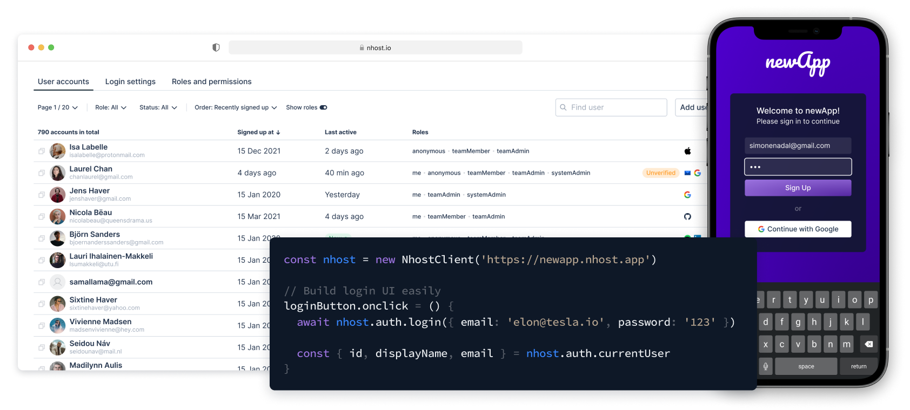
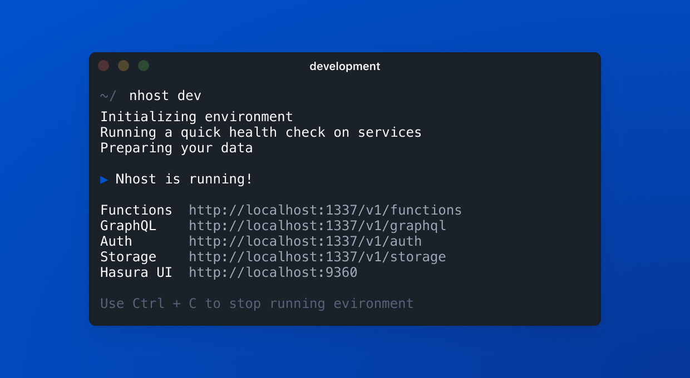
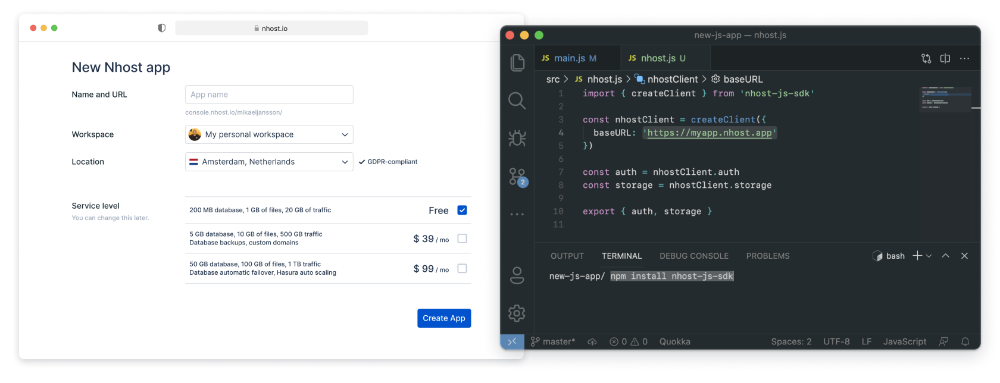

<div align="center">

<p align="center">
  
</p>

  <p>
    <!-- <div style="padding: 5px"></div> -->
    
    
    
    
    
    
  </p>
</div>

<p align="center">
  
</p>
<p align="center">
  
</p>

**Nhost is a serverless backend for web and mobile apps.** Nhost consists of open
source software pre-configured to make it fast to get started and easy to scale.

This is what you get with Nhost:

- Database: [Postgres](https://www.postgresql.org/)
- GraphQL API: [Hasura](https://hasura.io/)
- Authentication: [Hasura Auth](https://github.com/nhost/hasura-auth/)
- Storage: [Hasura Storage](https://github.com/nhost/hasura-backend-plus/)
- Functions: [JS](https://developer.mozilla.org/en-US/docs/Web/JavaScript)/[TS](https://www.typescriptlang.org/) and [Go](https://golang.org/) runtimes

We also provide a UI to manage your database, users, and files. And we have
JS/TS and Flutter SDKs to make it easy to work with.



<hr />

# Get Started



## Managed at Nhost.io

[Sign up](https://app.nhost.io) and create your first app [here](https://app.nhost.io/new).



Then connect to your new Nhost app using the [JavaScript/TypeScript SDK](https://docs.nhost.io/get-started/quick-start/javascript-client) or [Flutter SDK](https://github.com/nhost/nhost-dart).

```bash
$ npm install nhost-js-sdk
# or
$ flutter i nhost-dart-sdk
```

In your project, initialize the SDK with the endpoint of your new Nhost App:

```js
import { NhostClient } from '@nhost/nhost-js'

const nhost = new NhostClient({
  baseURL: 'https://project-id.nhost.app'
})

export { nhost }
```

Now you're ready to develop your app.

# Develop Your App

Now you're ready to use these fundamental building blocks to build a unique experience:

- [Quick Start](https://docs.nhost.io/get-started/quick-start): Create an app with React
- [Authentication](https://docs.nhost.io/platform/authentication) with email/password, magic link or social logins (Google, GitHub, Facebook, etc).
- [Real-time database](https://docs.nhost.io/platform/database) with GraphQL and Postgres to keep your data in sync.
- [File Storage](https://docs.nhost.io/platform/storage) with image transformation.
- [Payment](https://github.com/nhost/nhost) powered by Stripe _(coming soon)_.

[Full Documentation](https://docs.nhost.io)

### Examples and tutorials

- [CRM Example App](https://github.com/nhost/nhost/tree/main/examples/react-apollo-crm)
- [Multi-tenant App](https://github.com/nhost/nhost/tree/main/examples/multi-tenant-one-to-many)

# Backend development

To further develop your backend, deep dive into these topics:

- [Serverless Functions](https://docs.nhost.io/platform/serverless-functions)
- [User Permissions](https://docs.nhost.io/platform/database/permissions)
- [Database events and webhooks](https://docs.nhost.io/platform/serverless-functions/event-triggers)
- [Local development with the Nhost CLI](https://docs.nhost.io/platform/nhost/local-development)

[Full Documentation](https://docs.nhost.io)

# Resources

Nhost libraries and tools

- [JavaScript/TypeScript SDK](https://docs.nhost.io/reference/sdk)
- [Dart and Flutter SDK](https://github.com/nhost/nhost-dart)
- [Nhost CLI](https://docs.nhost.io/reference/cli)
- [Nhost React Auth](https://docs.nhost.io/reference/supporting-libraries/react-auth)
- [Nhost React Apollo](https://docs.nhost.io/reference/supporting-libraries/react-apollo)

## Community ❤️

First and foremost: **Star and watch this repository** to stay up-to-date.

Also, follow Nhost on [GitHub Discussions](https://github.com/nhost/nhost/discussions), our [Blog](https://nhost.io/blog), and on [Twitter](https://twitter.com/nhostio). You can chat with the team and other members on [Discord](https://discord.com/invite/9V7Qb2U), and follow our tutorials and other video material at [YouTube](https://www.youtube.com/channel/UCJ7irtvV9Y0EQMxpabb6ntg?view_as=subscriber).

## Nhost is Open Source

This repository, and most of our other open source projects, are licensed under the MIT license.

### How to contribute

Here are some ways of contributing to making Nhost better:

- **[Try out Nhost](https://docs.nhost.io/get-started/quick-start)**, and think of ways of how you can make the service better.
- Join our [Discord](https://discord.com/invite/9V7Qb2U) and connect with other members to share and learn from.
- Send a pull request to any of our [open source repositories](https://github.com/nhost) on Github. Check our [contribution guide](https://github.com/nhost/nhost/blob/main/CONTRIBUTING.md) for more details about how to contribute. We're looking forward to your contribution!

## Security

If you discover a security vulnerability within Nhost, please send an e-mail to [security@nhost.io](mailto:security@nhost.io). All security vulnerabilities will be promptly addressed.
