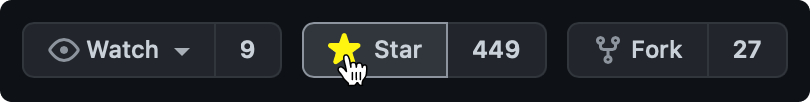

<div align="center">


  <p>
    <!-- <div style="padding: 5px"></div> -->
    
    
    
    
    
    
  </p>
</div>

[LATEST UPDATE: Flutter and Dart SDK has been released 🎉](https://nhost.io/blog/beta-support-for-dart-and-flutter-on-nhost)

**Nhost is an easy-to-use, full-featured backend-as-a-service (Baas) for your web and mobile apps.** Use GraphQL and our JS/TS or Flutter SDKs to build modern web and mobile apps that scale.

With just a few clicks, Nhost gives you a real-time database, authentication, file storage, transactional emails and payments. You can build advanced backend functionallity with serverless cloud functions, database events and webhooks.


<hr />

# Get Started

[Sign up](https://console.nhost.io) and create your first app on [https://console.nhost.io](https://console.nhost.io).


Then connect to your new Nhost app using the [JavaScript/TypeScript SDK]() or [Flutter SDK]().

```
$ npm install nhost-js-sdk
# or
$ flutter i nhost-dart-sdk
```

In your project, initialize the SDK with the endpoint of your new Nhost App:

```
import { createClient } from "nhost-js-sdk";

const nhost = createClient({
  baseURL: "https://project-id.nhost.app"
})

export { nhost };
```

Now you're ready to develop your app.

# Stay up-to-date

Follow this repository to stay-up-to-date with new releases.




# Develop Your App

Now you're ready to use these fundamental building blocks to build a unique experince:

- [Quick Start](): Create an app with Readt
- [Authentication]() with email/password, magic link or social logins (Google, GitHub, Facebook, etc).
- [Real-time database]() with GraphQL and Postgres to keep your data in sync.
- [File Storage]() with image transformation.
- [Email Templates]() for your users.
- [Payment]() powered by Stripe.

[Full Documentation](https://docs.nhost.io)

### Exampls and tutorials

- [Todo App]() with React
- [Full App Template]() with Next.js
- [Native Mobile App]() with Dart and Flutlter

# Backend development

To further develop your backend, deep dive into these topics:

- [Serverless Functions](https://docs.nhost.io/custom-api)
- [User Permissions](https://docs.nhost.io/hasura/permissions)
- [Database events and webhooks](https://docs.nhost.io/hasura/event-triggers)
- [Local development with the Nhost CLI](https://docs.nhost.io/cli)

[Full Documentation](https://docs.nhost.io)

# Resources

Nhost libraries and tools

- [JavaScript/TypeScript SDK](https://docs.nhost.io/libraries/nhost-js-sdk)
- [Dart and Flutter SDK](https://github.com/nhost/nhost-dart)
- [Nhost CLI](https://docs.nhost.io/cli)
- [Nhost React Auth](https://docs.nhost.io/libraries/react-auth)
- [Nhost React Apollo](https://docs.nhost.io/libraries/react-apollo)
- [Nhost Nuxt](https://docs.nhost.io/libraries/nhost-nuxt)

## Community ❤️

First and foremost: **Star and watch this repository** to stay up-to-date.

Also, follow Nhost on [GitHub Discussions](https://github.com/nhost/nhost/discussions), our [Blog](https://nhost.io/blog), and on [Twitter](https://twitter.com/nhostio). You can chat with the team and other members on [Discord](https://discord.com/invite/9V7Qb2U), and follow our tutorials and other video material at [YouTube](https://www.youtube.com/channel/UCJ7irtvV9Y0EQMxpabb6ntg?view_as=subscriber).

## Nhost is Open Source

This repository, and most of our other open source projects, are licensed under the MIT license.

### How to contribute

Here are some ways of contributing to making Nhost better:

- **[Try out Nhost]()**, and think of ways of how you can make the service better.
- Join our [Discord]() and connect with other members to share and learn from.
- Send a pull request to any our [open source repositories](https://github.com/nhost) on Github. We're looking forward to your contribution!

## Security

If you discover a security vulnerability within Nhost, please send an e-mail to [security@nhost.io](mailto:security@nhost.io). All security vulnerabilities will be promptly addressed.
