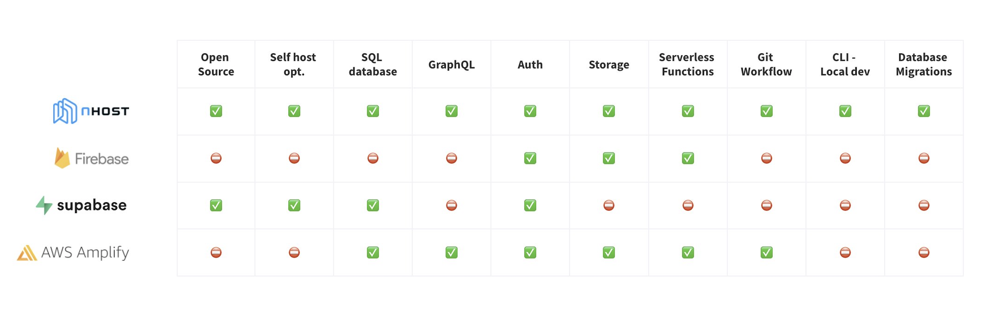

  <h1>Nhost</h1>
  <a href="https://docs.nhost.io/quick-start">Quickstart</a>
  &nbsp;&nbsp;•&nbsp;&nbsp;
  <a href="https://nhost.io/">Website</a>
  &nbsp;&nbsp;•&nbsp;&nbsp;
  <a href="https://docs.nhost.io/">Docs</a>
  &nbsp;&nbsp;•&nbsp;&nbsp;
  <a href="https://nhost.io/blog">Blog</a>
  &nbsp;&nbsp;•&nbsp;&nbsp;
  <a href="https://discord.com/invite/9V7Qb2U">Discord</a>
  &nbsp;&nbsp;•&nbsp;&nbsp;
  <a href="https://twitter.com/nhostio">Twitter</a>
   
  

## What is Nhost?

Nhost is a modern open-source Firebase alternative with the same developer experience on the backend as [Netlify](http://netlify.com/) and [Vercel](https://vercel.com/) on the frontend.

Nhost's goal is to provide the **most productive developer experience to build apps**. We use the most popular and powerful technologies and make them easy to use with zero vendor lock-in.

We also provide a **workflow** from your local development, to staging (coming soon), and finally to production. We try to make your life as a developer as efficient as possible.

A Nhost backend includes a PostgreSQL database, a GraphQL API (with Hasura), Authentication, Storage, and Serverless Functions.

## Getting started

Create a Nhost project for free and get your backend in less than a minute.

[Start your Nhost project &rarr;](https://console.nhost.io)

## Nhost compared to alternatives

## How Nhost works

The Nhost stack consists of:

### Database [PostgreSQL](https://github.com/postgres/postgres)

- The World's Most Advanced Open Source Relational Database.

### Realtime GraphQL ([Hasura's GraphQL Engine](https://github.com/hasura/graphql-engine))

- Instant GraphQL API based on your database schema.
- Event trigger webhooks on database changes (insert / update / delete).
- Connect remote GraphQL schemas.
- Hasura Actions to extend the GraphQL API with custom business logic.
- Powerful permission system based on JWT tokens.

### Authentication ([Hasura Backend Plus](https://github.com/nhost/hasura-backend-plus))

- Email / Password.
- OAuth providers (Google, GitHub, Facebook, Twitter, Apple, Spotify, LinkedIn, Windows Live).

### Storage ([Hasura Backend Plus](https://github.com/nhost/hasura-backend-plus))

- Let your users upload and download files / documents / images.
- S3 like storage API.
- On-the-fly image transformation.

### Custom API / serverless functions

- Add any business logic to your backend.

## Community

Use [Nhost GitHub Discussions](https://github.com/nhost/nhost/discussions) and join our [Discord Server](https://discord.com/invite/9V7Qb2U).
