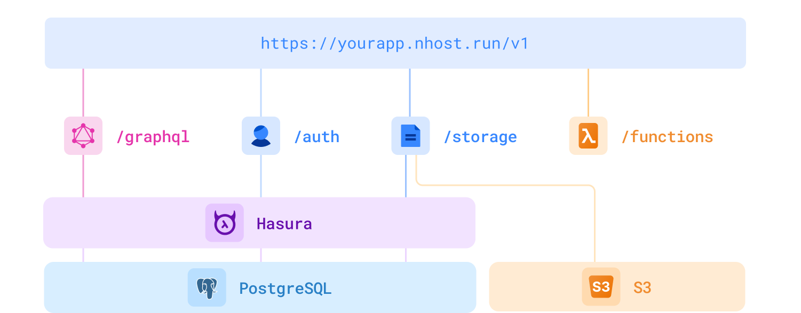

<div align="center">

# Nhost

<a href="https://docs.nhost.io/introduction#quick-start-guides">Quickstart</a>
<span>&nbsp;&nbsp;•&nbsp;&nbsp;</span>
<a href="http://nhost.io/">Website</a>
<span>&nbsp;&nbsp;•&nbsp;&nbsp;</span>
<a href="https://docs.nhost.io">Docs</a>
<span>&nbsp;&nbsp;•&nbsp;&nbsp;</span>
<a href="https://nhost.io/blog">Blog</a>
<span>&nbsp;&nbsp;•&nbsp;&nbsp;</span>
<a href="https://twitter.com/nhost">Twitter</a>
<span>&nbsp;&nbsp;•&nbsp;&nbsp;</span>
<a href="https://nhost.io/discord">Discord</a>
<span>&nbsp;&nbsp;•&nbsp;&nbsp;</span>
<a href="https://gurubase.io/g/nhost">Ask Nhost Guru (third party, unofficial)</a>
<br />

  <hr />
</div>

**Nhost is an open source Firebase alternative with GraphQL,** built with the following things in mind:

- Open Source
- GraphQL
- SQL
- Great Developer Experience

Nhost consists of open source software:

- Database: [PostgreSQL](https://www.postgresql.org/)
- Instant GraphQL API: [Hasura](https://hasura.io/)
- Authentication: [Hasura Auth](https://github.com/nhost/hasura-auth/)
- Storage: [Hasura Storage](https://github.com/nhost/hasura-storage)
- Serverless Functions: Node.js (JavaScript and TypeScript)
- [Nhost CLI](https://docs.nhost.io/development/cli/overview) for local development

## Architecture of Nhost

<div align="center">
  <br />
  
  <br />
  <br />
</div>

Visit [https://docs.nhost.io](http://docs.nhost.io) for the complete documentation.

# Get Started

## Option 1: Nhost Hosted Platform

1. Sign in to [Nhost](https://app.nhost.io).
2. Create Nhost app.
3. Done.

## Option 2: Self-hosting

Since Nhost is 100% open source, you can self-host the whole Nhost stack. Check out the example [docker-compose file](https://github.com/nhost/nhost/tree/main/examples/docker-compose) to self-host Nhost.

## Sign In and Make a Graphql Request

Install the `@nhost/nhost-js` package and start build your app:

```jsx
import { NhostClient } from '@nhost/nhost-js'

const nhost = new NhostClient({
  subdomain: '<your-subdomain>',
  region: '<your-region>'
})

await nhost.auth.signIn({ email: 'elon@musk.com', password: 'spaceX' })

await nhost.graphql.request(`{
  users {
    id
    displayName
    email
  }
}`)
```

## Frontend Agnostic

Nhost is frontend agnostic, which means Nhost works with all frontend frameworks.

<div align="center">
  <a href="https://docs.nhost.io/guides/quickstarts/nextjs"></a>
  <a href="https://docs.nhost.io/reference/javascript"></a>
  <a href="https://docs.nhost.io/guides/quickstarts/react"></a>
  <a href="https://docs.nhost.io/reference/javascript"></a>
  <a href="https://docs.nhost.io/reference/javascript"></a>
  <a href="https://docs.nhost.io/guides/quickstarts/vue"></a>
</div>

# Resources

- Start developing locally with the [Nhost CLI](https://docs.nhost.io/cli)

## Nhost Clients

- [JavaScript/TypeScript](https://docs.nhost.io/reference/javascript)
- [Dart and Flutter](https://github.com/nhost/nhost-dart)
- [React](https://docs.nhost.io/reference/react)
- [Next.js](https://docs.nhost.io/reference/nextjs)
- [Vue](https://docs.nhost.io/reference/vue)

## Integrations

- [Apollo](./integrations/apollo#nhostapollo)
- [React Apollo](./integrations/react-apollo#nhostreact-apollo)
- [React URQL](./integrations/react-urql#nhostreact-urql)
- [Stripe GraphQL API](./integrations/stripe-graphql-js#nhoststripe-graphql-js)
- [Google Translation GraphQL API](./integrations/google-translation#nhostgoogle-translation)

## Applications

- [Dashboard](./dashboard)
- [Docs](./docs)

## Community ❤️

First and foremost: **Star and watch this repository** to stay up-to-date.

Also, follow Nhost on [GitHub Discussions](https://github.com/nhost/nhost/discussions), our [Blog](https://nhost.io/blog), and on [Twitter](https://twitter.com/nhostio). You can chat with the team and other members on [Discord](https://discord.com/invite/9V7Qb2U) and follow our tutorials and other video material at [YouTube](https://www.youtube.com/channel/UCJ7irtvV9Y0EQMxpabb6ntg?view_as=subscriber).

### Nhost is Open Source

This repository, and most of our other open source projects, are licensed under the MIT license.

<a href="https://runacap.com/ross-index/" target="_blank" rel="noopener" >
    
</a>

### How to contribute

Here are some ways of contributing to making Nhost better:

- **[Try out Nhost](https://docs.nhost.io/introduction)**, and think of ways to make the service better. Let us know here on GitHub.
- Join our [Discord](https://discord.com/invite/9V7Qb2U) and connect with other members to share and learn from.
- Send a pull request to any of our [open source repositories](https://github.com/nhost) on Github. Check our [contribution guide](https://github.com/nhost/nhost/blob/main/CONTRIBUTING.md) and our [developers guide](https://github.com/nhost/nhost/blob/main/DEVELOPERS.md) for more details about how to contribute. We're looking forward to your contribution!

### Contributors

<a href="https://github.com/nhost/nhost/graphs/contributors">
  <p align="center">
    
  </p>
</a>