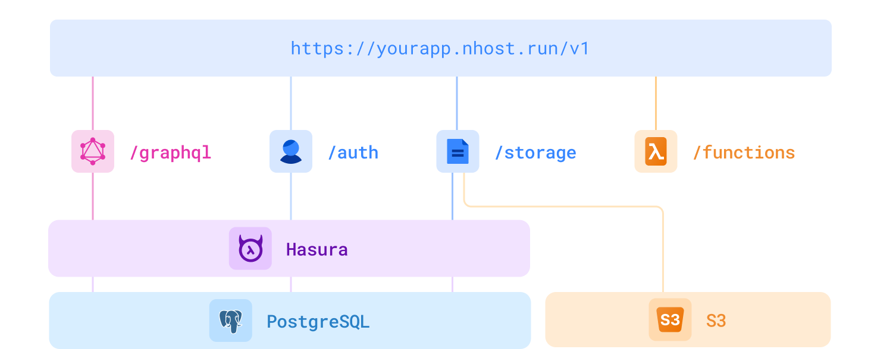

<div align="center">

# Nhost

<a href="https://docs.nhost.io/getting-started/">Quickstart</a>
<span>&nbsp;&nbsp;•&nbsp;&nbsp;</span>
<a href="https://nhost.io/">Website</a>
<span>&nbsp;&nbsp;•&nbsp;&nbsp;</span>
<a href="https://docs.nhost.io">Docs</a>
<span>&nbsp;&nbsp;•&nbsp;&nbsp;</span>
<a href="https://nhost.io/blog">Blog</a>
<span>&nbsp;&nbsp;•&nbsp;&nbsp;</span>
<a href="https://x.com/nhost">X</a>
<span>&nbsp;&nbsp;•&nbsp;&nbsp;</span>
<a href="https://nhost.io/discord">Discord</a>
<span>&nbsp;&nbsp;•&nbsp;&nbsp;</span>
<a href="https://gurubase.io/g/nhost">Ask Nhost Guru (third party, unofficial)</a>
<br />

  <hr />
</div>

**Nhost is an open source Firebase alternative with GraphQL,** built with the following things in mind:

- Open Source
- GraphQL
- SQL
- Great Developer Experience

Nhost consists of open source software:

- Database: [PostgreSQL](https://www.postgresql.org/)
- Instant GraphQL API: [Hasura](https://hasura.io/)
- Authentication: [Auth](https://github.com/nhost/nhost/tree/main/services/auth)
- Storage: [Storage](https://github.com/nhost/nhost/tree/main/services/storage)
- Serverless Functions: Node.js (JavaScript and TypeScript)
- [Nhost CLI](https://github.com/nhost/nhost/tree/main/cli) for local development

## Architecture of Nhost

<div align="center">
  <br />
  
  <br />
  <br />
</div>

Visit [https://docs.nhost.io](https://docs.nhost.io) for the complete documentation.

# Get Started

## Option 1: Nhost Hosted Platform

1. Sign in to [Nhost](https://app.nhost.io).
2. Create Nhost app.
3. Done.

## Option 2: Local Development (CLI)

The Nhost CLI is the easiest way to start developing locally. It sets up a local environment that tracks database migrations and Hasura metadata.

**Install the CLI:**
- **macOS / Linux:** `brew install nhost/tap/nhost` or `curl -sSL https://raw.githubusercontent.com/nhost/nhost/main/cli/get.sh | bash`
- **Nix:** `nix profile install github:nhost/nhost#cli`
- **npm / pnpm / Yarn / Bun:** `npm install -D @nhost/cli`,
  `pnpm add -D @nhost/cli`, `yarn add -D @nhost/cli`, or
  `bun add -d @nhost/cli`

**Start building:**
```bash
nhost login
nhost init
nhost up
```

Read the full [CLI Quickstart guide](https://docs.nhost.io/getting-started/quickstart/cli).

## Option 3: Self-hosting

Since Nhost is 100% open source, you can self-host the whole Nhost stack. Check out the example [docker-compose file](https://github.com/nhost/nhost/tree/main/examples/docker-compose) to self-host Nhost.

## Sign In and Make a GraphQL Request

Install the `@nhost/nhost-js` package and start building your app:

```ts
import { createClient } from '@nhost/nhost-js'

const nhost = createClient({
  subdomain: 'your-project',
  region: 'eu-central-1'
})

await nhost.auth.signInEmailPassword({
  email: 'user@example.com',
  password: '<password>'
})

await nhost.graphql.request({
  query: `
    query GetUsers {
      users {
        id
        displayName
        email
      }
    }
  `
})
```

## Frontend Agnostic

Nhost is frontend agnostic, which means Nhost works with all frontend frameworks.

<div align="center">
  <a href="https://docs.nhost.io/getting-started/quickstart/nextjs"></a>
  <a href="https://docs.nhost.io/reference/javascript/nhost-js/main"></a>
  <a href="https://docs.nhost.io/getting-started/quickstart/react"></a>
  <a href="https://docs.nhost.io/getting-started/quickstart/reactnative"></a>
  <a href="https://docs.nhost.io/getting-started/quickstart/sveltekit"></a>
  <a href="https://docs.nhost.io/getting-started/quickstart/vue"></a>
</div>

# Resources

- Start developing locally with the [Nhost CLI](https://docs.nhost.io/platform/cli/local-development)

## Nhost Clients

- [JavaScript/TypeScript](https://docs.nhost.io/reference/javascript/nhost-js/main)
- [Dart and Flutter](https://github.com/nhost/nhost-dart)

## Applications

- [Dashboard](./dashboard)
- [Docs](./docs)

## Community ❤️

First and foremost: **Star and watch this repository** to stay up-to-date.

Also, follow Nhost on [GitHub Discussions](https://github.com/nhost/nhost/discussions), our [Blog](https://nhost.io/blog), and on [X](https://x.com/nhost). You can chat with the team and other members on [Discord](https://nhost.io/discord) and follow our tutorials and other video material at [YouTube](https://www.youtube.com/channel/UCJ7irtvV9Y0EQMxpabb6ntg?view_as=subscriber).

### Nhost is Open Source

This repository, and most of our other open source projects, are licensed under the MIT license.

<a href="https://runacap.com/ross-index/" target="_blank" rel="noopener" >
    
</a>

### How to contribute

Here are some ways of contributing to making Nhost better:

- **[Try out Nhost](https://docs.nhost.io)**, and think of ways to make the service better. Let us know here on GitHub.
- Join our [Discord](https://nhost.io/discord) and connect with other members to share and learn from.
- Send a pull request to any of our [open source repositories](https://github.com/nhost) on Github. Check out our [contribution guide](https://github.com/nhost/nhost/blob/main/CONTRIBUTING.md) for more details about how to contribute. We're looking forward to your contribution!

### Contributors

<a href="https://github.com/nhost/nhost/graphs/contributors">
  <p align="center">
    
  </p>
</a>
