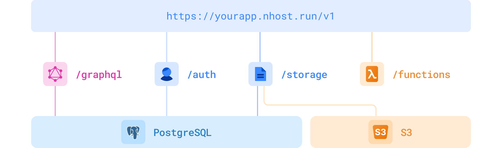

<div align="center">

# Nhost

<a href="https://docs.nhost.io/get-started">Quickstart</a>
<span>&nbsp;&nbsp;•&nbsp;&nbsp;</span>
<a href="http://nhost.io/">Website</a>
<span>&nbsp;&nbsp;•&nbsp;&nbsp;</span>
<a href="https://docs.nhost.io/get-started">Docs</a>
<span>&nbsp;&nbsp;•&nbsp;&nbsp;</span>
<a href="https://nhost.io/blog">Blog</a>
<span>&nbsp;&nbsp;•&nbsp;&nbsp;</span>
<a href="https://twitter.com/nhostio">Twitter</a>
<span>&nbsp;&nbsp;•&nbsp;&nbsp;</span>
<a href="https://nhost.io/discord">Discord</a>
<br />

  <hr />
</div>

**Nhost is an open-source GraphQL backend,** built with the following things in mind:

- Open-Source
- Developer Productivity
- SQL
- GraphQL

Nhost consists of open source software:

- Database: [PostgreSQL](https://www.postgresql.org/)
- Instant GraphQL API: [Hasura](https://hasura.io/)
- Authentication: [Hasura Auth](https://github.com/nhost/hasura-auth/)
- Storage: [Hasura Storage](https://hub.docker.com/r/nhost/hasura-storage)
- Serverless Functions: Node.js (JavaScript and TypeScript)
- [Nhost CLI](https://docs.nhost.io/reference/cli) for local development

## Architecture of Nhost

<div align="center">
  <br />
  
  <br />
  <br />
</div>

Visit [https://docs.nhost.io](http://docs.nhost.io) for the complete documentation.

# How to get started

### Option 1: One-click deployment with Nhost (recommended)

1. Create [Nhost account](https://app.nhost.io) (you can use GitHub to sign up)
2. Create Nhost app
3. Done!

### Option 2: Self-hosting

Since Nhost is 100% open source, you can self-host the whole Nhost stack. Check out the example [docker-compose file](https://github.com/nhost/nhost/tree/main/examples/docker-compose) to self-host Nhost.

## Sign in a user and make your first GraphQL query

Install the `@nhost/nhost-js` package and start build your app:

```jsx
import { NhostClient } from '@nhost/nhost-js'

const nhost = new NhostClient({
  backendUrl: 'https://awesome-app.nhost.run'
})

await nhost.auth.signIn({ email: 'elon@musk.com', password: 'spaceX' })

await nhost.graphql.request(`{
  users {
    id
    displayName
    email
  }
}`)
```

## Frontend Agnostic

Nhost is frontend agnostic, which means Nhost works with all frontend frameworks.

<div align="center">
  <a href="https://github.com/nhost/nhost/tree/main/templates/web/nextjs-apollo"></a>
  <a href="https://github.com/nhost/nhost/tree/main/examples/nuxt-apollo"></a>
  <a href="https://github.com/nhost/nhost/tree/main/templates/web/react-apollo"></a>
  
  <a href="https://github.com/nhost/nhost/tree/main/packages/nhost-js"></a>
  <a href="https://github.com/nhost/nhost/tree/main/packages/nhost-js"></a>
</div>

# Resources

Nhost libraries and tools

- [JavaScript/TypeScript SDK](https://docs.nhost.io/reference/sdk)
- [Dart and Flutter SDK](https://github.com/nhost/nhost-dart)
- [Nhost CLI](https://docs.nhost.io/reference/cli)
- [Nhost React](https://docs.nhost.io/reference/react)
- [Nhost Next.js](https://docs.nhost.io/reference/nextjs)

## Community ❤️

First and foremost: **Star and watch this repository** to stay up-to-date.

Also, follow Nhost on [GitHub Discussions](https://github.com/nhost/nhost/discussions), our [Blog](https://nhost.io/blog), and on [Twitter](https://twitter.com/nhostio). You can chat with the team and other members on [Discord](https://discord.com/invite/9V7Qb2U) and follow our tutorials and other video material at [YouTube](https://www.youtube.com/channel/UCJ7irtvV9Y0EQMxpabb6ntg?view_as=subscriber).

### Nhost is Open Source

This repository, and most of our other open source projects, are licensed under the MIT license.

### How to contribute

Here are some ways of contributing to making Nhost better:

- **[Try out Nhost](https://docs.nhost.io/get-started/quick-start)**, and think of ways to make the service better. Let us know here on GitHub.
- Join our [Discord](https://discord.com/invite/9V7Qb2U) and connect with other members to share and learn from.
- Send a pull request to any of our [open source repositories](https://github.com/nhost) on Github. Check our [contribution guide](https://github.com/nhost/nhost/blob/main/CONTRIBUTING.md) for more details about how to contribute. We're looking forward to your contribution!

### Contributors

<!-- readme: contributors -start -->
<table>
<tr>
    <td align="center">
        <a href="https://github.com/plmercereau">
            
            <br />
            <sub><b>Pilou</b></sub>
        </a>
    </td>
    <td align="center">
        <a href="https://github.com/elitan">
            
            <br />
            <sub><b>Johan Eliasson</b></sub>
        </a>
    </td>
    <td align="center">
        <a href="https://github.com/szilarddoro">
            
            <br />
            <sub><b>Szilárd Dóró</b></sub>
        </a>
    </td>
    <td align="center">
        <a href="https://github.com/nunopato">
            
            <br />
            <sub><b>Nuno Pato</b></sub>
        </a>
    </td>
    <td align="center">
        <a href="https://github.com/subatuba21">
            
            <br />
            <sub><b>Subha Das</b></sub>
        </a>
    </td>
    <td align="center">
        <a href="https://github.com/guicurcio">
            
            <br />
            <sub><b>Guido Curcio</b></sub>
        </a>
    </td></tr>
<tr>
    <td align="center">
        <a href="https://github.com/sebagudelo">
            
            <br />
            <sub><b>Sebagudelo</b></sub>
        </a>
    </td>
    <td align="center">
        <a href="https://github.com/mrinalwahal">
            
            <br />
            <sub><b>Mrinal Wahal</b></sub>
        </a>
    </td>
    <td align="center">
        <a href="https://github.com/gdangelo">
            
            <br />
            <sub><b>Grégory D'Angelo</b></sub>
        </a>
    </td>
    <td align="center">
        <a href="https://github.com/FuzzyReason">
            
            <br />
            <sub><b>Vadim Smirnov</b></sub>
        </a>
    </td>
    <td align="center">
        <a href="https://github.com/subhendukundu">
            
            <br />
            <sub><b>Subhendu Kundu</b></sub>
        </a>
    </td>
    <td align="center">
        <a href="https://github.com/chrtze">
            
            <br />
            <sub><b>Christopher Möller</b></sub>
        </a>
    </td></tr>
<tr>
    <td align="center">
        <a href="https://github.com/hajek-raven">
            
            <br />
            <sub><b>Filip Hájek</b></sub>
        </a>
    </td>
    <td align="center">
        <a href="https://github.com/jerryjappinen">
            
            <br />
            <sub><b>Jerry Jäppinen</b></sub>
        </a>
    </td>
    <td align="center">
        <a href="https://github.com/mustafa-hanif">
            
            <br />
            <sub><b>Mustafa Hanif</b></sub>
        </a>
    </td>
    <td align="center">
        <a href="https://github.com/timpratim">
            
            <br />
            <sub><b>Pratim</b></sub>
        </a>
    </td>
    <td align="center">
        <a href="https://github.com/Savinvadim1312">
            
            <br />
            <sub><b>Savin Vadim</b></sub>
        </a>
    </td>
    <td align="center">
        <a href="https://github.com/ahmic">
            
            <br />
            <sub><b>Amir Ahmic</b></sub>
        </a>
    </td></tr>
<tr>
    <td align="center">
        <a href="https://github.com/akd-io">
            
            <br />
            <sub><b>Anders Kjær Damgaard</b></sub>
        </a>
    </td>
    <td align="center">
        <a href="https://github.com/rustyb">
            
            <br />
            <sub><b>Colin Broderick</b></sub>
        </a>
    </td>
    <td align="center">
        <a href="https://github.com/dohomi">
            
            <br />
            <sub><b>Dominic Garms</b></sub>
        </a>
    </td>
    <td align="center">
        <a href="https://github.com/GavanWilhite">
            
            <br />
            <sub><b>Gavan Wilhite</b></sub>
        </a>
    </td>
    <td align="center">
        <a href="https://github.com/alveshelio">
            
            <br />
            <sub><b>Helio Alves</b></sub>
        </a>
    </td>
    <td align="center">
        <a href="https://github.com/nkhdo">
            
            <br />
            <sub><b>Hoang Do</b></sub>
        </a>
    </td></tr>
<tr>
    <td align="center">
        <a href="https://github.com/ghoshnirmalya">
            
            <br />
            <sub><b>Nirmalya Ghosh</b></sub>
        </a>
    </td>
    <td align="center">
        <a href="https://github.com/quentin-decre">
            
            <br />
            <sub><b>Quentin Decré</b></sub>
        </a>
    </td>
    <td align="center">
        <a href="https://github.com/komninoschat">
            
            <br />
            <sub><b>Komninos</b></sub>
        </a>
    </td></tr>
</table>
<!-- readme: contributors -end -->
