# Screenshots

Listing cloud projects:

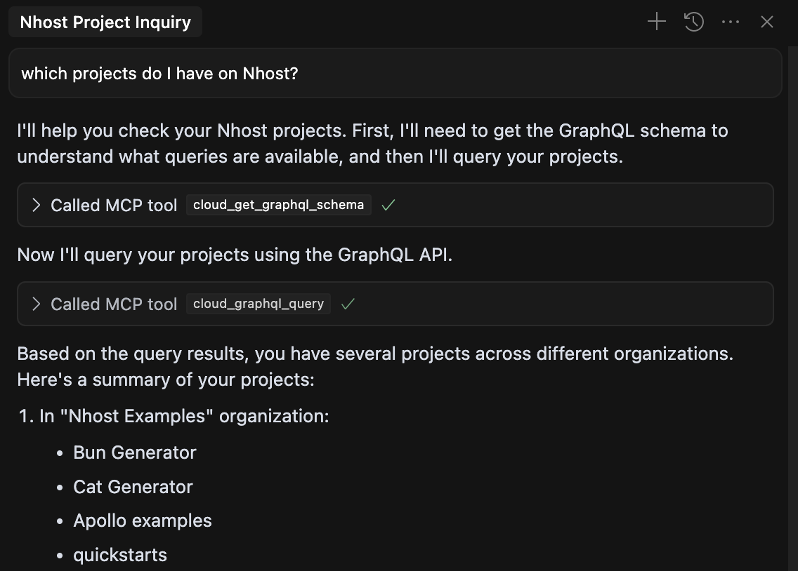

Changing cloud project's configuration:

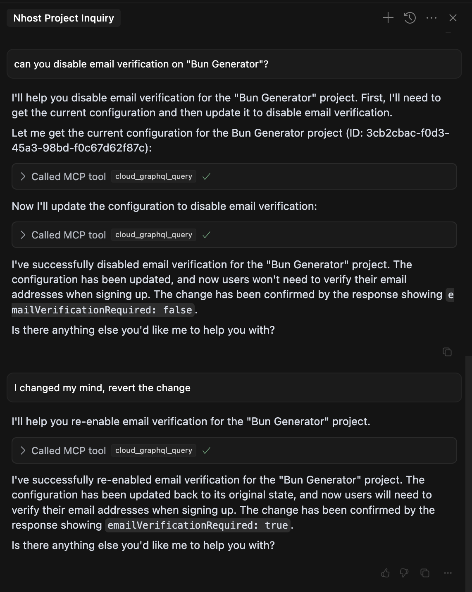

Querying cloud project's configuration:

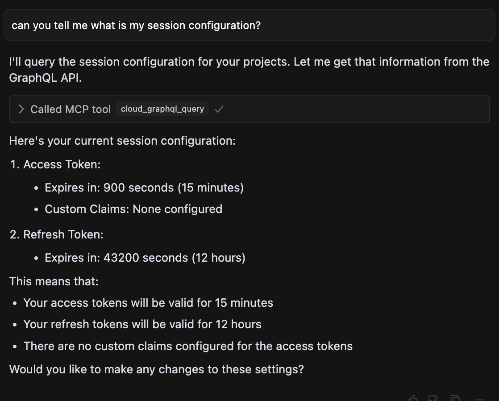

Querying local project's schema:

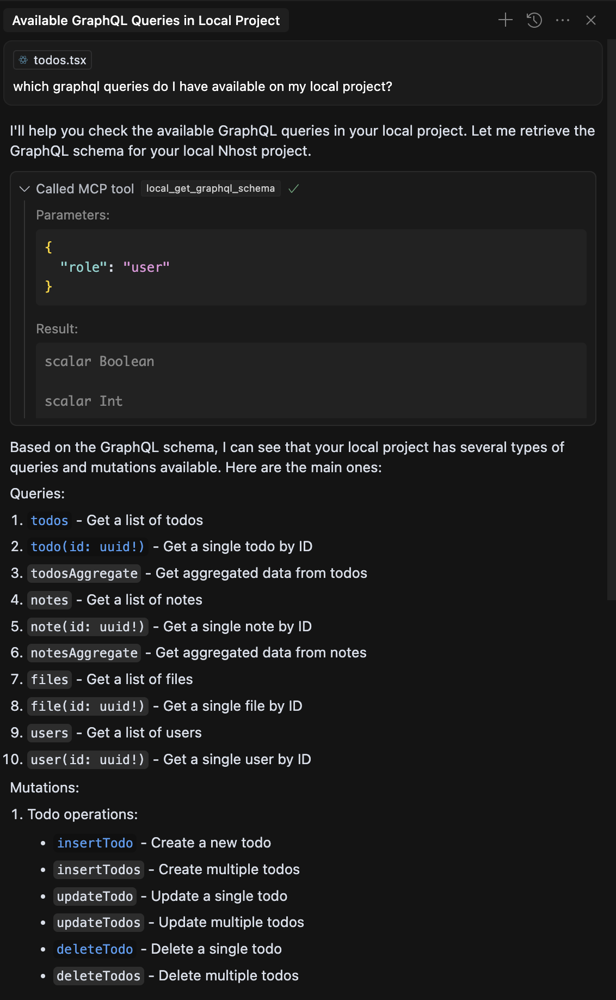

Generating code from local project's schema:

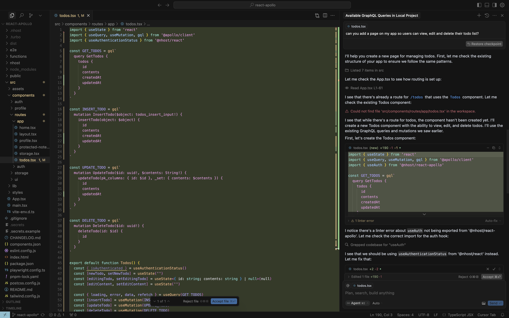

Resulting code:

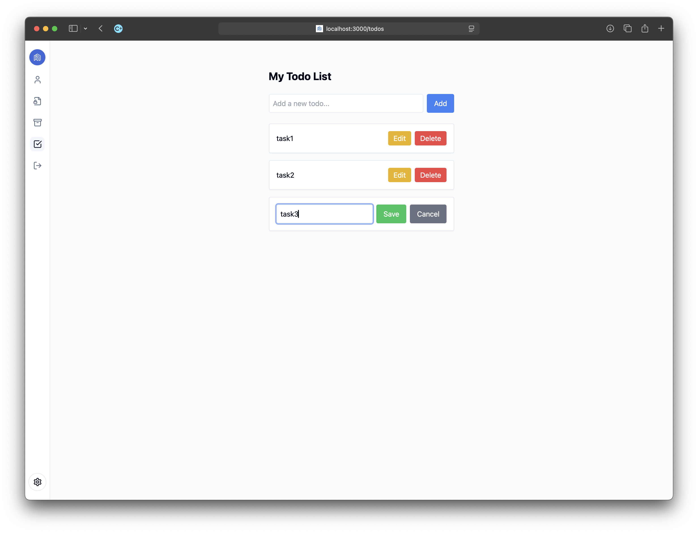

Querying local project's configuration:

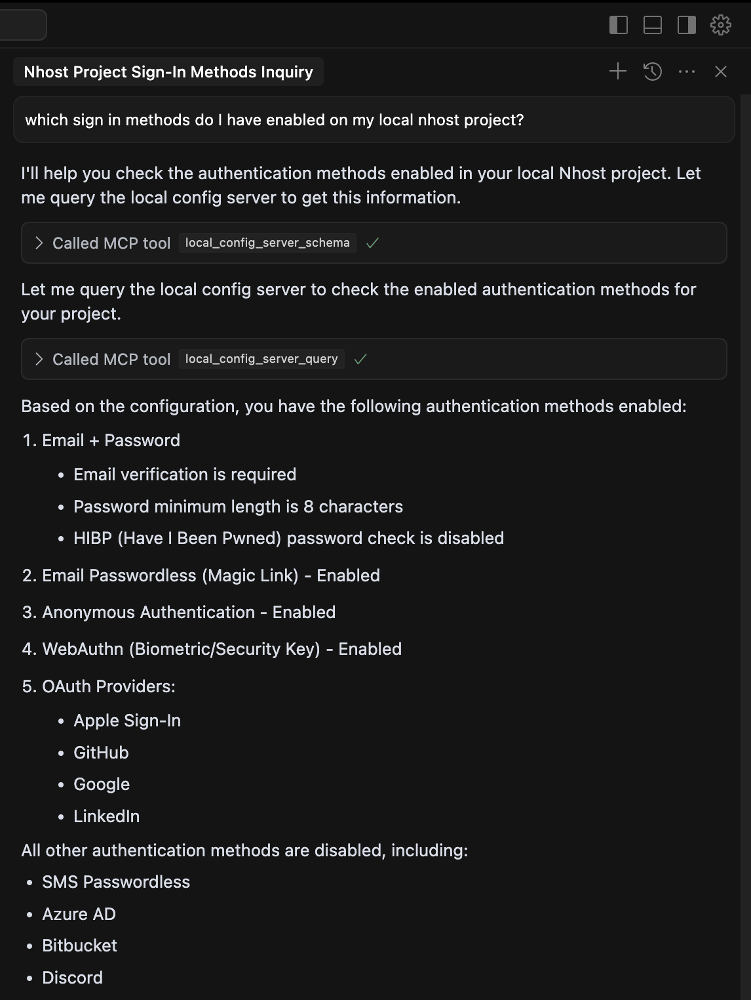

Modifying local project's configuration:

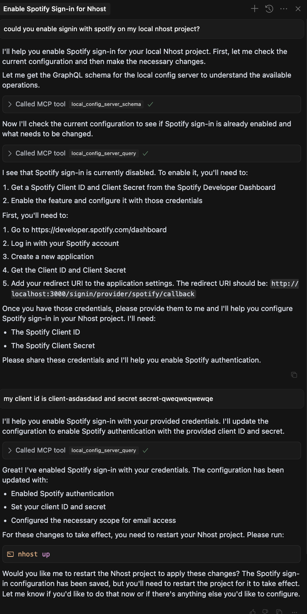

Querying cloud project's schema:

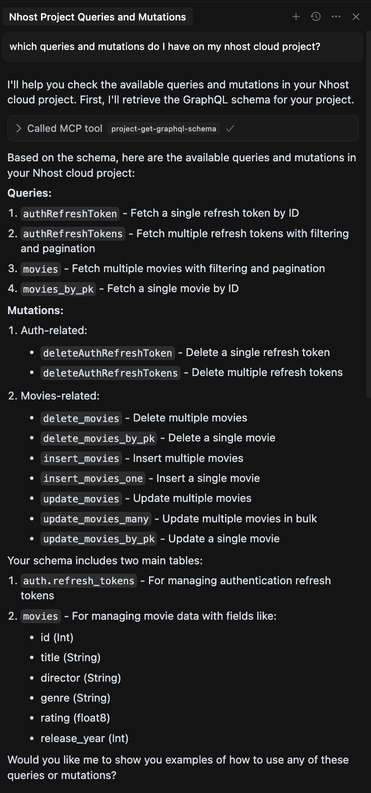

Querying cloud project's data:

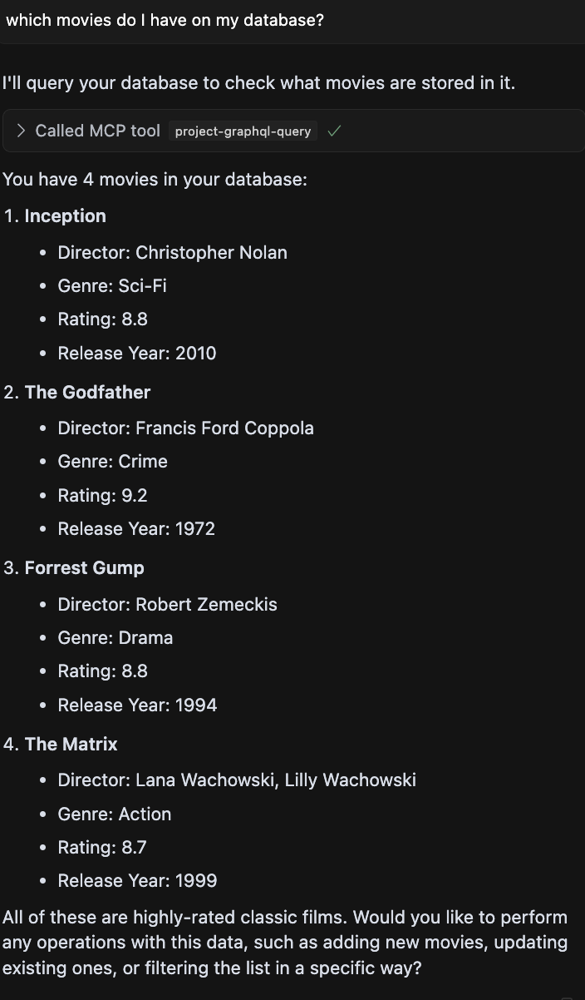

Managing cloud project's data:

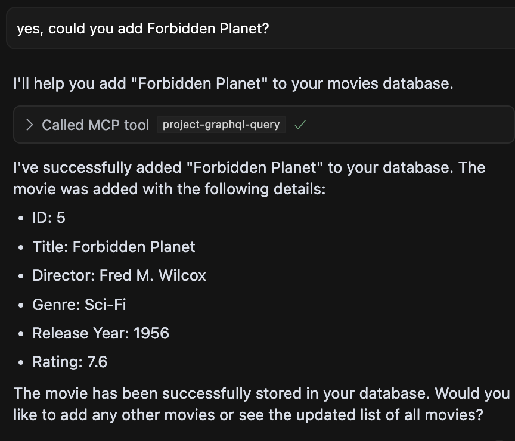

Analysing cloud project's data:

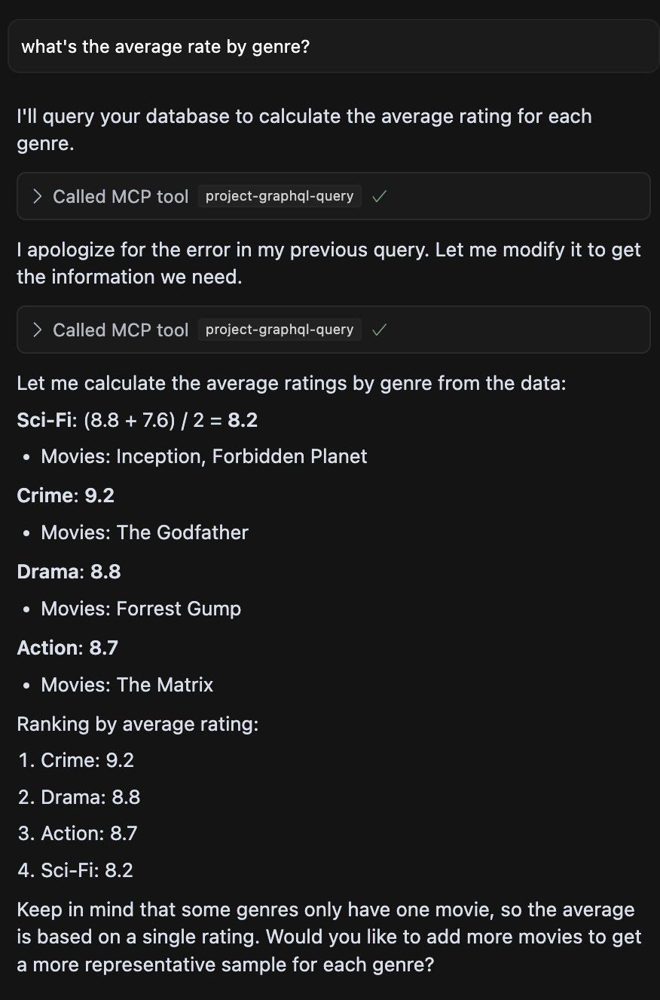
