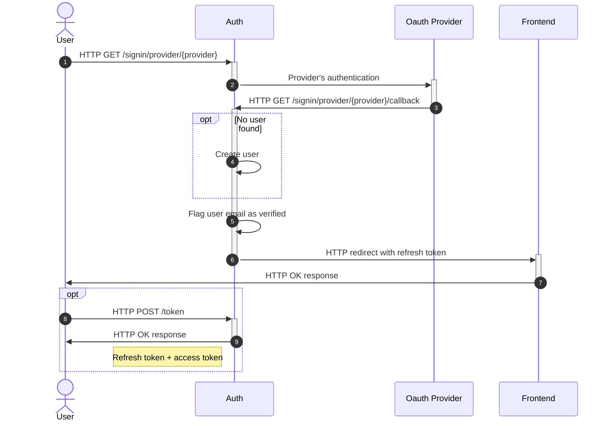

OAuth2 providers allow users to sign in to your Nhost application using their existing accounts from popular services like Google, GitHub, Apple, and many others. This eliminates the need for users to create and remember new credentials while providing a secure authentication method.

## How OAuth2 Authentication Works

When a user authenticates with an OAuth2 provider through Nhost, the following workflow occurs:

{/* Snippet removed - content needs manual import */}

### The Authentication Flow

1. **Initiation**: The user starts the authentication process by making a request to `/signin/provider/{provider}` (e.g., `/signin/provider/google`)

2. **Provider Authentication**: Auth redirects the user to the OAuth2 provider's authentication page where they log in and grant permissions

3. **Callback**: After successful authentication, the provider redirects back to Auth at `/signin/provider/{provider}/callback` with an authorization code

4. **User Management**: Auth processes the callback:
   - If this is a new user, a user account is automatically created
   - The user's email is flagged as verified (since the OAuth2 provider has already verified it)

5. **Token Issuance**: The user is redirected back to your frontend application with a refresh token

## Benefits of OAuth2 Authentication

- **Improved User Experience**: Users can sign in with accounts they already have
- **Enhanced Security**: No need to manage passwords; authentication is handled by established providers
- **Verified Emails**: Email addresses are automatically verified through the OAuth2 provider
- **Reduced Registration Friction**: Faster onboarding with one-click sign-in
