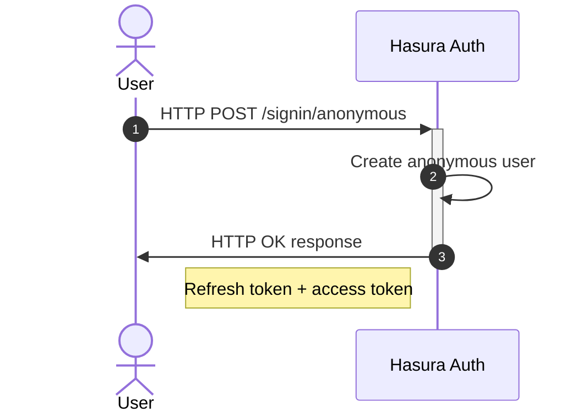
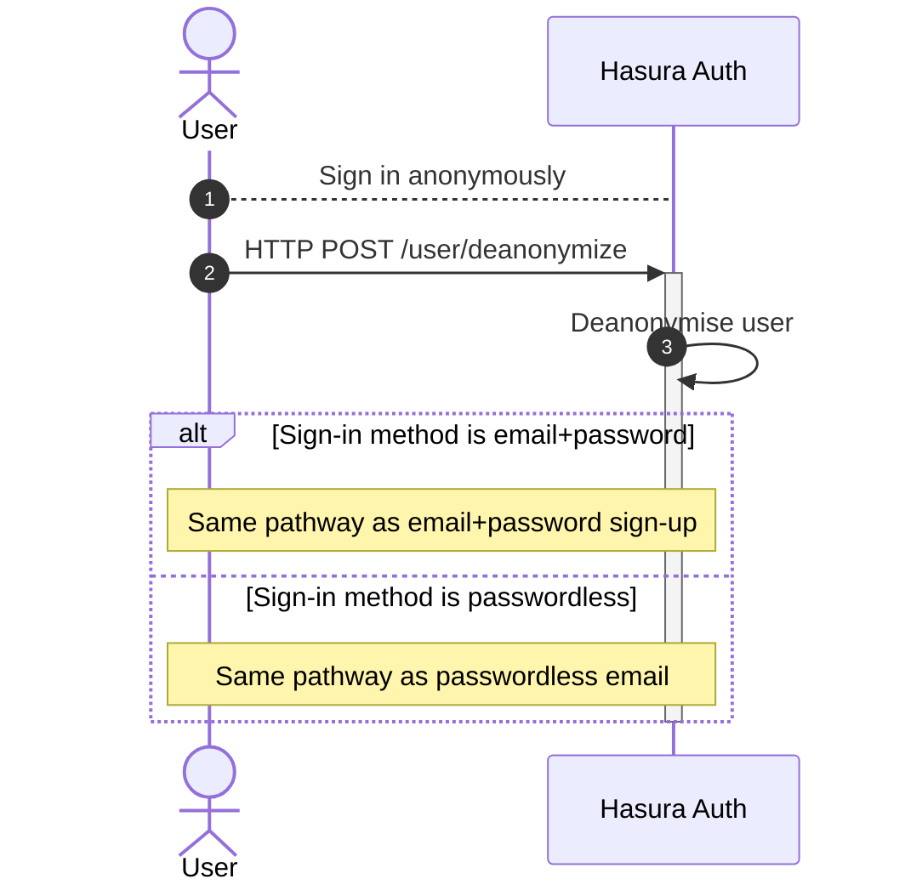

## Sign-in anonymously

```mermaid
sequenceDiagram
	autonumber
	actor U as User
	participant A as Hasura Auth
	U->>+A: HTTP POST /signin/anonymous
	A->>A: Create anonymous user
	A->>-U: HTTP OK response
	Note left of A: Refresh token + access token
```

## Deanonymisation

```mermaid
sequenceDiagram
	autonumber
	actor U as User
	participant A as Hasura Auth
	U-->A: Sign in anonymously
	U->>+A: HTTP POST /user/deanonymize
	A->>A: Deanonymise user
	alt Sign-in method is email+password
		Note over U,A: Same pathway as email+password sign-up
	else Sign-in method is passwordless
		Note over U,A: Same pathway as passwordless email
	end
	deactivate A
```
