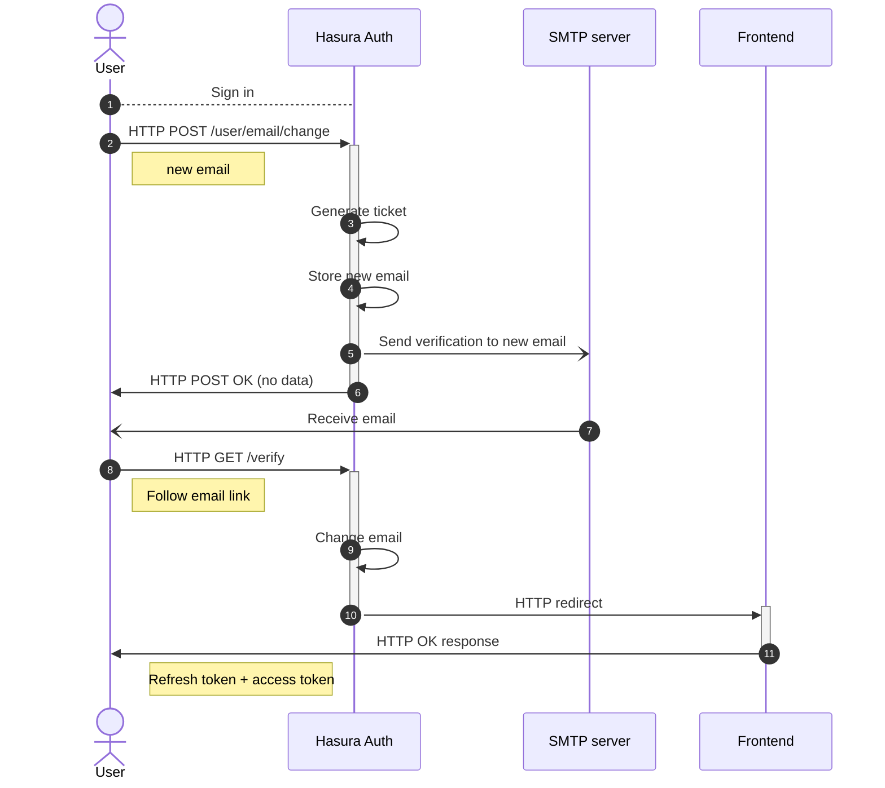

```mermaid
sequenceDiagram
	autonumber
	actor U as User
	participant A as Hasura Auth
	participant E as SMTP server
	participant F as Frontend
	U-->A: Sign in
	U->>+A: HTTP POST /user/email/change
	Note right of U: new email
	A->>A: Generate ticket
	A->>A: Store new email
	A-)E: Send verification to new email
	A->>-U: HTTP POST OK (no data)
	E-)U: Receive email
	U->>+A: HTTP GET /verify
	Note right of U: Follow email link
	A->>A: Change email
	A->>+F: HTTP redirect
	deactivate A
	F->>-U: HTTP OK response
	Note left of A: Refresh token + access token
```
