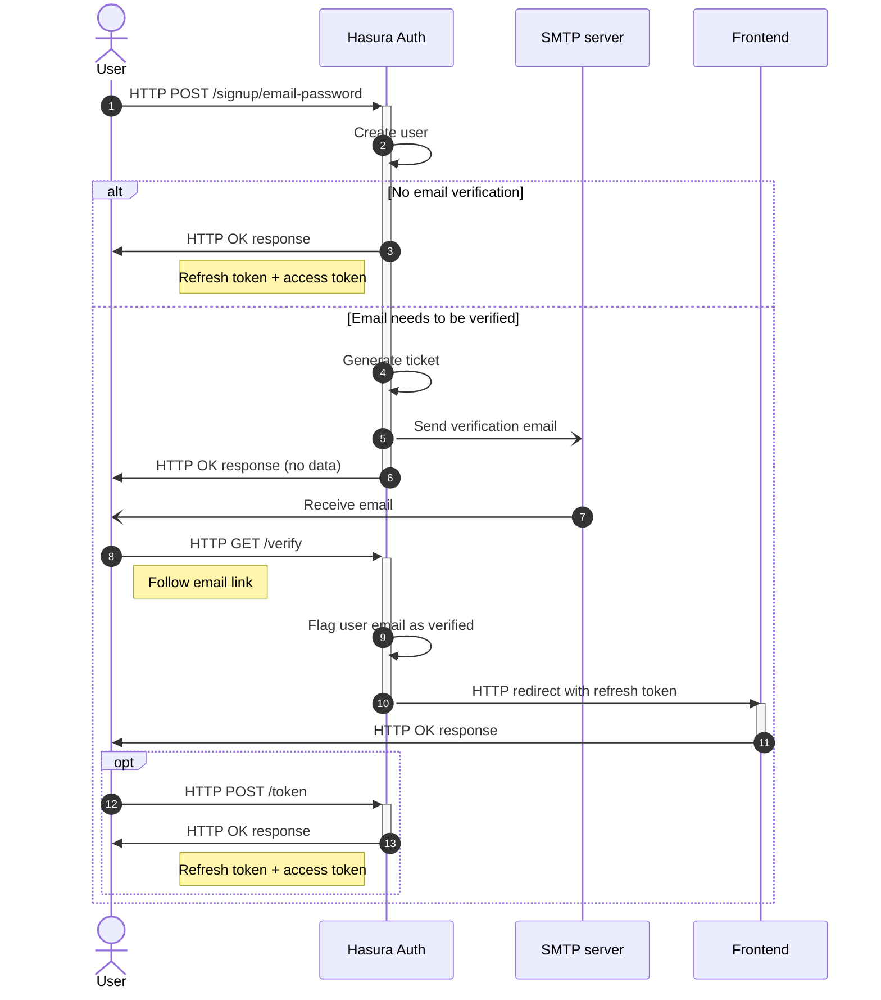
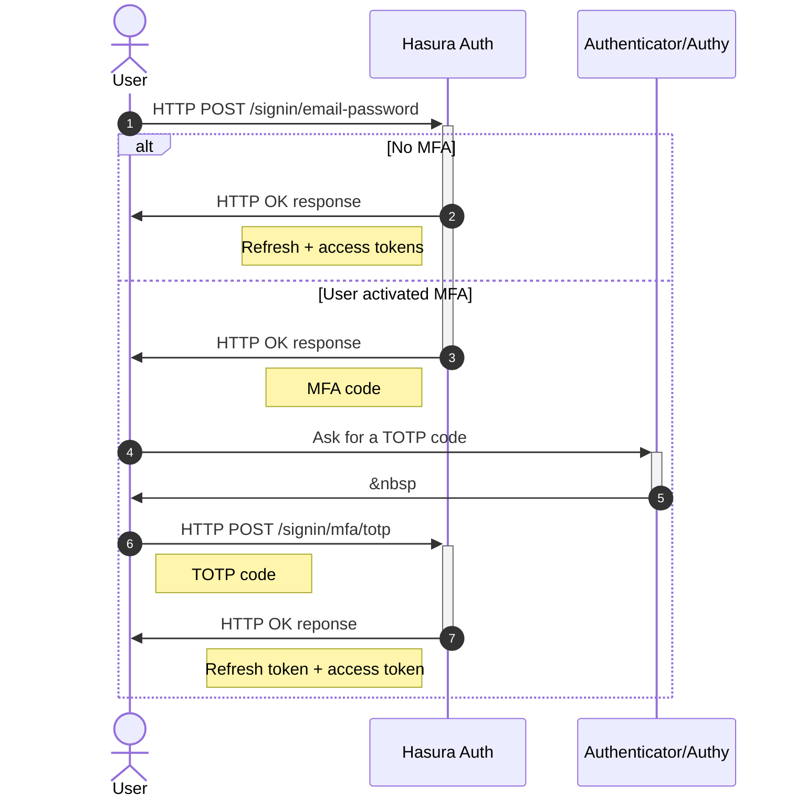
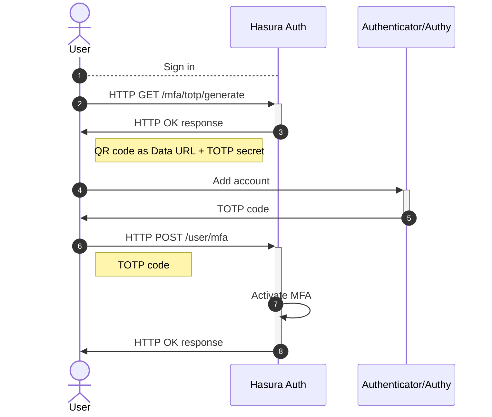

## Sign up

## Sign in

## Activate Multi-Factor Authentication

It is possible to add a step to authentication with email and password authentication. Once users registered, they can activate MFA TOTP:

1. Users generate a QR Code, that is then scanned in an authentication app such as [Authy](https://authy.com/) or [Google Authenticator](https://en.wikipedia.org/wiki/Google_Authenticator).
2. They then send the TOTP code to Hasura Auth. MFA is now activated
3. Next time they authenticate, Hasura Auth will first expect their email and password, but then, instead of completing authentication, Hasura Auth will expect the TOTP in order to return the refresh and the access tokens.

In order for users to be able to activate MFA TOTP, the `AUTH_MFA_ENABLED` environment variable must be set to `true`.

