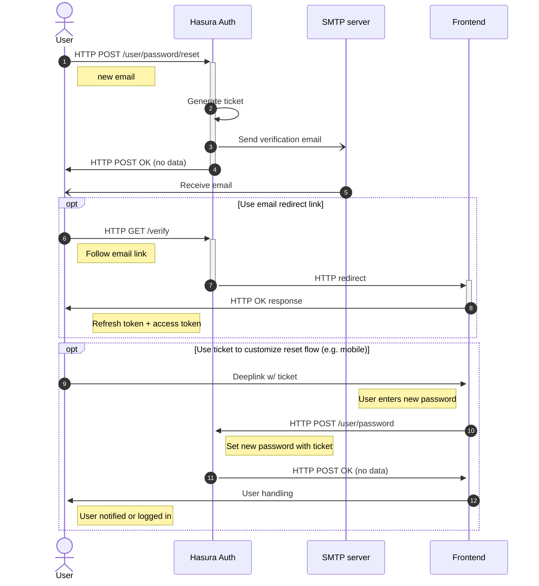

```mermaid
sequenceDiagram
	autonumber
	actor U as User
	participant A as Hasura Auth
	participant E as SMTP server
	participant F as Frontend
	U->>+A: HTTP POST /user/password/reset
	Note right of U: new email
	A->>A: Generate ticket
	A-)E: Send verification email
	A->>-U: HTTP POST OK (no data)
	E-)U: Receive email
        opt Use email redirect link
        	U->>+A: HTTP GET /verify
            Note right of U: Follow email link
            A->>+F: HTTP redirect
            deactivate A
            F->>-U: HTTP OK response
            Note left of A: Refresh token + access token
        end
        opt Use ticket to customize reset flow (e.g. mobile)
            U->>+F: Deeplink w/ ticket
            Note left of F: User enters new password
            F->>+A: HTTP POST /user/password
            Note right of A: Set new password with ticket
            A->>+F: HTTP POST OK (no data)
            F->>+U: User handling
            Note right of U: User notified or logged in
        end
```
