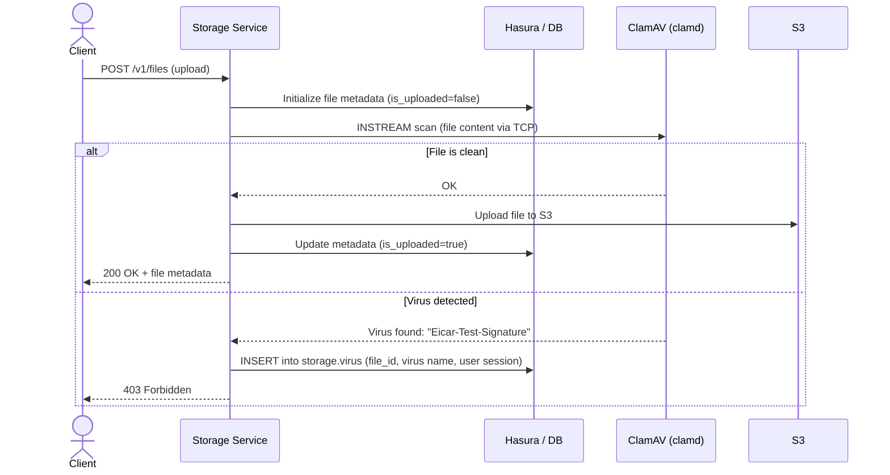

Nhost Storage integrates with [ClamAV](https://www.clamav.net) to scan uploaded files for malware. When enabled, every file is scanned during the upload process before it reaches S3. If a virus is detected, the upload is rejected and the incident is recorded for auditing.

## How It Works

When antivirus is enabled, the upload flow adds a scanning step between metadata initialization and S3 upload:

Key points:

- Scanning happens **before** the file is stored in S3, so infected files never reach your object store
- The client receives a **403 Forbidden** response when a virus is detected
- A record is inserted into the `storage.virus` table with the virus name, file details, and the user's session information

## The `storage.virus` Table

Every virus detection is recorded in the `storage.virus` table:

| Column | Description |
|--------|-------------|
| `id` | Unique record identifier |
| `file_id` | Reference to the file in `storage.files` |
| `filename` | Original uploaded filename |
| `virus` | ClamAV virus signature name (e.g., `Eicar-Test-Signature`) |
| `user_session` | JSONB snapshot of the user's session (user ID, role, claims) |
| `created_at` | Detection timestamp |

:::tip
The `storage.virus` table can be used as a source for [Hasura Event Triggers](https://hasura.io/docs/latest/event-triggers/overview/), allowing you to send alerts, block users, or trigger automated workflows when a virus is detected.
:::

## Setup

1. Deploy a dedicated `clamd` instance using [Nhost Run](/products/run/) with this [one-click install link](https://app.nhost.io:/run-one-click-install?config=eyJuYW1lIjoiY2xhbWF2IiwiaW1hZ2UiOnsiaW1hZ2UiOiJkb2NrZXIuaW8vbmhvc3QvY2xhbWF2OjAuMS4xIn0sImNvbW1hbmQiOltdLCJyZXNvdXJjZXMiOnsiY29tcHV0ZSI6eyJjcHUiOjEwMDAsIm1lbW9yeSI6MjA0OH0sInN0b3JhZ2UiOltdLCJyZXBsaWNhcyI6MX0sImVudmlyb25tZW50IjpbXSwicG9ydHMiOlt7InBvcnQiOiIzMzEwIiwidHlwZSI6InRjcCIsInB1Ymxpc2giOmZhbHNlfV19).

2. Select the project:

3. Click on "Create":

4. Make sure you are running **at least** storage version 0.4.0 and enable the antivirus:

5. Wait for the service to update and try to upload a sample virus file like [eicar](https://www.eicar.org/download-anti-malware-testfile/):

6. If the setup is working the upload should fail:

7. You can verify entries were added to the `virus` table in Hasura:

