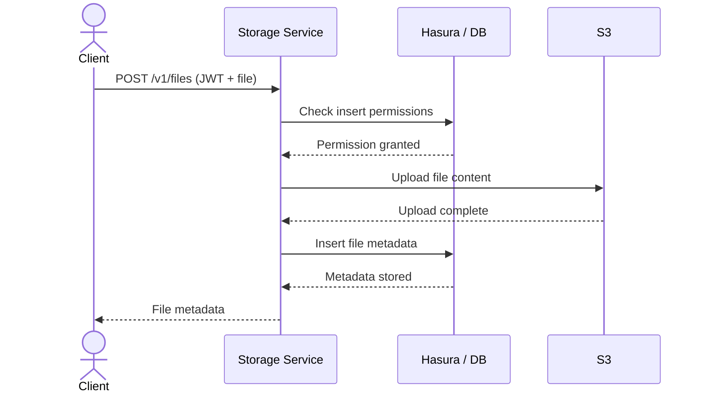
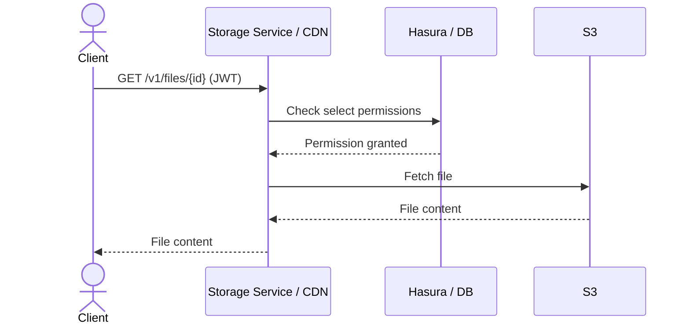

Nhost Storage is a service that sits between your application and an S3-compatible object store. Rather than exposing S3 directly, Storage adds authentication, permission checks, file metadata management, and image processing on top of standard object storage.

## Components

### S3-Compatible Backend

Files are stored in an S3-compatible object store. This is the actual storage layer where file content lives. Nhost manages this for you in the cloud, but the protocol is standard S3, meaning the system works with any S3-compatible provider.

### Storage Service

The Storage service is a Go-based API that handles all file operations. It provides a REST API for uploading, downloading, replacing, and deleting files. When a request comes in, the service:

1. Validates the user's authentication token
2. Checks permissions via the GraphQL API (Hasura)
3. Performs the file operation against S3
4. Manages file metadata in the database

### GraphQL API (Hasura)

File metadata is stored in PostgreSQL in the `storage` schema and exposed through the GraphQL API via Hasura. This gives you:

- **Metadata queries** -- query files and buckets using the full power of GraphQL (filtering, sorting, pagination, relationships)
- **Permission enforcement** -- the same Hasura permission system that protects your application data also protects file access
- **Relationships** -- create GraphQL relationships between your application tables and `storage.files`

### Auth Integration

Storage uses the same JWT tokens issued by [Nhost Auth](/products/auth). When a user makes a request to the Storage API, the service extracts the session information (user ID, role, custom claims) from the JWT and forwards it to Hasura for permission evaluation. No separate authentication is needed.

## Request Flows

### Upload Flow



If [antivirus](/products/storage/antivirus) is enabled, the file is scanned between the S3 upload and the metadata insert. If a virus is detected, the upload is aborted and the file is removed from S3.

### Download Flow



When the [CDN](/products/storage/cdn) is enabled, subsequent requests for the same file are served from the edge cache. For authenticated files, a conditional check is performed to verify permissions without re-fetching the file content.

## Database Schema

Storage uses two main tables in the `storage` schema:

### `storage.buckets`

| Column | Description |
|--------|-------------|
| `id` | Bucket identifier (e.g., `default`, `avatars`) |
| `min_upload_file_size` | Minimum file size in bytes |
| `max_upload_file_size` | Maximum file size in bytes |
| `cache_control` | HTTP Cache-Control header value |
| `presigned_urls_enabled` | Whether pre-signed URLs are allowed |
| `download_expiration` | Pre-signed URL expiration in seconds |

### `storage.files`

| Column | Description |
|--------|-------------|
| `id` | Unique file identifier (UUID) |
| `bucket_id` | Reference to the containing bucket |
| `name` | Original file name |
| `size` | File size in bytes |
| `mime_type` | MIME type (e.g., `image/png`) |
| `etag` | Entity tag for cache validation |
| `uploaded_by_user_id` | The user who uploaded the file |
| `is_uploaded` | Whether the upload completed successfully |
| `metadata` | Custom JSONB metadata |
| `created_at` | Upload timestamp |
| `updated_at` | Last modification timestamp |

:::caution
Do not modify the database schema or GraphQL root fields in the `storage` schema tables. You may add **relationships** and **permissions**.
:::

## Querying File Metadata via GraphQL

Because file metadata lives in Hasura, you can query it like any other table:

```graphql
# List files uploaded by the current user
query MyFiles {
  files(where: { bucketId: { _eq: "personal" } }, order_by: { createdAt: desc }) {
    id
    name
    size
    mimeType
    createdAt
  }
}
```

```graphql
# Create a relationship between your tables and files
# After setting up a relationship:
query CommunitiesWithFiles {
	communities {
    name
    community_files {
      file {
        name
      }
    }
  }
}
```

### Using the SDK

```typescript
// Query all files accessible to the current user
const response = await nhost.graphql.request<{
  files: Array<{ id: string; name: string; size: number; mimeType: string; bucketId: string; uploadedByUserId: string }>
}>({
  query: `query GetFiles {
    files {
      id
      name
      size
      mimeType
      bucketId
      uploadedByUserId
    }
  }`,
})

const files = response.body.data?.files ?? []
```

This integration means you don't need a separate API to search, filter, or paginate files -- it's all handled through the same GraphQL API you use for the rest of your data.
