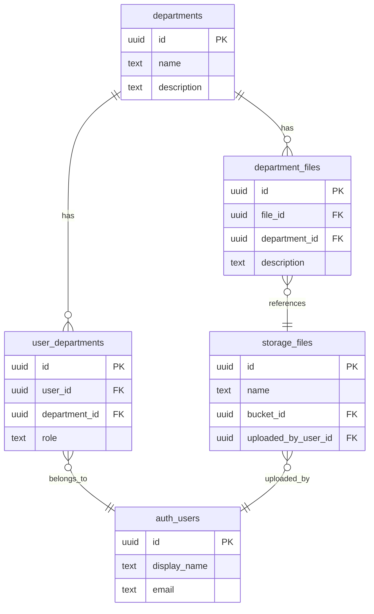

import { Tabs, TabItem } from '@astrojs/starlight/components';


This guide walks through two common file access patterns: **personal files** (users access only their own) and **department files** (shared across a team using a junction table and custom JWT claims). Both patterns build on [Hasura permissions](/products/graphql/permissions) applied to the `storage.files` table.

## Personal Files

The simplest pattern -- users can upload, view, and delete only their own files in a dedicated bucket.

### 1. Create a Bucket

Insert a `personal` bucket into `storage.buckets` (via the Dashboard or a migration):

```sql
INSERT INTO storage.buckets (id)
VALUES ('personal');
```

### 2. Configure Permissions

Set permissions on the `storage.files` table for the `user` role:

<Tabs>
<TabItem label="Insert (Upload)">

| Setting | Value |
|---------|-------|
| Columns | `id`, `bucket_id`, `name`, `size`, `mime_type` |
| Row check | `{"bucket_id": {"_eq": "personal"}}` |
| Column preset | `uploaded_by_user_id` = `X-Hasura-User-Id` |

The column preset automatically tags every upload with the authenticated user's ID.

</TabItem>
<TabItem label="Select (Download)">

| Setting | Value |
|---------|-------|
| Columns | **All** |
| Row check | `{"_and": [{"uploaded_by_user_id": {"_eq": "X-Hasura-User-Id"}}, {"bucket_id": {"_eq": "personal"}}]}` |

</TabItem>
<TabItem label="Delete">

| Setting | Value |
|---------|-------|
| Row check | `{"_and": [{"uploaded_by_user_id": {"_eq": "X-Hasura-User-Id"}}, {"bucket_id": {"_eq": "personal"}}]}` |

</TabItem>
</Tabs>

### 3. Upload and Query Files

```typescript
// Upload a file to the personal bucket
const { body } = await nhost.storage.uploadFiles({
  'bucket-id': 'personal',
  'file[]': [file],
})

const uploadedFile = body.processedFiles?.[0]
```

Because metadata lives in Hasura, you can query files via GraphQL -- permissions are applied automatically:

```typescript
const response = await nhost.graphql.request<{
  files: Array<{ id: string; name: string; size: number; mimeType: string; createdAt: string }>
}>({
  query: `query MyFiles {
    files(where: { bucketId: { _eq: "personal" } }, order_by: { createdAt: desc }) {
      id
      name
      size
      mimeType
      createdAt
    }
  }`,
})

// Only returns files uploaded by the current user (enforced by permissions)
const files = response.body.data?.files ?? []
```

---

## Department Files

A more advanced pattern where files are shared with teams. Files are uploaded to storage, then associated with departments through a junction table. Access is controlled using custom JWT claims that contain the user's department memberships.

### Architecture



### 1. Create the Schema

Set up departments, membership, and the file junction table:

```sql
-- Departments
CREATE TABLE public.departments (
    id UUID PRIMARY KEY DEFAULT gen_random_uuid(),
    name TEXT NOT NULL UNIQUE,
    description TEXT,
    created_at TIMESTAMPTZ NOT NULL DEFAULT now(),
    updated_at TIMESTAMPTZ NOT NULL DEFAULT now()
);

-- Department membership (users belong to departments with a role)
CREATE TABLE public.user_departments (
    id UUID PRIMARY KEY DEFAULT gen_random_uuid(),
    user_id UUID NOT NULL REFERENCES auth.users(id) ON DELETE CASCADE,
    department_id UUID NOT NULL REFERENCES public.departments(id) ON DELETE CASCADE,
    role TEXT NOT NULL DEFAULT 'member',
    joined_at TIMESTAMPTZ NOT NULL DEFAULT now(),
    UNIQUE(user_id, department_id)
);

-- Junction table linking files to departments
CREATE TABLE public.department_files (
    id UUID PRIMARY KEY DEFAULT gen_random_uuid(),
    file_id UUID NOT NULL REFERENCES storage.files(id) ON DELETE CASCADE,
    department_id UUID NOT NULL REFERENCES public.departments(id) ON DELETE CASCADE,
    description TEXT
);
```

Track all three tables and their foreign key relationships in Hasura so they appear in the GraphQL API.

### 2. Configure Custom JWT Claims

Add a custom claim so the user's JWT includes their department IDs. In `nhost.toml`:

```toml
[[auth.session.accessToken.customClaims]]
key = 'departments'
value = 'departments[*].department.id'
```

This produces a claim `X-Hasura-Departments` containing a PostgreSQL array of department UUIDs, e.g. `{uuid1,uuid2}`. You can then use this claim in Hasura permission rules. See [Permission Variables](/products/graphql/permissions#permission-variables) for details.

### 3. Configure Relationships in Hasura

Add a relationship from `storage.files` to `department_files` so you can navigate from files to their department associations in GraphQL:

- On the `storage.files` table, add an **array relationship** named `department_files` using the `file_id` foreign key on `public.department_files`
- On the `public.department_files` table, add **object relationships** named `file` (to `storage.files` via `file_id`) and `department` (to `public.departments` via `department_id`)

### 4. Configure Permissions

#### `storage.files` permissions (user role)

<Tabs>
<TabItem label="Insert (Upload)">

Users can upload to the `default` bucket. The uploader is automatically recorded:

| Setting | Value |
|---------|-------|
| Columns | `id`, `bucket_id`, `name`, `size`, `mime_type` |
| Row check | `{"bucket_id": {"_eq": "default"}}` |
| Column preset | `uploaded_by_user_id` = `X-Hasura-User-Id` |

</TabItem>
<TabItem label="Select (Download)">

Users can see files that belong to their departments (via the junction table):

| Setting | Value |
|---------|-------|
| Columns | **All** |
| Row check | `{"department_files": {"department_id": {"_in": "X-Hasura-Departments"}}}` |

This uses the relationship to check if any `department_files` row links this file to one of the user's departments.

</TabItem>
<TabItem label="Delete">

Users can delete files they uploaded OR files in their departments:

| Setting | Value |
|---------|-------|
| Row check | `{"_or": [{"uploaded_by_user_id": {"_eq": "X-Hasura-User-Id"}}, {"department_files": {"department_id": {"_in": "X-Hasura-Departments"}}}]}` |

</TabItem>
</Tabs>

#### `department_files` permissions (user role)

<Tabs>
<TabItem label="Insert">

Users can assign files to departments they belong to:

| Setting | Value |
|---------|-------|
| Columns | `file_id`, `department_id` |
| Row check | `{"department_id": {"_in": "X-Hasura-Departments"}}` |

</TabItem>
<TabItem label="Select">

Users can see file-department associations for their departments:

| Setting | Value |
|---------|-------|
| Columns | **All** |
| Row check | `{"department_id": {"_in": "X-Hasura-Departments"}}` |

</TabItem>
<TabItem label="Delete">

Users can remove file-department associations for their departments:

| Setting | Value |
|---------|-------|
| Row check | `{"department_id": {"_in": "X-Hasura-Departments"}}` |

</TabItem>
</Tabs>

### 5. Upload and Assign to a Department

```typescript
// 1. Upload the file
const { body } = await nhost.storage.uploadFiles({
  'bucket-id': 'default',
  'file[]': [file],
})

const uploadedFile = body.processedFiles?.[0]
if (!uploadedFile) throw new Error('Upload failed')

// 2. Associate the file with a department
await nhost.graphql.request({
  query: `mutation AddDepartmentFile($fileId: uuid!, $departmentId: uuid!) {
    insert_department_files(objects: [{ file_id: $fileId, department_id: $departmentId }]) {
      affected_rows
    }
  }`,
  variables: {
    fileId: uploadedFile.id,
    departmentId: 'engineering-dept-uuid',
  },
})
```

### 6. Query Department Files

```typescript
// Fetch all files shared with the user's departments
const response = await nhost.graphql.request<{
  department_files: Array<{
    id: string
    department: { id: string; name: string }
    file: { id: string; name: string; size: number; mimeType: string; createdAt: string }
  }>
}>({
  query: `query GetDepartmentFiles {
    department_files {
      id
      department {
        id
        name
      }
      file {
        id
        name
        size
        mimeType
        createdAt
        uploadedByUserId
      }
    }
  }`,
})

// Permissions automatically filter to the user's departments
const departmentFiles = response.body.data?.department_files ?? []
```

You can also navigate from a department to its files:

```graphql
query GetDepartmentWithFiles($deptId: uuid!) {
  departments_by_pk(id: $deptId) {
    id
    name
    files {
      file {
        id
        name
        size
        mimeType
      }
    }
  }
}
```

### 7. Remove a File from a Department

```typescript
await nhost.graphql.request({
  query: `mutation RemoveDepartmentFile($fileId: uuid!, $departmentId: uuid!) {
    delete_department_files(
      where: { file_id: { _eq: $fileId }, department_id: { _eq: $departmentId } }
    ) {
      affected_rows
    }
  }`,
  variables: {
    fileId: 'file-uuid',
    departmentId: 'dept-uuid',
  },
})
```

This removes the association but does not delete the file itself. To delete the file from storage entirely:

```typescript
await nhost.storage.deleteFile(fileId)
```

The `ON DELETE CASCADE` on `department_files.file_id` automatically removes all department associations when the file is deleted.
