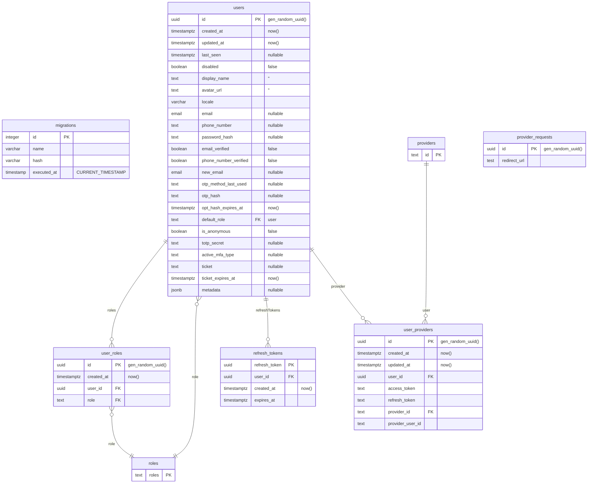

Hasura Auth stores all its data in a dedicated `auth` PostgreSQL schema. It is created or updated when Hasura Auth starts.

## Extending user data

Adding columns to the user tables may be tempting. However, all the tables and columns have a specific purpose, and changing the structure of the `auth` schema will very likely end in breaking the functionning of Hasura Auth.

There are two recommended ways of extending user information:

- to store information in the `auth.users.metadata` column
- to store information in a separate table located in the `public` PostgreSQL schema, and to point to `auth.users.id` through a foreign key.

### The `auth.users.metadata` column

### User information in the `public` schema
