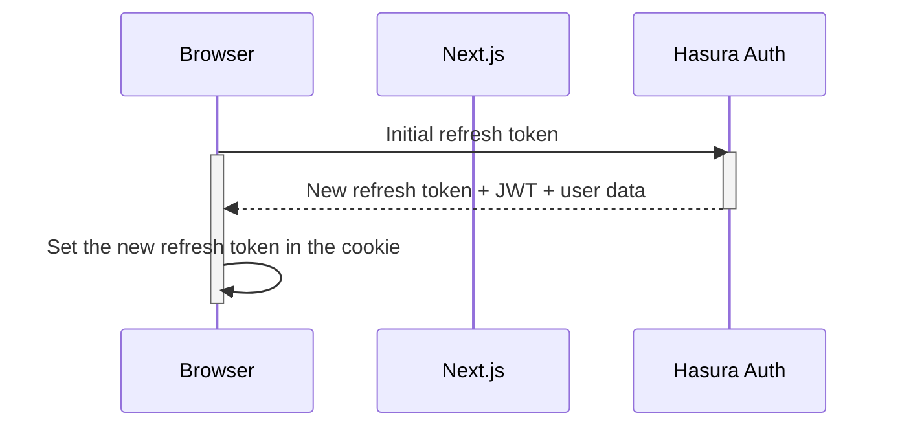
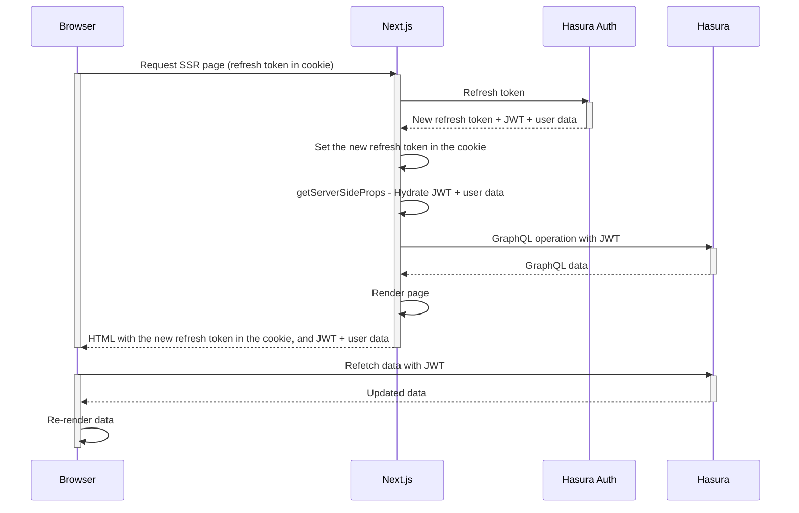
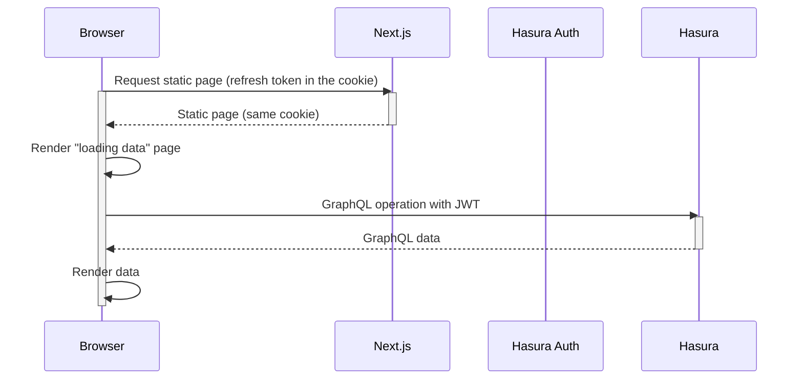

When rendering a page from the server-side, Next.js needs to get some information from the client to determine their authentication status. Such communication is only available from cookies, and the Nhost client is designed to enable such a mechanism.

The cookie is `same-site` and is used only to store the refresh cookie and the expiration date of the JWT so the browser can proactively ask for a new JWT before it expires.

## Signing in

There is no need to activate SSR on the sign-in page as there is no session information to capture. As a result, it is recommended to code it as a classic static page.

The initial authentication would then work like this diagram:

## Refreshing the JWT token

For security considerations, the Nhost clients never persist the JWT anywhere in the browser either in `localStorage` or in a cookie, and the JWT expires regularly (15 minutes by default). As a result, the Nhost client regularly calls the `hasura-auth` service to get a new JWT from a valid refresh token. The new JWT is emitted together with a new refresh token, while the old one is invalidated.
As a result, it is important to ensure both the browser and the Next.js will always use the last refresh token, as it will be the only one that is still valid.
The above diagram illustrates how a JWT is renewed, while making sure the refresh token is updated:

## Loading a SSR page

When Nhost is activated on a specific page, the Next.js server will first check the refresh token in the cookie. If it is present, it will call the `hasura-auth` service to refresh the JWT, user data and the new refresh cookie.
It then:

- sets the new refresh cookie in the response headers
- hydrates the page with user data and JWT
- renders the page on the server side. At this stage, an authenticated GraphQL call can be done on the server-side as a valid JWT is available

Once the SSR page is loaded, it is still possible to refetch data from Hasura as the JWT will then be available in the browser, and kept up to date as explained in the above diagram.

## Loading a static page

It is still possible to use the Nhost SDK in a more classic 'React' mode. It will then be handled in a very similar way, except that the refresh token will be stored in the cookie instead of `localStorage`.

