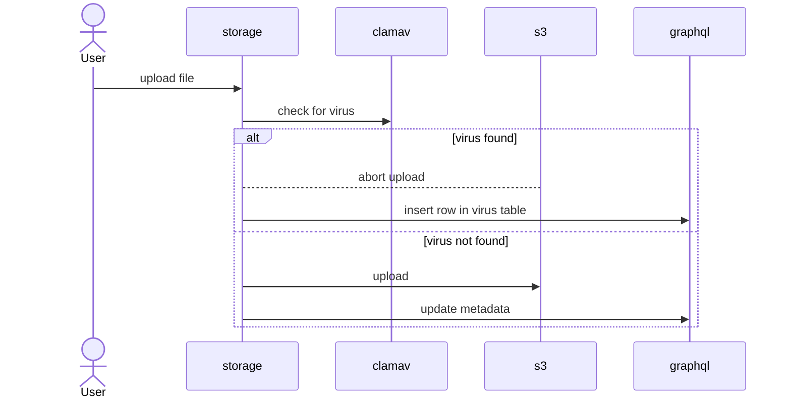

import Tabs from '@theme/Tabs'
import TabItem from '@theme/TabItem'

Integration with [clamav](https://www.clamav.net) antivirus relies on an external [clamd](https://docs.clamav.net/manual/Usage/Scanning.html#clamd) service. When a file is uploaded `hasura-storage` will create the file metadata first and then check if the file is clean with `clamd` via its TCP socket. If the file is clean the rest of the process will continue as usual. If a virus is found details about the virus will be added to the `virus` table and the rest of the process will be aborted.

To enable the antivirus you need to follow the next steps:

1. Deploy using [Nhost Run](/run) a dedicated instance of `clamd` with this [one-click install link](https://app.nhost.io:/run-one-click-install?config=eyJuYW1lIjoiY2xhbWF2IiwiaW1hZ2UiOnsiaW1hZ2UiOiJkb2NrZXIuaW8vbmhvc3QvY2xhbWF2OjAuMS4xIn0sImNvbW1hbmQiOltdLCJyZXNvdXJjZXMiOnsiY29tcHV0ZSI6eyJjcHUiOjEwMDAsIm1lbW9yeSI6MjA0OH0sInN0b3JhZ2UiOltdLCJyZXBsaWNhcyI6MX0sImVudmlyb25tZW50IjpbXSwicG9ydHMiOlt7InBvcnQiOiIzMzEwIiwidHlwZSI6InRjcCIsInB1Ymxpc2giOmZhbHNlfV19).
2. Select the project:

3. Click on "Create":

4. Make sure you are running **at least** storage version 0.4.0 and enable the antivirus:

5. Wait for the service to update and try to upload a sample virus file like [eicar](https://www.eicar.org/download-anti-malware-testfile/)

6. If the setup is working the upload should fail

7. You can also head to hasura and verify entries were added to the `virus` table:

That entry should have useful information about like the filename, the virus found and the user session. In addition, the information on that table can be used a source for events.
