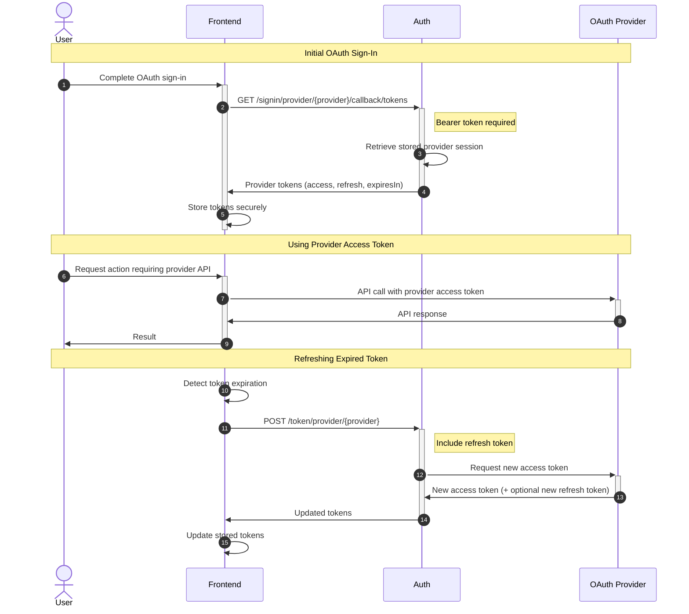

When users authenticate with OAuth providers through Nhost, you can access the provider's access and refresh tokens. This enables your application to make API calls directly to external services (like Google Drive, GitHub repositories, or Spotify playlists) on behalf of your users.

## How Provider Token Management Works

After a user completes OAuth authentication, you can retrieve and manage the provider's tokens to interact with their external accounts:



### The Token Flow

1. **OAuth Completion**: After the user successfully authenticates with an OAuth provider, they are redirected back to your application

2. **Token Retrieval**: Your frontend immediately calls `/signin/provider/{provider}/callback/tokens` with the user's Nhost authentication token to retrieve the provider's tokens

3. **Secure Storage**: The provider's access token, refresh token, and expiration time are stored securely in your application

4. **Provider API Calls**: Your application uses the provider's access token to make API calls to the external service on behalf of the user

5. **Token Refresh**: When the access token expires, your application uses the refresh token to obtain a new access token without requiring the user to re-authenticate

## Retrieving Provider Tokens

After a successful OAuth sign-in, retrieve the provider's session to access their tokens.

```javascript
import { createClient } from '@nhost/nhost-js'

const nhost = createClient({
  subdomain: 'myapp',
  region: 'us-east-1'
})

// Immediately after OAuth callback completes
const resp = await nhost.auth.getProviderTokens('google')

// Store tokens securely
localStorage.setItem('google_access_token', resp.body.accessToken)
if (resp.body.refreshToken) {
  localStorage.setItem('google_refresh_token', resp.body.refreshToken)
}

// Use provider token to call Google APIs
const userInfo = await fetch('https://www.googleapis.com/oauth2/v2/userinfo', {
  headers: {
    'Authorization': `Bearer ${resp.body.accessToken}`
  }
})
```

**Important Notes:**
- This method must be called **immediately** after the OAuth callback completes
- The provider session is stored temporarily and is cleared during this call
- Subsequent calls will fail without re-authenticating with the provider
- Requires the user to be authenticated with Nhost

## Refreshing Provider Tokens

Provider access tokens typically expire after a short period (often 1 hour). Use the refresh token to obtain a new access token without user interaction.

```javascript
import { createClient } from '@nhost/nhost-js'

const nhost = createClient({
  subdomain: 'myapp',
  region: 'us-east-1'
})

// Retrieve stored refresh token
const storedRefreshToken = localStorage.getItem('google_refresh_token')

// Refresh the provider tokens
const resp = await nhost.auth.refreshProviderToken('google', {
  refreshToken: storedRefreshToken
})

// Update stored tokens
localStorage.setItem('google_access_token', resp.body.accessToken)
if (resp.body.refreshToken) {
  // Some providers rotate refresh tokens
  localStorage.setItem('google_refresh_token', resp.body.refreshToken)
}
```

**Important Notes:**
- Some providers (like Google) rotate refresh tokens, returning a new one in the response
- Always update your stored refresh token with the new value if provided
- Token refresh can fail if the user revokes access or the refresh token expires
- Handle these cases by prompting the user to re-authenticate

## Best Practices

**Immediate Retrieval** - Call the tokens endpoint immediately after OAuth callback to prevent session loss

**Secure Storage** - Store provider tokens in secure storage appropriate for your platform (encrypted storage for mobile, httpOnly cookies or secure localStorage for web)

**Proactive Refresh** - Use the `expiresIn` value to refresh tokens before they expire, preventing API call failures

**Handle Rotation** - Always update your stored refresh token when a new one is returned, as some providers invalidate old refresh tokens

**Graceful Errors** - Handle token refresh failures by prompting users to re-authenticate, as they may have revoked access through the provider's settings

**Token Isolation** - Store tokens per provider and per user to support multiple OAuth connections
