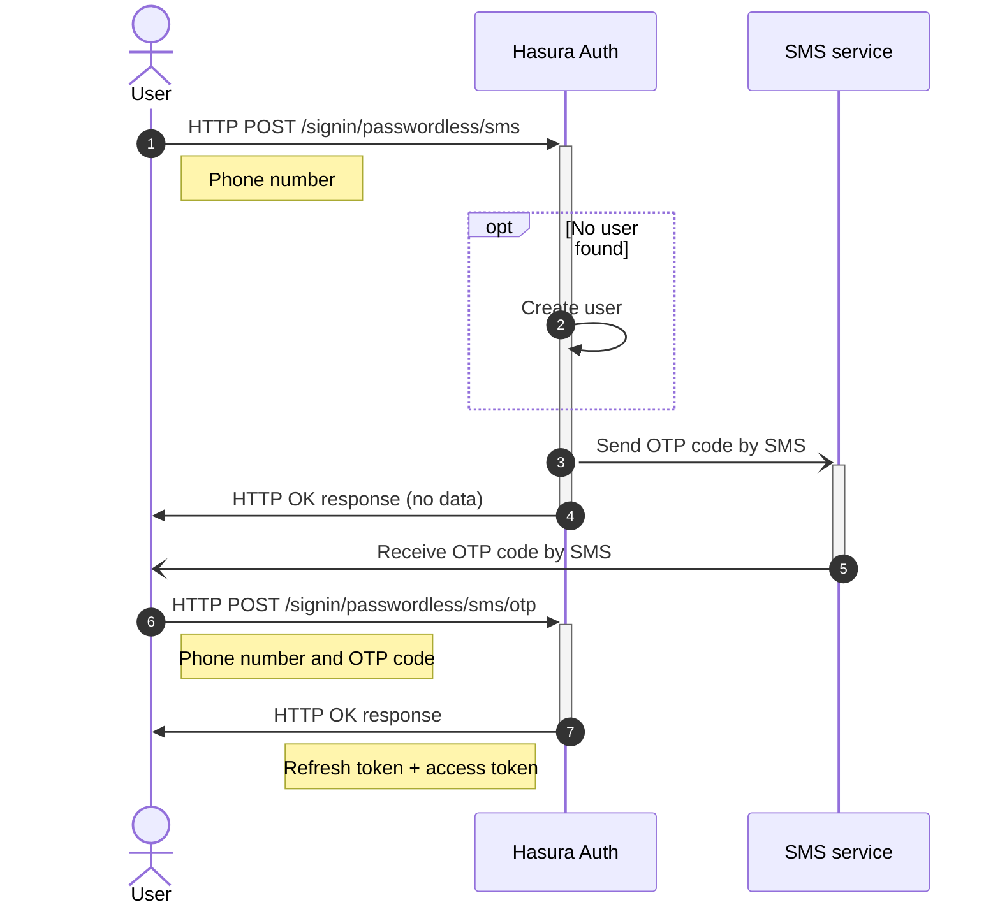

## Test phone numbers

Environmental variable `AUTH_SMS_TEST_PHONE_NUMBERS` can be set with a comma separated test phone numbers. When sign in
is invoked the the SMS message with the verification code will be available in the logs. This way you can also test your SMS templates.
