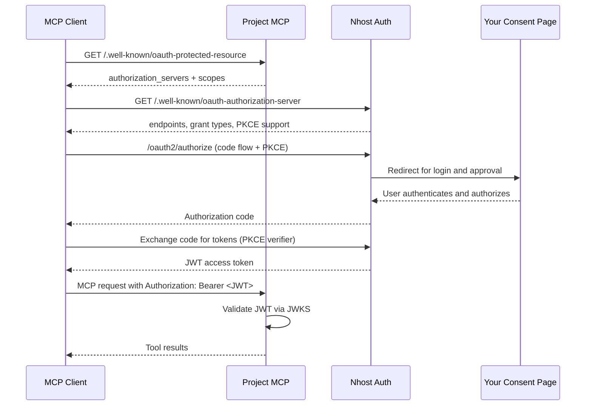

import { Steps } from '@astrojs/starlight/components';

The Project MCP server integrates with Nhost Auth as an [OAuth2 authorization server](/products/auth/oauth2-provider), following the [MCP Authorization specification](https://modelcontextprotocol.io/specification/2025-03-26/basic/authorization). Any MCP client that supports OAuth2 can authenticate against your Nhost project automatically — you do not register clients by hand.

## Prerequisites

Before the flow works end to end, your Nhost Auth project needs:

<Steps>

1. **The OAuth2 provider enabled**

   Project MCP relies on Nhost Auth acting as an OAuth2 authorization server. Enable it and configure an RSA signing key. See [OAuth2 / OIDC Provider](/products/auth/oauth2-provider).

2. **CIMD enabled**

   MCP clients register themselves dynamically using a [Client ID Metadata Document (CIMD)](/products/auth/oauth2-provider/cimd-clients) rather than a pre-created client ID and secret. This must be enabled for the flow to work.

   ```toml
   [auth.oauth2Provider.clientIdMetadataDocument]
   enabled = true
   ```

3. **A consent page**

   OAuth2 requires a page where the user approves the client's access request. You build this page as part of your application's auth flow. See [what you build: the consent page](/products/auth/oauth2-provider/authorization-flow).

</Steps>

## The flow



<Steps>

1. The MCP client discovers authentication requirements by fetching `/.well-known/oauth-protected-resource` from Project MCP.
2. It reads the authorization server metadata and redirects the user to the Nhost Auth authorization endpoint, using the authorization code flow with PKCE.
3. The user logs in and approves the request on your consent page.
4. The client exchanges the authorization code for a JWT access token.
5. Every subsequent MCP request carries the JWT as a `Bearer` token.
6. Project MCP validates the JWT and forwards it to GraphQL, which enforces permissions based on the token's claims.

</Steps>

## Discovery endpoints

Project MCP serves two well-known documents that let clients bootstrap the flow without manual configuration.

### `/.well-known/oauth-protected-resource`

Describes Project MCP as a protected resource and points to the authorization server.

```json
{
  "resource": "https://mcp.acme.com",
  "authorization_servers": ["https://SUBDOMAIN.auth.REGION.nhost.run/v1"],
  "scopes_supported": ["openid", "graphql"]
}
```

`resource` is derived from the request's scheme and host. When Project MCP runs behind a proxy or load balancer, the scheme is taken from the `X-Forwarded-Proto` header.

### `/.well-known/oauth-authorization-server`

Mirrors the metadata of your Nhost Auth OAuth2 server so clients can find the authorization and token endpoints.

```json
{
  "issuer": "https://SUBDOMAIN.auth.REGION.nhost.run/v1",
  "jwks_uri": "https://SUBDOMAIN.auth.REGION.nhost.run/v1/.well-known/jwks.json",
  "authorization_endpoint": "https://SUBDOMAIN.auth.REGION.nhost.run/v1/oauth2/authorize",
  "token_endpoint": "https://SUBDOMAIN.auth.REGION.nhost.run/v1/oauth2/token",
  "scopes_supported": ["openid", "graphql"],
  "response_types_supported": ["code"],
  "grant_types_supported": ["authorization_code", "refresh_token"],
  "token_endpoint_auth_methods_supported": ["none"],
  "code_challenge_methods_supported": ["S256"],
  "client_id_metadata_document_supported": true
}
```

Notable values:

- `token_endpoint_auth_methods_supported` is `["none"]` — clients are public and use PKCE instead of a client secret.
- `code_challenge_methods_supported` is `["S256"]` — PKCE with SHA-256 is required.
- `client_id_metadata_document_supported` is `true` — clients register via CIMD.

## Scopes

The scopes advertised in the discovery documents depend on whether you enforce a role:

| Configuration | Scopes advertised |
|---------------|-------------------|
| No `--enforce-role` | `openid`, `graphql` |
| `--enforce-role=user_mcp` | `openid`, `graphql:role:user_mcp` |

The `graphql:role:<role>` scope requests a token whose default Hasura role is `<role>`. See [Roles & permissions](/products/ai/mcp/permissions) for how enforcement works.

## JWT validation

On each request Project MCP:

<Steps>

1. Reads the `Authorization: Bearer <token>` header. A missing or malformed header results in `401 Unauthorized`.
2. Fetches the signing keys from `<auth-url>/.well-known/jwks.json` (JWKS) and validates the token's signature.
3. Checks that the token's issuer matches the configured auth URL, that it has not expired, and that it carries an issued-at claim.
4. Forwards the same `Authorization` header to every downstream GraphQL request, so Hasura enforces permissions from the token's claims.

</Steps>

### The `WWW-Authenticate` challenge

When a request is unauthorized, Project MCP returns a `401` with a `WWW-Authenticate` header that points clients back to the resource metadata, so they can (re)start the flow:

```http
WWW-Authenticate: Bearer realm="https://mcp.acme.com", resource_metadata="https://mcp.acme.com/.well-known/oauth-protected-resource"
```

The `realm` value comes from the `--realm` flag. Set it to the public URL of your Project MCP server.

## Next steps

- [Roles & permissions](/products/ai/mcp/permissions) — restrict what the assistant can do with a dedicated role.
- [Connecting clients](/products/ai/mcp/clients) — point Claude, Cursor, and others at Project MCP.
