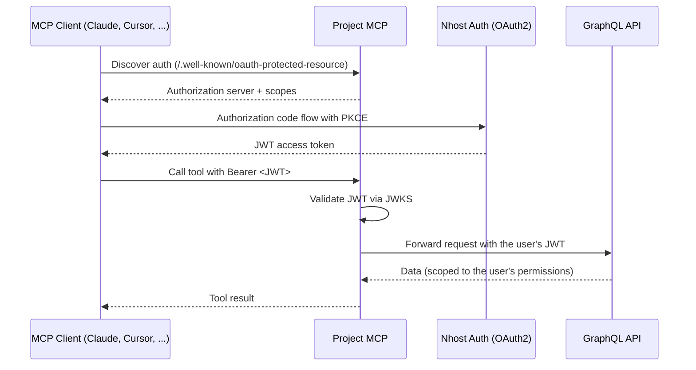

import { Card, CardGroup } from '@components';

The Project MCP server gives any Nhost project an agentic interface: it exposes your GraphQL API as an [MCP](https://modelcontextprotocol.io/) server, so assistants like Claude, Cursor, or any MCP-compatible client can query and mutate your data on behalf of your users.

You deploy it alongside your project. Any MCP client can then connect, authenticate through your existing Nhost Auth setup, and work with your data within the permissions you have already defined. No custom integration code is required.

## Why use it

AI assistants are becoming an interface layer for applications. Instead of navigating dashboards and forms, users increasingly want to interact with their data in natural language. Project MCP lets you offer that experience on top of a backend you already have:

- **Let your users talk to their data** — expose your project to any MCP-compatible assistant so users can ask questions and take actions in natural language.
- **Reuse your permission model** — every request runs as the authenticated user, so your existing row-level and column-level permissions apply unchanged.
- **No glue code** — the assistant discovers the available tools and your schema through the MCP protocol; you do not write per-tool integrations.
- **Open source** — Project MCP is a small Go binary you can read, extend, and self-host. The [source lives in the monorepo](https://github.com/nhost/nhost/tree/main/services/mcp).

## How it works

Project MCP sits between the AI assistant and your project's GraphQL API. It authenticates each request through your Nhost Auth OAuth2 provider, then forwards the user's JWT to GraphQL so your permissions are enforced downstream.

The assistant discovers the tools automatically, learns your data model from the schema, and then queries and mutates data as the authenticated user.

## Project MCP vs. [CLI MCP](/platform/cli/mcp)

Nhost offers two MCP servers for different jobs:

| | **Project MCP** | **CLI MCP** |
|---|---|---|
| When to use | Ship an AI interface to your app's users | Build and manage your project with AI |
| Where it runs | Deployed with your project, on Nhost Run | Locally, via `nhost mcp start` |
| Who it runs as | Each end user, through OAuth2 | You (admin secret or PAT) |
| Available tools | `get-schema`, `graphql-query`, `graphql-mutation` | `get-schema`, `graphql-query`, `manage-graphql`, `cloud-graphql-query`, `search` |

:::note
`get-schema` and `graphql-query` appear in Project MCP and CLI MCP, but each server runs them as a different identity, so the same request returns different results.

So for example, if you asked an assistant to *"list every order"*, the Project MCP would only return specifically the current user's orders, while CLI MCP, if run as an admin, would return all of the orders in the project.
:::

## Tools

Project MCP exposes three tools:

| Tool | What it does | Read-only |
|------|--------------|-----------|
| `get-schema` | Introspects the GraphQL schema. Returns a summary of available operations, or the full SDL for the queries and mutations you name. | Yes |
| `graphql-query` | Executes a read-only GraphQL query. Mutations are rejected. | Yes |
| `graphql-mutation` | Executes a GraphQL mutation to create, update, or delete data. Queries are rejected. | No |

Subscriptions are not supported. An assistant typically calls `get-schema` first to understand your data model, then uses `graphql-query` and `graphql-mutation` to work with it.

## Access control

Every request runs as the authenticated user. Project MCP validates the incoming JWT and forwards it to GraphQL, so the API enforces the same permissions that apply to that user everywhere else. The assistant can only read and write what the user is allowed to.

You can tighten this further with a dedicated role. Setting the `--enforce-role` flag (for example `user_mcp`) makes Project MCP accept only tokens issued with that default role, so you can give AI access a narrower permission set than a user's normal role — read-only on certain tables, restricted columns, whatever fits your use case. See [Roles & permissions](/products/ai/mcp/permissions).

## Next steps

<CardGroup cols={2}>
  <Card title="Authentication" icon="shield-check" href="/products/ai/mcp/authentication">
    Understand the OAuth2 flow, CIMD, and the consent page.
  </Card>
  <Card title="Deployment" icon="rocket-launch" href="/products/ai/mcp/deployment">
    Deploy Project MCP to Nhost Run and run it locally.
  </Card>
  <Card title="Roles & Permissions" icon="key" href="/products/ai/mcp/permissions">
    Enforce a dedicated role and follow security best practices.
  </Card>
  <Card title="Configuration" icon="gear" href="/products/ai/mcp/configuration">
    Every flag and environment variable, with defaults.
  </Card>
  <Card title="Connecting Clients" icon="plug" href="/products/ai/mcp/clients">
    Connect Claude, Cursor, and other MCP clients.
  </Card>
</CardGroup>
