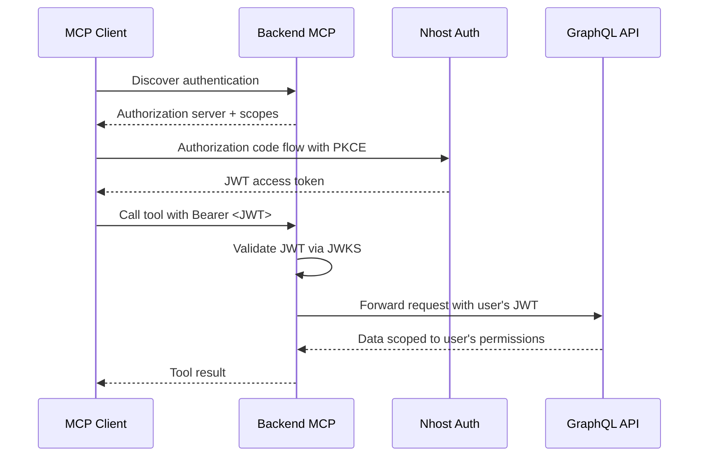

import { Card, CardGroup, Example, Prompt } from '@components';

The Backend MCP Server gives your Nhost backend an MCP interface. It exposes your GraphQL API as tools that assistants such as [Claude](/products/ai/mcp/clients/claude), [Cursor](/products/ai/mcp/clients/cursor), and other [MCP](https://modelcontextprotocol.io/) clients can use to query and mutate data.

Users authenticate through Nhost Auth, and every GraphQL operation runs with that user's existing permissions.

<Example label="Example 1">

A user could connect Claude to your application and ask:

<Prompt>
Which of my orders are still awaiting shipment?
</Prompt>

The assistant can inspect the available GraphQL schema, generate the appropriate query, and return only the orders that user is allowed to access.

</Example>

<Example label="Example 2">

Or, if you grant the appropriate mutation permissions, that same user could ask:

<Prompt>
Cancel order #123.
</Prompt>

The assistant can execute the corresponding mutation on the user's behalf.

</Example>

You deploy the Backend MCP Server alongside your project, typically using [Nhost Run](/products/run). You don't need to build individual MCP tools or write custom GraphQL integration code.

## Why use it

Backend MCP lets your users interact with your application through MCP-compatible AI assistants while keeping your existing backend and permission model.

- **Natural-language access to your application** — users can query data and perform actions through assistants such as Claude or Cursor.
- **Reuse your GraphQL API** — your existing API schema automatically becomes available to the assistant.
- **Reuse your permission model** — every request runs as the authenticated user, so your existing row-level and column-level permissions continue to apply.
- **No per-tool integrations** — the assistant discovers the available tools and GraphQL schema through MCP instead of requiring you to implement a separate tool for every operation.
- **Control how assistants use your backend** — provide application-specific instructions and optionally enforce a dedicated GraphQL role for AI access.
- **Open source** — Backend MCP is a small Go service that you can inspect, extend, and self-host. The [source lives in the monorepo](https://github.com/nhost/nhost/tree/main/services/mcp).

## How it works

The Backend MCP Server sits between an MCP client and your project's GraphQL API.

When a user connects an MCP client:

1. The client discovers the authentication requirements exposed by Backend MCP.
2. The user authenticates through your Nhost Auth OAuth2 provider.
3. The client receives a JWT access token for that user.
4. Backend MCP validates the JWT and forwards it with GraphQL requests.
5. The GraphQL engine applies the permissions associated with that user and role.
6. The result is returned to the assistant.


```mermaid
sequenceDiagram
    participant Client as MCP Client
    participant MCP as Backend MCP
    participant Auth as Nhost Auth
    participant GraphQL as GraphQL API

    Client->>MCP: Discover authentication
    MCP-->>Client: Authorization server + scopes

    Client->>Auth: Authorization code flow with PKCE
    Auth-->>Client: JWT access token

    Client->>MCP: Call tool with Bearer <JWT>
    MCP->>MCP: Validate JWT via JWKS
    MCP->>GraphQL: Forward request with user's JWT
    GraphQL-->>MCP: Data scoped to user's permissions
    MCP-->>Client: Tool result
```

The assistant discovers the available tools automatically and can inspect your GraphQL schema to understand which queries and mutations are available.

You can also provide application-specific context using `MCP_INSTRUCTIONS`. For example:

```text
This application manages customer orders. Never cancel an order without first
confirming the order number and current status with the user.
```

These instructions help the assistant understand how your application should be used. GraphQL permissions remain the security boundary for what it is actually allowed to do. You can also override the description of each individual tool — see [Configuration](/products/ai/mcp/configuration#mcp-instructions).

## Backend MCP vs. CLI MCP

Nhost provides two MCP servers for different use cases:

| | **Backend MCP** | **[CLI MCP](/platform/cli/mcp)** |
|---|---|---|
| **Use it for** | Giving your application's users an AI interface | Building and managing Nhost projects with AI |
| **Runs** | Alongside your backend, typically on Nhost Run | Locally through `nhost mcp start` |
| **Identity** | The authenticated end user | You, as developer or admin |
| **Authentication** | Nhost Auth OAuth2 | Admin secret or Personal Access Token |
| **Tools** | `get-schema`, `graphql-query`, `graphql-mutation` | `get-schema`, `graphql-query`, `manage-graphql`, `cloud-graphql-query`, `search` |

Both servers may expose similarly named tools, but they run with very different permissions.

For example, consider:

<Prompt>
List every order.
</Prompt>

With **Backend MCP**, the request runs as the authenticated user and only returns orders that user is allowed to access.

With **CLI MCP**, a developer running with administrative access may be able to retrieve every order in the project.

Use **Backend MCP** when you want to expose your application's capabilities to its users. Use **CLI MCP** when you want an AI assistant to help you develop or administer the project.

## Tools

Backend MCP exposes three tools:

| Tool | What it does | Read-only |
|---|---|---|
| `get-schema` | Introspects the GraphQL schema and returns available operations or SDL for selected queries and mutations. | Yes |
| `graphql-query` | Executes a GraphQL query. Mutations are rejected. | Yes |
| `graphql-mutation` | Executes a GraphQL mutation to create, update, or delete data. Queries are rejected. | No |

Subscriptions are not currently supported.

An assistant will typically use `get-schema` to understand the available data and operations before calling `graphql-query` or `graphql-mutation`.

You do not need to manually expose individual tables or operations as separate MCP tools. What the assistant can actually access is determined by the GraphQL schema and permissions available to the authenticated user.

## Access control

Every Backend MCP request runs as an authenticated user.

Backend MCP validates the incoming JWT and forwards it to your GraphQL API. The engine then applies the same role, row-level, and column-level permissions that would apply if the user made the GraphQL request directly.

The assistant can therefore only read or modify data that the user is allowed to access.

### Dedicated AI role

For additional control, you can create a GraphQL role specifically for AI access and enforce it when running Backend MCP.

For example:

```text
user_mcp
```

You could configure this role to:

- allow access to only a subset of tables;
- hide sensitive columns;
- preserve row-level permissions based on the current user;
- allow queries but no mutations; or
- allow only the specific mutations appropriate for AI assistants.

Then configure Backend MCP with:

```text
--enforce-role=user_mcp
```

or:

```text
MCP_ENFORCE_ROLE=user_mcp
```

This lets your application give users broader permissions through its normal UI while exposing a narrower set of capabilities to AI assistants.

For production applications, we recommend using a dedicated, least-privilege role and granting mutation permissions deliberately. See [Roles & Permissions](/products/ai/mcp/permissions).

## Authentication requirements

Backend MCP uses Nhost Auth as its OAuth2 authorization server and follows the MCP authorization flow.

Your project must have:

1. the Nhost Auth OAuth2 provider enabled;
2. an OAuth2 consent page configured; and
3. Client ID Metadata Document (CIMD) support enabled.

MCP clients that support OAuth2 can then discover the authentication configuration and authenticate users against your Nhost project without you registering each client manually.

See [Authentication](/products/ai/mcp/authentication) for the complete setup and OAuth2 flow.

## Deployment

Backend MCP is distributed as the `nhost/mcp` container image and can be deployed alongside your project using [Nhost Run](/products/run).

Two settings are required:

- `MCP_AUTH_URL` — your project's Nhost Auth endpoint.
- `MCP_GRAPHQL_ENDPOINT` — the GraphQL endpoint requests are forwarded to.

You will usually also set:

- `MCP_REALM` — the public URL of your Backend MCP Server, reported in the `WWW-Authenticate` header.
- `MCP_INSTRUCTIONS` — application-specific instructions for the assistant.
- `MCP_ENFORCE_ROLE` — a dedicated GraphQL role to use for AI access.

See [Deployment](/products/ai/mcp/deployment) for the one-click installer, a `run-mcp.toml` example, and local development instructions.

## Next steps

<CardGroup cols={2}>
  <Card title="Authentication" icon="shield-check" href="/products/ai/mcp/authentication">
    Configure OAuth2, CIMD, and your consent page.
  </Card>
  <Card title="Deployment" icon="rocket-launch" href="/products/ai/mcp/deployment">
    Deploy Backend MCP using Nhost Run, or run it locally.
  </Card>
  <Card title="Roles & Permissions" icon="key" href="/products/ai/mcp/permissions">
    Control what assistants can access and follow security best practices.
  </Card>
  <Card title="Configuration" icon="gear" href="/products/ai/mcp/configuration">
    Every flag and environment variable, with defaults.
  </Card>
  <Card title="Connecting Clients" icon="plug" href="/products/ai/mcp/clients">
    Connect Claude, Cursor, and other MCP clients.
  </Card>
</CardGroup>
