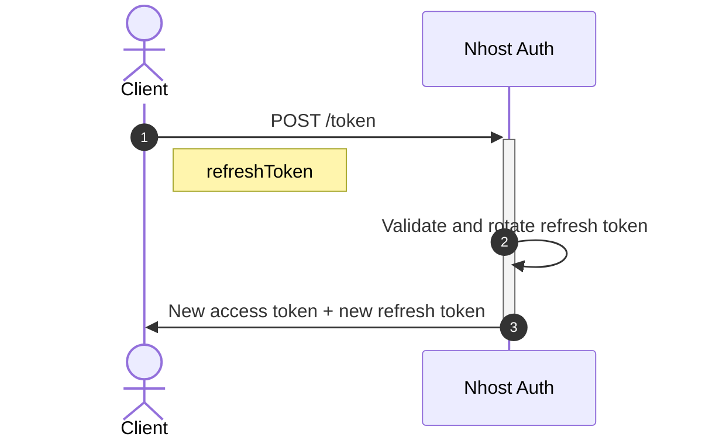

import { Card, CardGroup } from '@components';


Nhost Auth is a ready-to-use authentication service seamlessly integrated with the [GraphQL API](/products/graphql) and its [Permission System](/products/graphql/permissions) from Hasura. This allows you to easily add user authentication to your application without having to build and maintain your own authentication system.

## Supported Methods

<CardGroup cols={4}>
  <Card title="Email and Password" icon="at" href="/products/auth/sign-in-email-password">
  </Card>
  <Card title="One-Time Passwords (OTP)" icon="key" href="/products/auth/sign-in-otp">
  </Card>
  <Card title="Magic Link" icon="bolt" href="/products/auth/sign-in-magic-link">
  </Card>
  <Card title="Phone Number (SMS)" icon="mobile" href="/products/auth/sign-in-sms-otp">
  </Card>
  <Card title="Security Keys (WebAuthn)" icon="fingerprint" href="/products/auth/webauthn">
  </Card>
  <Card title="ID Tokens" icon="ticket" href="/products/auth/providers/idtokens">
  </Card>
  <Card title="Elevated Permissions" icon="shield-check" href="/products/auth/elevated-permissions">
  </Card>
  <Card title="OAuth2 / OIDC Provider" icon="key" href="/products/auth/oauth2-provider">
  </Card>
</CardGroup>

## Sessions and Token Refresh

After a successful sign-in, Nhost Auth returns a **session** containing:

- **Access token** - A short-lived JWT (default: 15 minutes) used to authenticate requests to the [GraphQL API](/products/graphql) and [Storage](/products/storage)
- **Refresh token** - A long-lived token (default: 30 days) used to obtain new access tokens

The Nhost SDK automatically refreshes the access token before it expires. You can also refresh tokens manually:

```js
await nhost.auth.refreshToken({ refreshToken });
```

### Token Refresh Flow



### OAuth Providers

<CardGroup cols={4}>
  <Card title="Apple" icon="apple" href="/products/auth/providers/sign-in-apple">
  </Card>
  <Card title="Discord" icon="discord" href="/products/auth/providers/sign-in-discord">
  </Card>
  <Card title="Entra ID" icon="microsoft" href="/products/auth/providers/sign-in-entraid">
  </Card>
  <Card title="Facebook" icon="facebook" href="/products/auth/providers/sign-in-facebook">
  </Card>
  <Card title="GitHub" icon="github" href="/products/auth/providers/sign-in-github">
  </Card>
  <Card title="Google" icon="google" href="/products/auth/providers/sign-in-google">
  </Card>
  <Card title="Linkedin" icon="linkedin" href="/products/auth/providers/sign-in-linkedin">
  </Card>
  <Card title="Spotify" icon="spotify" href="/products/auth/providers/sign-in-spotify">
  </Card>
  <Card title="Twitch" icon="twitch" href="/products/auth/providers/sign-in-twitch">
  </Card>
  <Card title="WorkOS" icon="building" href="/products/auth/providers/sign-in-workos">
  </Card>
</CardGroup>
