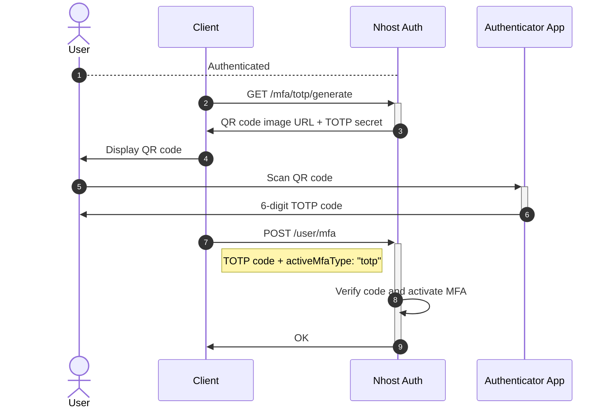
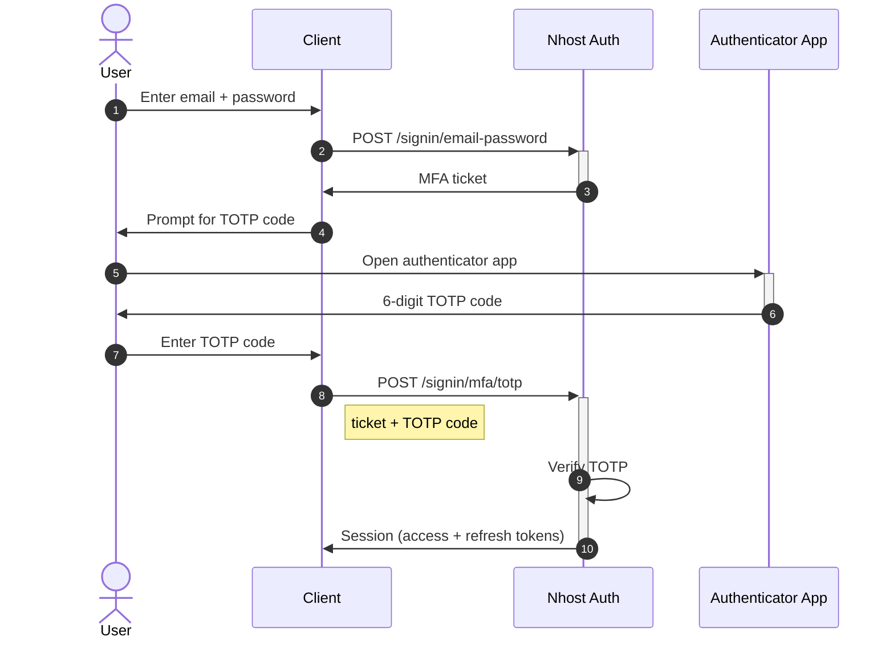

Multi-Factor Authentication adds an extra layer of security by requiring a verification code from an authenticator app (e.g., [Authy](https://authy.com/), [Google Authenticator](https://en.wikipedia.org/wiki/Google_Authenticator)) in addition to the user's email and password.

## Configuration

To enable MFA, navigate to **Settings -> Authentication** and enable **Multi-Factor Authentication**. You can also configure it using the `nhost.toml` file:

```toml title="nhost.toml"
[auth.totp]
enabled = true
```

## Enabling MFA

Once MFA is enabled for your project, individual users can activate it on their account. This is a two-step process:

### Step 1: Generate TOTP Secret

Request a TOTP secret and QR code for the user to scan with their authenticator app:

```js
const response = await nhost.auth.changeUserMfa();

// Display the QR code image for the user to scan
const imageUrl = response.body.imageUrl;
// Or show the totpSecret for manual entry
const totpSecret = response.body.totpSecret;
```

### Step 2: Verify and Activate

After the user scans the QR code, they enter the 6-digit verification code from their authenticator app to confirm activation:

```js
await nhost.auth.verifyChangeUserMfa({
  activeMfaType: 'totp',
  code: '123456', // 6-digit code from authenticator app
});
```

### Activation Flow



## Signing In with MFA

When a user with MFA enabled signs in with email and password, the server returns a `ticket` instead of a session. The client must then prompt for a TOTP code and verify it to complete sign-in.

### Step 1: Initial Sign-In

```js
const response = await nhost.auth.signInEmailPassword({
  email: 'joe@example.com',
  password: 'secret-password',
});

if (response.body?.mfa) {
  // MFA is required — store the ticket and prompt for TOTP
  const ticket = response.body.mfa.ticket;
  // Navigate to MFA verification page
}
```

### Step 2: Verify TOTP Code

```js
const response = await nhost.auth.verifySignInMfaTotp({
  ticket: ticket,       // from step 1
  otp: '123456',        // 6-digit code from authenticator app
});

// response.body.session contains the access + refresh tokens
```

### Sign-In with MFA Flow



## Disabling MFA

Users can disable MFA by providing a current TOTP code from their authenticator app:

```js
await nhost.auth.verifyChangeUserMfa({
  activeMfaType: '',    // empty string disables MFA
  code: '123456',       // current 6-digit code from authenticator app
});
```
