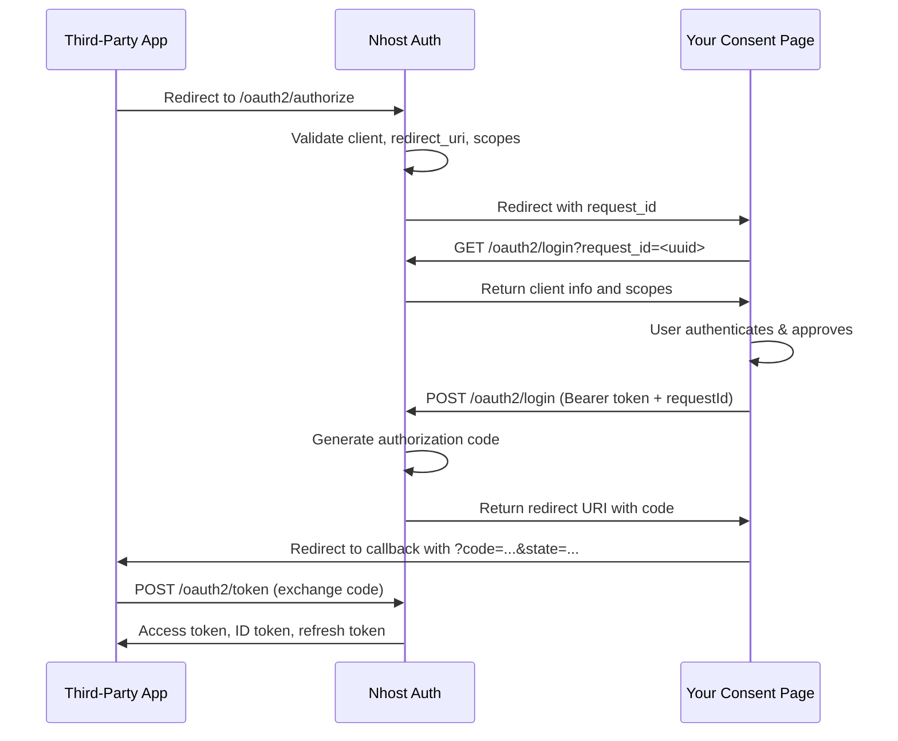

import { Card, CardGroup } from '@components';


When a third-party app wants to authenticate one of your users, it triggers the Authorization Code flow. This is a standard OAuth2 flow where three parties are involved:

| Party | Who | Role |
|-------|-----|------|
| **Third-Party App** | The external service (e.g. a wiki, an MCP tool) | Initiates the flow and receives tokens |
| **Nhost Auth** | Your Nhost project's auth service | Validates requests, issues codes and tokens |
| **Your Consent Page** | A page **you build** in your frontend | Authenticates the user and collects their approval |



The flow is the same regardless of client type (confidential, public, or CIMD). What differs is how the client authenticates at the token endpoint — see the client-specific pages below for details.

## What Nhost Auth Handles

You don't need to implement any of this — Nhost Auth takes care of it automatically:

- **Validating the authorization request** — checks that the client exists, the redirect URI matches, and the requested scopes are allowed
- **Redirecting to your consent page** — sends the user to the `loginURL` you configured in `nhost.toml`, with a `request_id` parameter
- **Issuing authorization codes** — after your consent page submits approval, Auth generates a one-time code
- **Exchanging codes for tokens** — the third-party app calls the token endpoint and Auth returns access tokens, ID tokens, and refresh tokens
- **PKCE validation** — if the third-party app used PKCE (required for public clients), Auth verifies the code challenge automatically

## What the Third-Party App Handles

This is the responsibility of the external service integrating with your Nhost project. As the Nhost developer, you don't need to build this — the third-party app developer follows standard OAuth2/OIDC protocols. For reference, they:

1. Redirect the user to your `/oauth2/authorize` endpoint with their client ID, redirect URI, and requested scopes
2. Receive the authorization code at their callback URL
3. Exchange the code for tokens at your `/oauth2/token` endpoint

The third-party app can discover all the endpoints it needs from your project's OIDC Discovery document at `/.well-known/openid-configuration`.

## What You Build: The Consent Page

The consent page is the only part of the authorization flow you need to implement. It's a page in your frontend application where your users:

1. **Sign in** if they aren't already authenticated
2. **Review** which third-party app is requesting access and what scopes it wants
3. **Approve or deny** the request

Nhost Auth redirects users to the URL you set in `loginURL` (in your `nhost.toml`) with a `request_id` query parameter. Your consent page uses this ID to interact with two endpoints:

### Fetch the Request Details

Use the `request_id` to get information about what the third-party app is asking for:

```js
const response = await nhost.auth.oauth2LoginGet({
  request_id: requestId,
});

// response.body contains:
// {
//   requestId: "550e8400-...",
//   clientId: "nhoa_a1b2c3d4e5f67890",
//   redirectUri: "https://thirdparty.example.com/callback",
//   scopes: ["openid", "profile", "email"]
// }
```

Display this information to the user so they know which app is requesting access and what permissions it needs.

### Submit the User's Approval

Once the user is authenticated and approves, submit the consent. The user's session token is sent as a Bearer token so Auth knows who is granting access:

```js
const consentResponse = await nhost.auth.oauth2LoginPost({
  requestId: requestId,
});

// Redirect the user to the third-party app with the authorization code
window.location.href = consentResponse.body.redirectUri;
```

### React Example

For a full working example of a consent page built with React and the Nhost SDK, see [`Consent.tsx`](https://github.com/nhost/nhost/tree/main/examples/demos/react-demo/src/pages/Consent.tsx) in the [react-demo](https://github.com/nhost/nhost/tree/main/examples/demos/react-demo) example.

## Client Types

The authorization code flow works with all three client types. The differences are in how the client is registered and how it authenticates at the token endpoint:

<CardGroup cols={3}>
  <Card title="Confidential Clients" icon="lock" href="/products/auth/oauth2-provider/confidential-clients">
    Server-side apps that can securely store a secret
  </Card>
  <Card title="Public Clients" icon="globe" href="/products/auth/oauth2-provider/public-clients">
    Browser or mobile apps that use PKCE instead of a secret
  </Card>
  <Card title="CIMD Clients" icon="plug" href="/products/auth/oauth2-provider/cimd-clients">
    URL-based client IDs for MCP and similar tools
  </Card>
</CardGroup>
