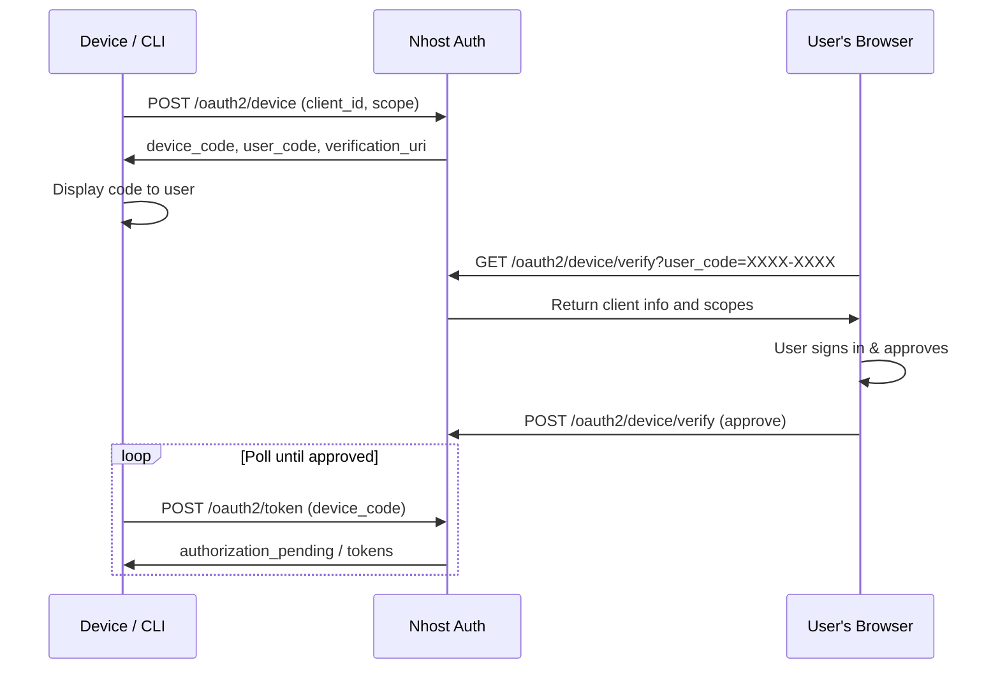

import { Card, CardGroup } from '@components';


The Device Authorization Grant ([RFC 8628](https://datatracker.ietf.org/doc/html/rfc8628)) lets input-constrained devices — CLI tools, IoT devices, smart TVs, and similar — authenticate users through a browser on a separate device. The device displays a short code, the user enters it in a browser, and the device receives tokens once the user approves.



## When to Use

Use the device flow when the application:

- Has no browser or limited input capability (smart TV, IoT sensor, kiosk)
- Is a CLI tool or terminal application
- Cannot easily handle browser redirects (no local HTTP server for a callback URL)

Both **public** and **confidential** clients support the device flow. Public clients are typical for CLI tools and devices.

## How It Works

### Step 1: Request Device Authorization

The device sends a request with its client ID and desired scopes:

```js
const { body: device } = await nhost.auth.oauth2DeviceAuthorization({
  client_id: clientId,
  scope: 'openid profile email',
});

// device contains:
// {
//   device_code: "550e8400-...",          — secret, kept by the device
//   user_code: "BCKD-FGHJ",              — displayed to the user
//   verification_uri: "https://example.com/oauth2/device",
//   verification_uri_complete: "https://example.com/oauth2/device?user_code=BCKD-FGHJ",
//   expires_in: 600,                      — seconds until the code expires
//   interval: 5                           — minimum seconds between polls
// }
```

The device displays the `user_code` and `verification_uri` (or `verification_uri_complete`) to the user.

### Step 2: User Verifies in a Browser

The user opens `verification_uri` in a browser on any device (phone, laptop, etc.), signs in, and approves or denies the request. This is the **verification page** — a page you build in your frontend.

### Step 3: Device Polls for Tokens

While the user is verifying, the device polls the token endpoint:

```js
const { body: tokens } = await nhost.auth.oauth2Token({
  grant_type: 'urn:ietf:params:oauth:grant-type:device_code',
  device_code: device.device_code,
  client_id: clientId,
  client_secret: clientSecret, // only for confidential clients
});
```

The device must respect the `interval` from the device authorization response. Polling faster results in a `slow_down` error.

### Polling Responses

| Response | Meaning | Action |
|----------|---------|--------|
| `authorization_pending` | User hasn't approved yet | Wait `interval` seconds and retry |
| `slow_down` | Polling too fast | Increase interval by 5 seconds and retry |
| `access_denied` | User denied the request | Stop polling, show error |
| `expired_token` | Device code expired | Stop polling, restart the flow |
| Success (200 with tokens) | User approved | Use the tokens |

### Full Polling Example

```js
let interval = device.interval * 1000;

while (true) {
  await sleep(interval);

  const res = await fetch(`${authUrl}/oauth2/token`, {
    method: 'POST',
    headers: { 'Content-Type': 'application/x-www-form-urlencoded' },
    body: new URLSearchParams({
      grant_type: 'urn:ietf:params:oauth:grant-type:device_code',
      device_code: device.device_code,
      client_id: clientId,
    }),
  });

  const body = await res.json();

  if (body.error === 'authorization_pending') continue;
  if (body.error === 'slow_down') { interval += 5000; continue; }
  if (body.error === 'access_denied') throw new Error('User denied');
  if (body.error === 'expired_token') throw new Error('Code expired');
  if (body.error) throw new Error(body.error);

  // Success — body contains access_token, refresh_token, id_token, etc.
  return body;
}
```

## Building the Verification Page

The verification page is a page in your frontend where users enter the code displayed on their device and approve the request. It works similarly to the [consent page](/products/auth/oauth2-provider/authorization-flow#what-you-build-the-consent-page) in the authorization code flow.

### Fetch the Device Request

Use the `user_code` (entered by the user or pre-filled via the `user_code` query parameter) to look up the request:

```js
const response = await nhost.auth.oauth2DeviceVerifyGet({
  user_code: userCode,
});

// response.body contains:
// {
//   clientId: "nhoa_a1b2c3d4e5f67890",
//   scopes: ["openid", "profile", "email"]
// }
```

Display the client ID and requested scopes to the user.

### Submit the User's Decision

Once the user reviews the request, submit their approval or denial. The user must be authenticated — their session token is sent as a Bearer token:

```js
// Approve the device
await nhost.auth.oauth2DeviceVerifyPost({
  userCode: userCode,
  action: 'approve',
});

// Or deny it
await nhost.auth.oauth2DeviceVerifyPost({
  userCode: userCode,
  action: 'deny',
});
```

### React Example

For a full working example of a device verification page built with React and the Nhost SDK, see [`DeviceVerify.tsx`](https://github.com/nhost/nhost/tree/main/examples/demos/react-demo/src/pages/DeviceVerify.tsx) in the [react-demo](https://github.com/nhost/nhost/tree/main/examples/demos/react-demo) example.

For a CLI demo that initiates the device flow and polls for tokens, see the [device-flow](https://github.com/nhost/nhost/tree/main/examples/demos/device-flow) example.

## Configuration

The verification URL — where users are directed to enter their code — defaults to `{clientUrl}/oauth2/device`. You can override it with the `AUTH_OAUTH2_PROVIDER_DEVICE_VERIFY_URL` environment variable:

```bash
AUTH_OAUTH2_PROVIDER_DEVICE_VERIFY_URL=https://example.com/oauth2/device
```

## User Code Format

Device codes displayed to users follow the format `XXXX-XXXX` — eight consonant characters (excluding ambiguous letters like I, O, L) separated by a dash. The code is case-insensitive and the dash is optional when entering it.

## Security

- **Device codes** are stored as SHA-256 hashes — the plaintext is only returned once in the initial response
- **User codes** expire after 10 minutes
- **Rate limiting** — the `slow_down` error prevents brute-force polling
- **Single use** — once a device code is exchanged for tokens, it cannot be reused
- **PKCE is not used** — the device flow relies on the short-lived device code and user verification instead
