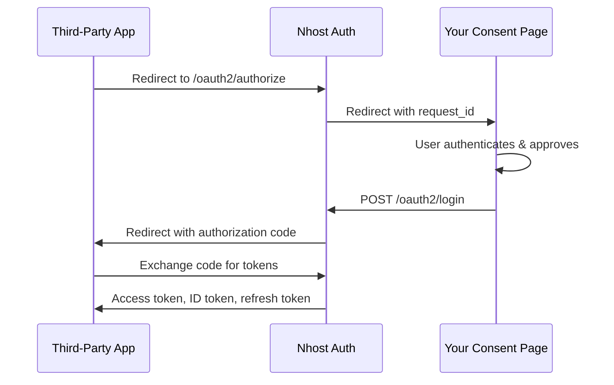

import { Card, CardGroup } from '@components';
import { Tabs, TabItem } from '@astrojs/starlight/components';


Nhost Auth can act as an OAuth2 Authorization Server and OpenID Connect Identity Provider. This lets third-party applications — wikis, dashboards, MCP servers, internal tools — authenticate users through your Nhost project using standard OAuth2/OIDC flows.



## What It Supports

- **Three client types** — confidential (with secret), public (no secret, PKCE required), and URL-based (CIMD)
- **Scopes** — `openid`, `profile`, `email`, `phone`, `offline_access`, `graphql`
- **RSA-signed JWT tokens** — access tokens and ID tokens signed with RSA (RS256, RS384, or RS512), with a JWKS endpoint for verification

## Standards Compliance

| Standard | Description |
|----------|-------------|
| [RFC 6749](https://datatracker.ietf.org/doc/html/rfc6749) | OAuth 2.0 Authorization Framework — Authorization Code grant |
| [RFC 6750](https://datatracker.ietf.org/doc/html/rfc6750) | OAuth 2.0 Bearer Token Usage |
| [RFC 7009](https://datatracker.ietf.org/doc/html/rfc7009) | Token Revocation — Refresh token revocation |
| [RFC 7517](https://datatracker.ietf.org/doc/html/rfc7517) | JSON Web Key (JWK) — JWKS endpoint for public signing keys |
| [RFC 7519](https://datatracker.ietf.org/doc/html/rfc7519) | JSON Web Token (JWT) — RSA-signed access and ID tokens |
| [RFC 7636](https://datatracker.ietf.org/doc/html/rfc7636) | PKCE — Proof Key for Code Exchange (S256 only) |
| [RFC 7662](https://datatracker.ietf.org/doc/html/rfc7662) | Token Introspection — Check token validity |
| [RFC 8414](https://datatracker.ietf.org/doc/html/rfc8414) | Authorization Server Metadata — Discovery endpoints |
| [RFC 9207](https://datatracker.ietf.org/doc/html/rfc9207) | Issuer Identification — `iss` parameter in authorization responses |
| [RFC 9728](https://datatracker.ietf.org/doc/html/rfc9728) | Client ID Metadata Document — URL-based client IDs for MCP and similar tools |
| [OpenID Connect Core 1.0](https://openid.net/specs/openid-connect-core-1_0.html) | ID tokens, UserInfo, Discovery, standard claims |

## Prerequisites

- An **[RSA signing key](/products/auth/jwt/#asymmetric-keys)** must be configured. Other algorithms are not supported when the OAuth2 provider is enabled.
- The OAuth2 provider must be **explicitly enabled** via configuration.

## Configuration

<Tabs>
<TabItem label="Dashboard">
Go to your project's dashboard, then **Settings** → **OAuth2 Provider**.


</TabItem>
<TabItem label="nhost.toml">
```toml
[auth.oauth2Provider]
# Enable the OAuth2/OIDC provider
enabled = true # default: false
# URL where users are redirected for login and consent
# You need to implement this page yourself, check our guides for details
loginURL = 'https://example.com/oauth2/login'

[auth.oauth2Provider.accessToken]
# Access token lifetime in seconds
expiresIn = 900 # default: 900 - 15 minutes

[auth.oauth2Provider.refreshToken]
# Refresh token lifetime in seconds
expiresIn = 2592000 # default: 2592000 - 30 days

[auth.oauth2Provider.clientIdMetadataDocument]
# Enable URL-based client IDs per RFC 9728, used by MCP and similar tools
enabled = true # default: false
```
</TabItem>
</Tabs>

## Next Steps

<CardGroup cols={3}>
  <Card title="Managing Clients" icon="key" href="/products/auth/oauth2-provider/managing-clients">
    Create and manage OAuth2 clients via GraphQL
  </Card>
  <Card title="Authorization Code Flow" icon="shield-check" href="/products/auth/oauth2-provider/authorization-flow">
    Understand the flow and build your consent page
  </Card>
  <Card title="Tokens and Scopes" icon="ticket" href="/products/auth/oauth2-provider/tokens-and-scopes">
    Understand token formats, scopes, and claims
  </Card>
</CardGroup>
