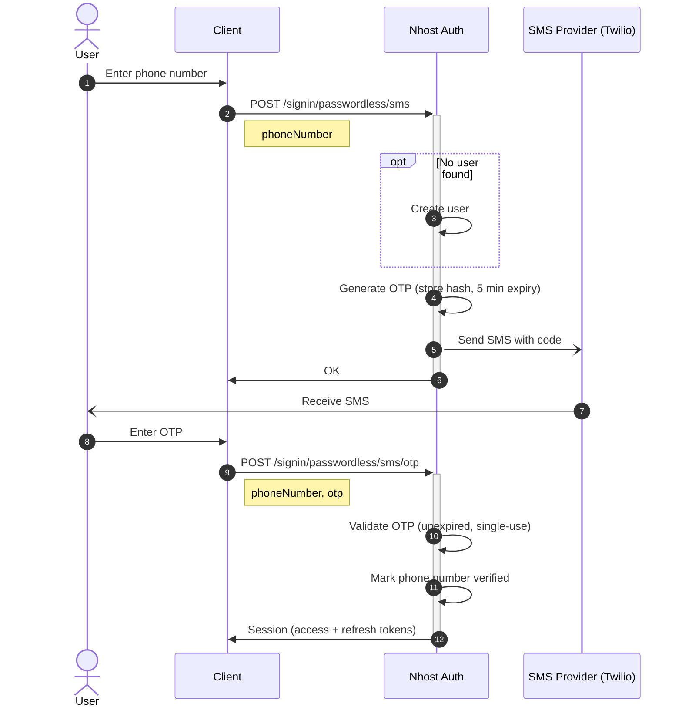

import { Tabs, TabItem } from '@astrojs/starlight/components';

An SMS OTP (one-time password) is a secure authentication method where a numeric or alphanumeric code is sent to a mobile phone number. Codes expire after 5 minutes and can only be used once.

Nhost supports OTP via SMS with Twilio.

## Prerequisites

All SMS are sent through [Twilio](https://www.twilio.com/try-twilio), so you need a Twilio account with:

- An **Account SID** and **Auth Token** (both on the Twilio Console home page).
- A **Messaging Service SID** (`MG…`) **or** a Twilio **phone number** (`+…`) to send from.

## Configuration

Enable the Phone Number (SMS) sign-in method and provide your Twilio credentials.

<Tabs>
<TabItem label="nhost.toml">

```toml
[auth.method.smsPasswordless]
enabled = true

[provider.sms]
provider = 'twilio'
accountSid = '{{ secrets.TWILIO_ACCOUNT_SID }}'
authToken = '{{ secrets.TWILIO_AUTH_TOKEN }}'
messagingServiceId = 'MG...'
```

Store sensitive values as [secrets](/platform/cloud/secrets) and reference them with `{{ secrets.NAME }}`. `messagingServiceId` accepts a Messaging Service SID (`MG…`) or a Twilio phone number.

</TabItem>
<TabItem label="Dashboard">

In the Nhost Dashboard, go to **Settings → Sign-In Methods → Phone Number (SMS)**.


Turn on the toggle and fill in:

- **Account SID**
- **Auth Token**
- **Messaging Service ID** — a Messaging Service SID (`MG…`) or a Twilio phone number

</TabItem>
</Tabs>

## Sign In

Signing in users with a phone number is a two-step process:

### Step 1: Request OTP

The user will receive the OTP on the phone number specified.

<Tabs>
<TabItem label="JavaScript">
```js
await nhost.auth.signInPasswordlessSms({
  phoneNumber: '+11233213123'
})
```
</TabItem>
<TabItem label="Dart">
```dart
await nhost.auth.signInWithSmsPasswordless(
  phoneNumber: '+11233213123'
)
```
</TabItem>
</Tabs>

### Step 2: Verify OTP

To sign in the user, pass in the OTP received on the previous step.

<Tabs>
<TabItem label="JavaScript">
```js
await nhost.auth.verifySignInPasswordlessSms({
  phoneNumber: '+11233213123',
  otp: '123456'
})
```
</TabItem>
<TabItem label="Dart">
```dart
await nhost.auth.completeSmsPasswordlessSignIn(
  '+11233213123',
  '123456'
)
```
</TabItem>
</Tabs>

:::note
A user account is created the first time a phone number is used
:::

:::note
Phone numbers should start with `+` (not `00`) to follow the [E.164 formatting standard](https://en.wikipedia.org/wiki/E.164)
:::

### Sign In Flow



## Change Phone Number

An authenticated user can change the phone number on their account. This is a two-step flow: the user requests the change, an OTP is sent via SMS to the **new** number, and the user submits that OTP to confirm. The current phone number stays in place until verification succeeds, so a failed or abandoned change never locks the user out.

This endpoint requires [elevated permissions](/products/auth/elevated-permissions).

### Request the Change

```js
await nhost.auth.changeUserPhoneNumber({
  newPhoneNumber: '+11233213123'
})
```

### Verify the Change

Submit the OTP received via SMS to commit the new number:

```js
await nhost.auth.verifyChangeUserPhoneNumber({
  newPhoneNumber: '+11233213123',
  otp: '123456'
})
```

:::note
If another user already has this phone number verified, the request fails with `user-already-exists`. Unverified numbers staged by other users don't block the change.
:::

## Deanonymize with SMS

[Anonymous users](/products/auth/sign-in-anonymous) can be upgraded to permanent accounts by attaching a phone number. Request the conversion from the anonymous user's session, which also sends an OTP to that number:

```js
await nhost.auth.deanonymizeUserSMS({
  phoneNumber: '+11233213123'
})
```

The same user then completes the [Step 2: Verify OTP](#step-2-verify-otp) step above to verify the code. On success the number is marked verified, the account becomes non-anonymous, and a fresh session is returned.

:::note
The account only becomes non-anonymous once the OTP is verified — if the code is lost, the user keeps their anonymous session and can retry. The number must not already belong to another user.
:::

## Self-Hosting

Nhost Cloud sends SMS through Twilio. If you self-host [Auth](https://github.com/nhost/nhost/tree/main/services/auth), the `AUTH_SMS_PROVIDER` environment variable also accepts **`modica`** and a **`generic`** HTTP provider. `twilio` and `modica` are presets built on top of the generic provider.

### Generic provider

The `generic` provider sends an HTTP `POST` request to any SMS API you configure:

| Environment variable | Description |
| --- | --- |
| `AUTH_SMS_PROVIDER` | Set to `generic`. |
| `AUTH_SMS_GENERIC_URL` | URL each SMS request is `POST`ed to. |
| `AUTH_SMS_GENERIC_CONTENT_TYPE` | Content-Type of each request. Defaults to `application/json`. |
| `AUTH_SMS_GENERIC_BODY_TEMPLATE` | Request body template using the `${to}` and `${body}` variables. |
| `AUTH_SMS_GENERIC_HEADERS` | Optional JSON object of extra request headers, such as authentication. |
| `AUTH_SMS_GENERIC_TIMEOUT` | Request timeout, for example `30s`. |

`${to}` (the recipient in E.164 format) and `${body}` (the rendered message) are substituted into the template. For `application/x-www-form-urlencoded`, the template must render to a JSON object whose fields become the form values; any other content type sends the rendered template verbatim.

```bash
AUTH_SMS_PROVIDER=generic
AUTH_SMS_GENERIC_URL=https://sms.example.com/send
AUTH_SMS_GENERIC_CONTENT_TYPE=application/json
AUTH_SMS_GENERIC_BODY_TEMPLATE={"to":"${to}","message":"${body}"}
AUTH_SMS_GENERIC_HEADERS={"Authorization":"Bearer <token>"}
AUTH_SMS_GENERIC_TIMEOUT=30s
```

All values are validated when Auth starts, so a misconfigured URL or template fails fast rather than on the first SMS send.

### Modica

The `modica` preset targets [Modica](https://www.modicagroup.com/)'s REST API:

```bash
AUTH_SMS_PROVIDER=modica
AUTH_SMS_MODICA_USERNAME=<username>
AUTH_SMS_MODICA_PASSWORD=<password>
```
