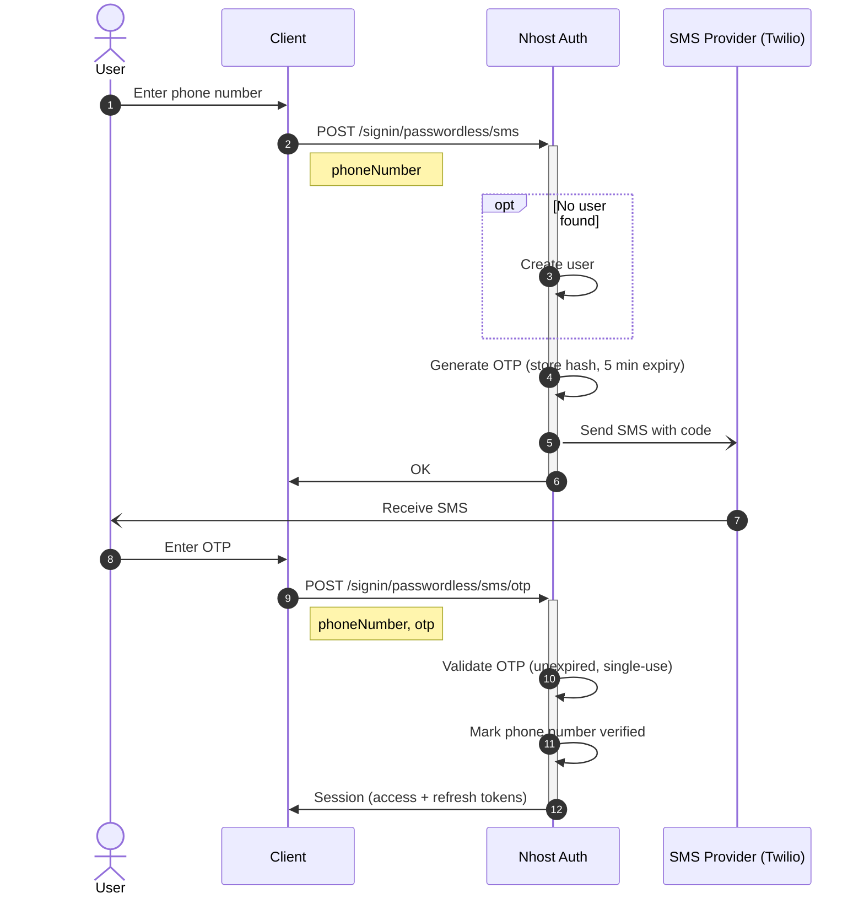

import { Tabs, TabItem } from '@astrojs/starlight/components';

An SMS OTP (one-time password) is a secure authentication method where a numeric or alphanumeric code is sent to a mobile phone number. Codes expire after 5 minutes and can only be used once.

Nhost supports OTP via SMS with Twilio.

## Prerequisites

All SMS are sent through [Twilio](https://www.twilio.com/try-twilio), so you need a Twilio account with:

- An **Account SID** and **Auth Token** (both on the Twilio Console home page).
- A **Messaging Service SID** (`MG…`) **or** a Twilio **phone number** (`+…`) to send from.

## Configuration

Enable the Phone Number (SMS) sign-in method and provide your Twilio credentials.

<Tabs>
<TabItem label="nhost.toml">

```toml
[auth.method.smsPasswordless]
enabled = true

[provider.sms]
provider = 'twilio'
accountSid = '{{ secrets.TWILIO_ACCOUNT_SID }}'
authToken = '{{ secrets.TWILIO_AUTH_TOKEN }}'
# A Twilio phone number can be used instead of a Messaging Service SID.
messagingServiceId = '{{ secrets.TWILIO_MESSAGING_SERVICE_ID }}'
```

Store sensitive values as [secrets](/platform/cloud/secrets) and reference them with `{{ secrets.NAME }}`.

</TabItem>
<TabItem label="Dashboard">

In the Nhost Dashboard, go to **Settings → Sign-In Methods → Phone Number (SMS)**.


Turn on the toggle and fill in:

- **Account SID**
- **Auth Token**
- **Messaging Service ID** — a Messaging Service SID (`MG…`) or a Twilio phone number

</TabItem>
</Tabs>

## Sign In

Signing in users with a phone number is a two-step process:

### Request OTP

The user will receive the OTP on the phone number specified.

<Tabs>
<TabItem label="JavaScript">
```js
await nhost.auth.signInPasswordlessSms({
  phoneNumber: '+11233213123'
})
```
</TabItem>
<TabItem label="Dart">
```dart
await nhost.auth.signInWithSmsPasswordless(
  phoneNumber: '+11233213123'
)
```
</TabItem>
</Tabs>

### Sign In with OTP

To sign in the user, pass in the OTP received on the previous step.

<Tabs>
<TabItem label="JavaScript">
```js
await nhost.auth.verifySignInPasswordlessSms({
  phoneNumber: '+11233213123',
  otp: '123456'
})
```
</TabItem>
<TabItem label="Dart">
```dart
await nhost.auth.completeSmsPasswordlessSignIn(
  '+11233213123',
  '123456'
)
```
</TabItem>
</Tabs>

:::note
A user account is created the first time a phone number is used
:::

:::note
Phone numbers should start with `+` (not `00`) to follow the [E.164 formatting standard](https://en.wikipedia.org/wiki/E.164)
:::

:::note
After 5 incorrect attempts the code is burned and verification returns `otp-too-many-attempts` instead of `invalid-otp`. Request a new code to continue. This applies to every SMS code, including phone number changes and deanonymization.
:::

### Sign In Flow


```mermaid
sequenceDiagram
 autonumber
 actor U as User
 participant C as Client
 participant A as Nhost Auth
 participant S as SMS Provider (Twilio)
 U->>C: Enter phone number
 C->>+A: POST /signin/passwordless/sms
 Note right of C: phoneNumber
 opt No user found
  A->>A: Create user
 end
 A->>A: Generate OTP (store hash, 5 min expiry)
 A-)S: Send SMS with code
 A->>-C: OK
 S-)U: Receive SMS
 U->>C: Enter OTP
 C->>+A: POST /signin/passwordless/sms/otp
 Note right of C: phoneNumber, otp
 A->>A: Validate OTP (unexpired, single-use)
 A->>A: Mark phone number verified
 A->>-C: Session (access + refresh tokens)
```

## Change Phone Number

An authenticated user can change the phone number on their account. This is a two-step flow: the user requests the change, an OTP is sent via SMS to the new number, and the user submits the OTP to confirm. The current phone number is left unchanged until verification succeeds.

Both endpoints require [elevated permissions](/products/auth/elevated-permissions) when `auth.elevatedPrivileges.mode` is `required`, or when it is `recommended` and the user has a security key. With the default `disabled` mode no elevated claim is needed.

### Request the Change

```js
await nhost.auth.changeUserPhoneNumber({
  newPhoneNumber: '+11233213123'
})
```

### Verify the Change

Submit the OTP received via SMS to commit the new number:

```js
await nhost.auth.verifyChangeUserPhoneNumber({
  newPhoneNumber: '+11233213123',
  otp: '123456'
})
```

:::note
Both steps reject a number that already belongs to another account, verified or not, with `user-already-exists`. The request step pre-checks it, and the verify step still fails if another user claimed the number in between. A number another user has only staged, through a pending change or an unfinished sign-up, doesn't block it.
:::

## Deanonymize with SMS

[Anonymous users](/products/auth/sign-in-anonymous) can be converted to permanent accounts by linking a phone number. An OTP is sent to the new number; the user completes the conversion by signing in with the OTP via the standard SMS sign-in flow, which also returns a non-anonymous session.

```js
// 1. Anonymous user requests deanonymization with a phone number
await nhost.auth.deanonymizeUserSms({
  phoneNumber: '+11233213123'
})

// 2. The same user verifies the OTP via verifySignInPasswordlessSms —
//    on success the phone number is verified and a non-anonymous session is returned
await nhost.auth.verifySignInPasswordlessSms({
  phoneNumber: '+11233213123',
  otp: '123456'
})
```
