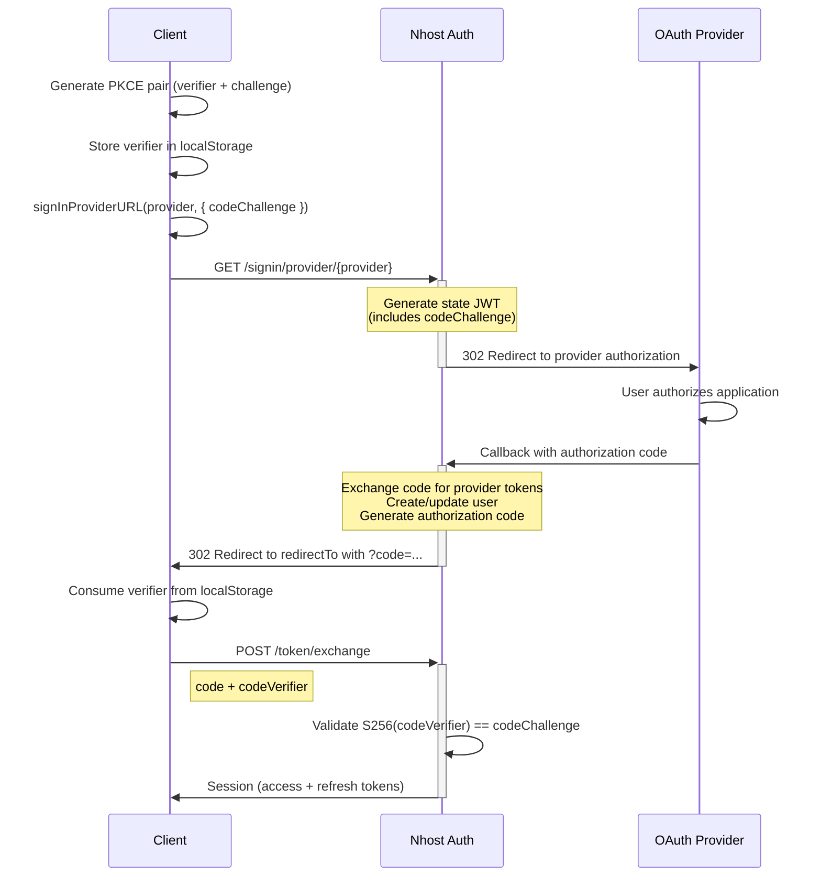

## Overview

Nhost supports OAuth 2.0 authentication with various social providers including GitHub, Google, Apple, Discord, and more. This guide explains the OAuth sign-in flow and how to implement it using [PKCE](/products/auth/sign-in-email-password#pkce).

## OAuth Sign-In Flow

The OAuth authentication flow uses PKCE to securely exchange an authorization code for a session after the OAuth provider callback:


```mermaid
sequenceDiagram
	participant C as Client
	participant A as Nhost Auth
	participant P as OAuth Provider
	C->>C: Generate PKCE pair (verifier + challenge)
	C->>C: Store verifier in localStorage
	C->>C: signInProviderURL(provider, { codeChallenge })
	C->>+A: GET /signin/provider/{provider}
	Note over A: Generate state JWT<br/>(includes codeChallenge)
	A->>-P: 302 Redirect to provider authorization
	P->>P: User authorizes application
	P->>+A: Callback with authorization code
	Note over A: Exchange code for provider tokens<br/>Create/update user<br/>Generate authorization code
	A->>-C: 302 Redirect to redirectTo with ?code=...
	C->>C: Consume verifier from localStorage
	C->>+A: POST /token/exchange
	Note right of C: code + codeVerifier
	A->>A: Validate S256(codeVerifier) == codeChallenge
	A->>-C: Session (access + refresh tokens)
```

## Implementation Steps

### 1. Generate the Provider Sign-In URL

Use `signInProviderURL()` to generate the OAuth authorization URL with a PKCE `codeChallenge`:

```tsx
import { generatePKCEPair } from '@nhost/nhost-js/auth';

const handleSocialSignIn = async (provider: 'github' | 'google' | 'apple') => {
  const { verifier, challenge } = await generatePKCEPair();
  localStorage.setItem('nhost_pkce_verifier', verifier);

  const url = nhost.auth.signInProviderURL(provider, {
    redirectTo: `${window.location.origin}/verify`,
    codeChallenge: challenge,
  });

  window.location.href = url;
};
```

### 2. OAuth Provider Authorization

When the user is redirected to the OAuth provider (e.g., GitHub, Google), they will:

1. See a consent screen asking to authorize your application
2. Grant or deny permission to access their profile information
3. Be redirected back to Nhost Auth's callback URL

### 3. Nhost Auth Callback Processing

Nhost Auth receives the callback from the OAuth provider at `/v1/signin/provider/{provider}/callback` and performs the following:

1. **Validates the OAuth state** to prevent CSRF attacks
2. **Exchanges the authorization code** for access and refresh tokens from the provider
3. **Fetches the user's profile** from the provider
4. **Creates or updates the user** in your Nhost database
5. **Generates an authorization code** bound to the PKCE challenge
6. **Redirects to your client application** with `?code=...`

### 4. Handle the Redirect

After successful authentication, Nhost redirects back to your `redirectTo` URL with a `code` query parameter:

```
https://your-app.com/verify?code=abc123...
```

Exchange this code for a session using the stored PKCE verifier. See [Handling the Verification Redirect](/products/auth/sign-in-email-password#handling-the-verification-redirect) for the complete implementation.

```tsx
const params = new URLSearchParams(location.search);
const code = params.get('code');

const codeVerifier = localStorage.getItem('nhost_pkce_verifier');
localStorage.removeItem('nhost_pkce_verifier');

await nhost.auth.tokenExchange({ code, codeVerifier });
```

#### Error Handling

On error, the URL will contain error parameters:

```
https://your-app.com/verify?error=access_denied
```

Common error scenarios include:
- User denied authorization at the OAuth provider
- Invalid OAuth request configuration
- Error from the OAuth provider
- Provider account already linked to another user

### 5. Session Management

Once you've exchanged the authorization code for a session, the Nhost SDK automatically manages:

- **Access token** - Short-lived JWT for API requests (default: 15 minutes)
- **Refresh token** - Used to obtain new access tokens (default: 30 days)
- **Automatic token refresh** - The SDK refreshes tokens before expiration

## Security Considerations

### PKCE Protection

PKCE prevents authorization code interception attacks by binding the authorization code to the client that initiated the request. The code can only be exchanged by presenting the original `codeVerifier` that matches the `codeChallenge` sent during initiation.

### CSRF Protection

Nhost automatically handles CSRF protection using the OAuth `state` parameter. Each sign-in request generates a unique state value that is validated during the callback.

### Redirect URL Validation

For security, Nhost validates that the `redirectTo` URL matches either your clientUrl or one of your configured allowed redirect URLs. Configure these in your Nhost project settings.

### Custom Domains

To use your own domain for the OAuth callback URL instead of the default Nhost domain, refer to the [custom domains](/platform/cloud/custom-domains) documentation.

## Provider-Specific Setup

Each OAuth provider requires specific configuration. Refer to the provider-specific guides for detailed setup instructions:

- [Apple](/products/auth/providers/sign-in-apple)
- [Azure AD / Entra ID](/products/auth/providers/sign-in-azuread)
- [Bitbucket](/products/auth/providers/sign-in-bitbucket)
- [Discord](/products/auth/providers/sign-in-discord)
- [Facebook](/products/auth/providers/sign-in-facebook)
- [GitHub](/products/auth/providers/sign-in-github)
- [GitLab](/products/auth/providers/sign-in-gitlab)
- [Google](/products/auth/providers/sign-in-google)
- [LinkedIn](/products/auth/providers/sign-in-linkedin)
- [Spotify](/products/auth/providers/sign-in-spotify)
- [Strava](/products/auth/providers/sign-in-strava)
- [Twitch](/products/auth/providers/sign-in-twitch)
- [Windows Live](/products/auth/providers/sign-in-windowslive)
- [WorkOS](/products/auth/providers/sign-in-workos)

## API Reference

For detailed API documentation, see:

- [signInProviderURL()](/reference/javascript/nhost-js/auth#signinproviderurl) in the JavaScript SDK reference
- [GET /v1/signin/provider/{ '{provider}' }](/reference/auth/get-signin-provider-{provider}) in the API reference
- [GET /v1/signin/provider/{ '{provider}' }/callback](/reference/auth/get-signin-provider-{provider}-callback) in the API reference
