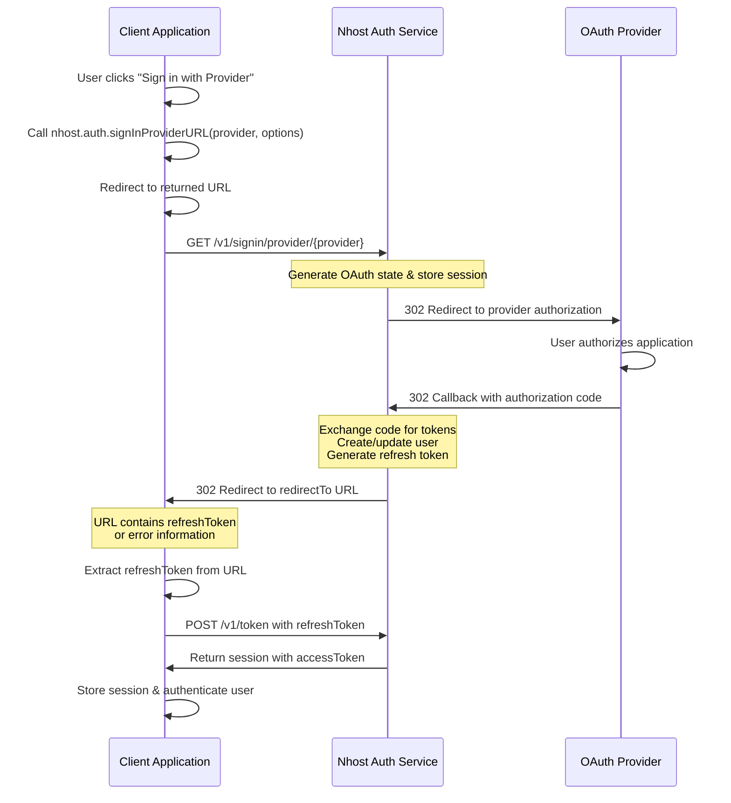

## Overview

Nhost supports OAuth 2.0 authentication with various social providers including GitHub, Google, Apple, Discord, and more. This guide explains the OAuth sign-in flow and how to implement it in your application.

## OAuth Sign-In Flow

The OAuth authentication flow in Nhost involves several steps coordinating between your client application, Nhost Auth service, and the OAuth provider:



## Implementation Steps

### 1. Generate the Provider Sign-In URL

Use the `signInProviderURL()` method to generate the OAuth authorization URL. This method returns a URL that you'll redirect the user to:

```tsx
import { nhost } from './lib/nhost';

const handleSocialSignIn = (provider: 'github' | 'google' | 'apple') => {
  // Get the current origin to build the callback URL
  const origin = window.location.origin;
  const redirectUrl = `${origin}/verify`;

  // Generate the provider sign-in URL
  const url = nhost.auth.signInProviderURL(provider, {
    redirectTo: redirectUrl,
  });

  // Redirect the user to the OAuth provider
  window.location.href = url;
};
```

### 2. OAuth Provider Authorization

When the user is redirected to the OAuth provider (e.g., GitHub, Google), they will:

1. See a consent screen asking to authorize your application
2. Grant or deny permission to access their profile information
3. Be redirected back to Nhost Auth's callback URL

### 3. Nhost Auth Callback Processing

Nhost Auth receives the callback from the OAuth provider at `/v1/signin/provider/{provider}/callback` and performs the following:

1. **Validates the OAuth state** to prevent CSRF attacks
2. **Exchanges the authorization code** for access and refresh tokens from the provider
3. **Fetches the user's profile** from the provider
4. **Creates or updates the user** in your Nhost database
5. **Generates a Nhost refresh token** for the session
6. **Redirects to your client application** at the `redirectTo` URL

### 4. Handle the Redirect

After successful authentication, Nhost redirects back to your `redirectTo` URL with query parameters. You need to handle two scenarios:

#### Success - Extract the Refresh Token

On success, the URL will contain a `refreshToken` parameter:

```
https://your-app.com/verify?refreshToken=abc123...
```

Extract this token and exchange it for a session:

```tsx
import type { ErrorResponse } from '@nhost/nhost-js/auth';
import type { FetchError } from '@nhost/nhost-js/fetch';
import { useEffect, useState } from 'react';
import { useNavigate, useLocation } from 'react-router-dom';
import { nhost } from './lib/nhost';

export default function Verify() {
  const navigate = useNavigate();
  const location = useLocation();
  const [status, setStatus] = useState<'verifying' | 'success' | 'error'>('verifying');
  const [error, setError] = useState<string>('');

  useEffect(() => {
    const params = new URLSearchParams(location.search);
    const refreshToken = params.get('refreshToken');

    if (!refreshToken) {
      setStatus('error');
      setError('No refresh token found in URL');
      return;
    }

    let isMounted = true;

    async function processToken() {
      try {
        // Exchange refresh token for session
        await nhost.auth.refreshToken({ refreshToken });

        if (!isMounted) return;

        setStatus('success');

        // Redirect to the application
        setTimeout(() => {
          if (isMounted) navigate('/profile');
        }, 1500);
      } catch (err) {
        const error = err as FetchError<ErrorResponse>;
        if (!isMounted) return;

        setStatus('error');
        setError(`An error occurred during verification: ${error.message}`);
      }
    }

    processToken();

    return () => {
      isMounted = false;
    };
  }, [location.search, navigate]);

  return (
    <div>
      {status === 'verifying' && <p>Verifying...</p>}
      {status === 'success' && <p>Successfully verified! Redirecting...</p>}
      {status === 'error' && (
        <div>
          <p>Verification failed: {error}</p>
          <button onClick={() => navigate('/signin')}>Back to Sign In</button>
        </div>
      )}
    </div>
  );
}
```

#### Error - Handle Authentication Failure

On error, the URL will contain error parameters:

```
https://your-app.com/verify?error=access_denied
```

You can handle these errors by checking for the `error` query parameter:

```tsx
const params = new URLSearchParams(location.search);
const error = params.get('error');

if (error) {
  // Handle error - redirect to sign-in page with error message
  navigate(`/signin?error=${encodeURIComponent(error)}`);
  return;
}
```

Common error scenarios include:
- User denied authorization at the OAuth provider
- Invalid OAuth request configuration
- Error from the OAuth provider
- Provider account already linked to another user

### 5. Session Management

Once you've exchanged the refresh token for a session, the Nhost SDK automatically manages:

- **Access token** - Short-lived JWT for API requests (default: 15 minutes)
- **Refresh token** - Used to obtain new access tokens (default: 30 days)
- **Automatic token refresh** - The SDK refreshes tokens before expiration

## Security Considerations

### CSRF Protection

Nhost automatically handles CSRF protection using the OAuth `state` parameter. Each sign-in request generates a unique state value that is validated during the callback.

### Redirect URL Validation

For security, Nhost validates that the `redirectTo` URL matches either your clientUrl or one of your configured allowed redirect URLs. Configure these in your Nhost project settings.

### Custom Domains

To use your own domain for the OAuth callback URL instead of the default Nhost domain, refer to the [custom domains](/platform/cloud/custom-domains) documentation.

## Provider-Specific Setup

Each OAuth provider requires specific configuration. Refer to the provider-specific guides for detailed setup instructions:

- [Apple](/products/auth/providers/sign-in-apple)
- [Azure AD / Entra ID](/products/auth/providers/sign-in-azuread)
- [Bitbucket](/products/auth/providers/sign-in-bitbucket)
- [Discord](/products/auth/providers/sign-in-discord)
- [Facebook](/products/auth/providers/sign-in-facebook)
- [GitHub](/products/auth/providers/sign-in-github)
- [GitLab](/products/auth/providers/sign-in-gitlab)
- [Google](/products/auth/providers/sign-in-google)
- [LinkedIn](/products/auth/providers/sign-in-linkedin)
- [Spotify](/products/auth/providers/sign-in-spotify)
- [Strava](/products/auth/providers/sign-in-strava)
- [Twitch](/products/auth/providers/sign-in-twitch)
- [Windows Live](/products/auth/providers/sign-in-windowslive)
- [WorkOS](/products/auth/providers/sign-in-workos)

## API Reference

For detailed API documentation, see:

- [signInProviderURL()](/reference/javascript/nhost-js/auth#signinproviderurl) in the JavaScript SDK reference
- [GET /v1/signin/provider/{ '{provider}' }](/reference/auth/get-signin-provider-{provider}) in the API reference
- [GET /v1/signin/provider/{ '{provider}' }/callback](/reference/auth/get-signin-provider-{provider}-callback) in the API reference
