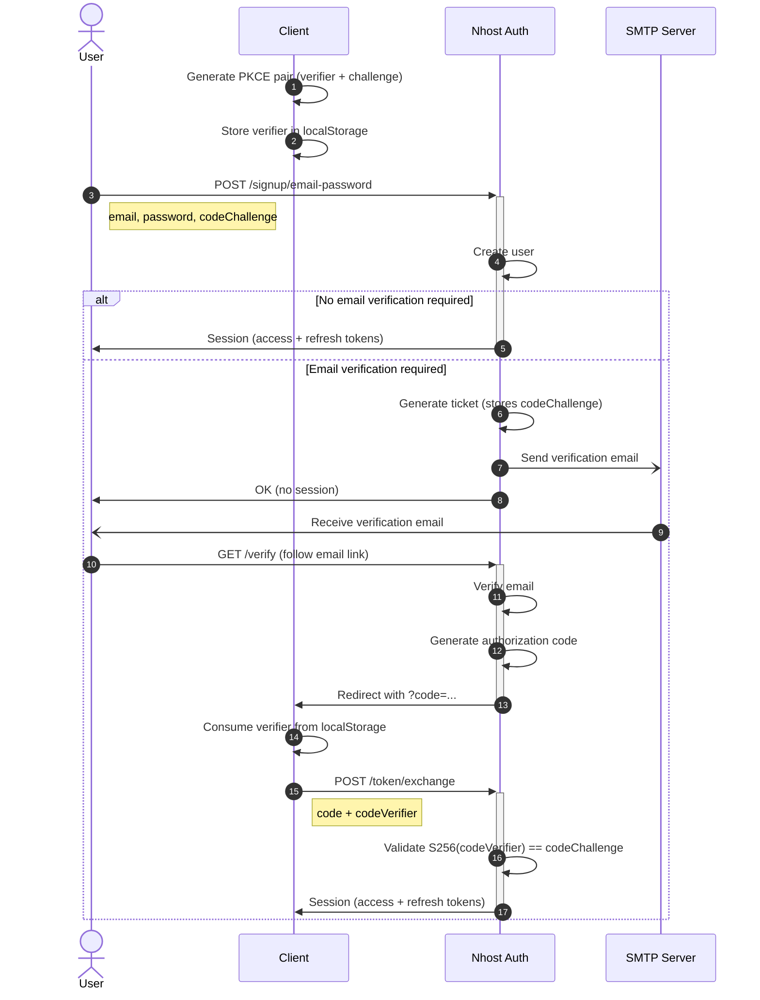
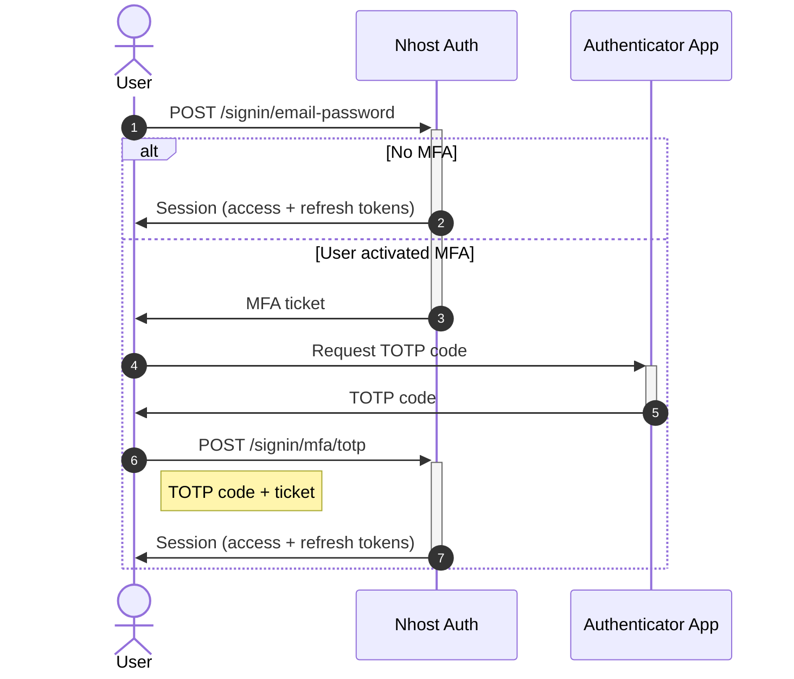
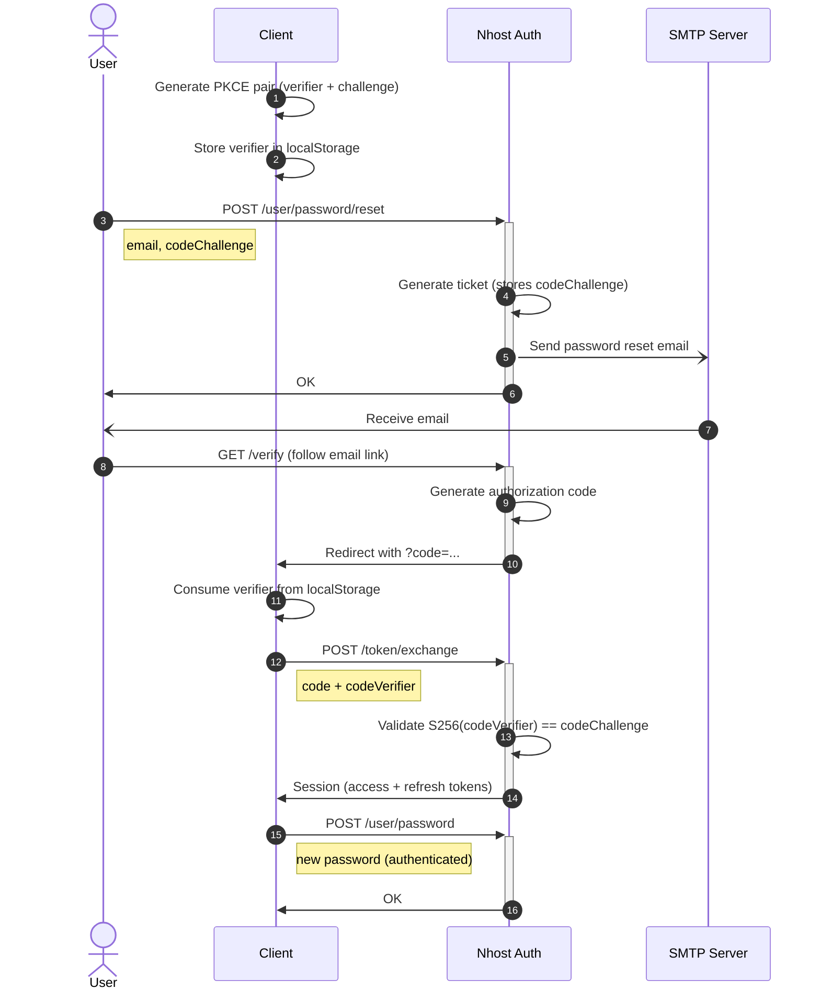
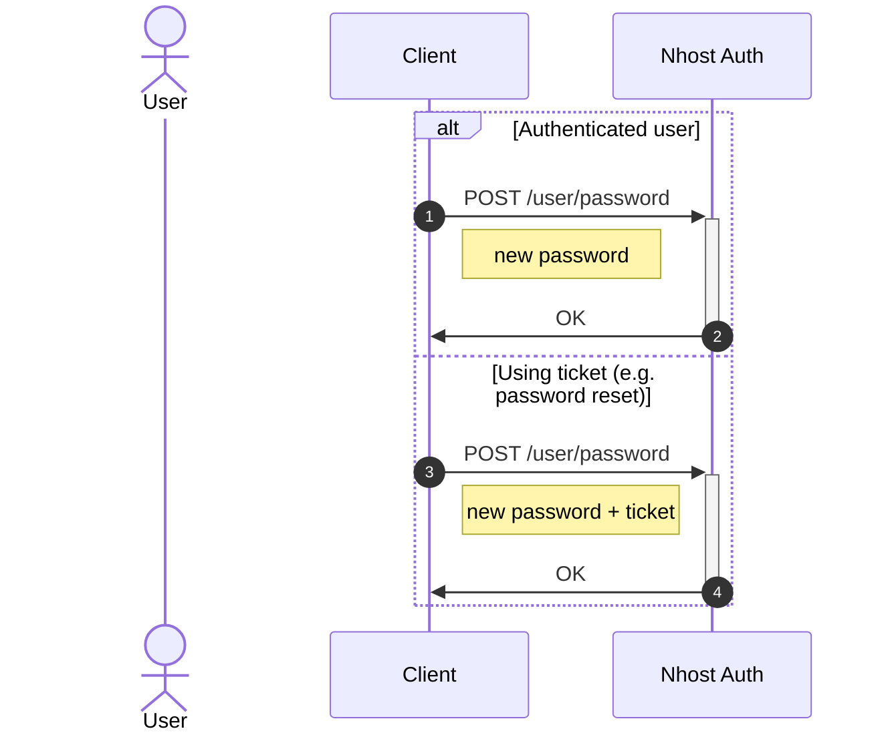
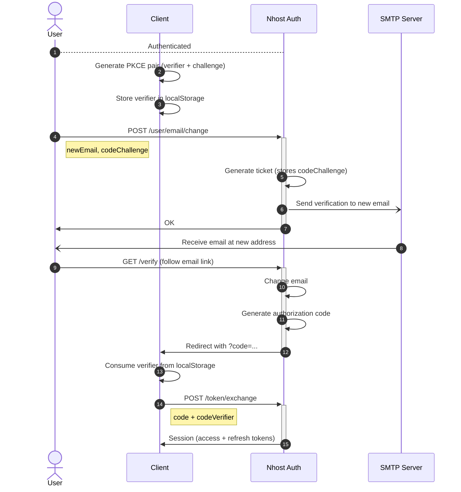

Sign In with Email and Password is enabled by default on all projects.

## Sign Up

To sign up a new user, use `signUpEmailPassword` with a valid email and password. When email verification is enabled, pass a `codeChallenge` for [PKCE](#pkce) so the verification link can securely establish a session.

```js
import { generatePKCEPair } from '@nhost/nhost-js/auth';

// Generate PKCE pair and store verifier for later
const { verifier, challenge } = await generatePKCEPair();
localStorage.setItem('nhost_pkce_verifier', verifier);

await nhost.auth.signUpEmailPassword({
  email: 'joe@example.com',
  password: 'secret-password',
  options: {
    redirectTo: `${window.location.origin}/verify`,
  },
  codeChallenge: challenge,
});
```

:::note
When email verification is enabled, a newly registered user will receive an email with a verification link. Clicking the link redirects to your app with an authorization `code` that must be [exchanged for a session](#handling-the-verification-redirect).
:::

### Sign Up Flow



## Sign In

After a user is registered and verified, they can sign in. Email/password sign-in returns a session directly without PKCE.

```js
await nhost.auth.signInEmailPassword({
  email: 'joe@example.com',
  password: 'secret-password',
});
```

### Sign In Flow



## Email Verification

By default, newly registered users must verify their email before they can sign in. To change this, navigate to **Settings -> Sign-In Methods -> Email and Password** and set **Require Verified Emails**.

You can manually resend the verification email:

```js
import { generatePKCEPair } from '@nhost/nhost-js/auth';

const { verifier, challenge } = await generatePKCEPair();
localStorage.setItem('nhost_pkce_verifier', verifier);

await nhost.auth.userEmailSendVerificationEmail({
  email: 'joe@example.com',
  options: {
    redirectTo: `${window.location.origin}/verify`,
  },
  codeChallenge: challenge,
});
```

:::tip
It is possible to customize these automatic emails, learn how to [here](/products/auth/email-templates).
:::

## Password Reset

Users can request a password reset email. The reset flow uses PKCE to securely establish a session so the user can set a new password.

```js
import { generatePKCEPair } from '@nhost/nhost-js/auth';

const { verifier, challenge } = await generatePKCEPair();
localStorage.setItem('nhost_pkce_verifier', verifier);

await nhost.auth.userPasswordReset({
  email: 'joe@example.com',
  options: {
    redirectTo: `${window.location.origin}/verify`,
  },
  codeChallenge: challenge,
});
```

After the user clicks the reset link and the authorization code is [exchanged for a session](#handling-the-verification-redirect), the user can set a new password:

```js
await nhost.auth.changePassword({
  newPassword: 'new-secret-password',
});
```

### Password Reset Flow



## Change Password

An authenticated user can change their password directly:

```js
await nhost.auth.changePassword({
  newPassword: 'new-secret-password',
});
```

A user who has completed a [password reset](#password-reset) flow can also set a new password using the session established by the reset link.

### Change Password Flow



## Change Email

An authenticated user can request an email change. A verification email is sent to the new address using PKCE to securely confirm the change.

```js
import { generatePKCEPair } from '@nhost/nhost-js/auth';

const { verifier, challenge } = await generatePKCEPair();
localStorage.setItem('nhost_pkce_verifier', verifier);

await nhost.auth.userEmailChange({
  newEmail: 'new-joe@example.com',
  options: {
    redirectTo: `${window.location.origin}/verify`,
  },
  codeChallenge: challenge,
});
```

### Change Email Flow



:::note
Email/password sign-in also supports [Multi-Factor Authentication (MFA)](/products/auth/mfa). When MFA is enabled, the sign-in response returns a ticket instead of a session, and the user must provide a TOTP code to complete authentication.
:::

## Handling the Verification Redirect

When using PKCE, email verification links redirect to your app with a `code` query parameter. Your verification page must exchange this code for a session using the stored PKCE verifier. This pattern is the same across all flows that use email verification (sign-up, magic links, password reset, email change, WebAuthn, and OAuth providers).

```tsx
import { useEffect, useState } from 'react';
import { useNavigate, useLocation } from 'react-router-dom';
import { nhost } from './lib/nhost';

export default function Verify() {
  const navigate = useNavigate();
  const location = useLocation();
  const [status, setStatus] = useState('verifying');
  const [error, setError] = useState('');

  useEffect(() => {
    const params = new URLSearchParams(location.search);
    const code = params.get('code');

    if (!code) {
      setStatus('error');
      setError('No authorization code found in URL');
      return;
    }

    async function exchangeCode() {
      // Retrieve and consume the stored verifier
      const codeVerifier = localStorage.getItem('nhost_pkce_verifier');
      localStorage.removeItem('nhost_pkce_verifier');

      if (!codeVerifier) {
        setStatus('error');
        setError(
          'No PKCE verifier found. The flow must be initiated from the same browser.',
        );
        return;
      }

      try {
        await nhost.auth.tokenExchange({ code, codeVerifier });
        setStatus('success');
        navigate('/profile');
      } catch (err) {
        setStatus('error');
        setError(`Verification failed: ${err.message}`);
      }
    }

    exchangeCode();
  }, [location.search, navigate]);

  // Render based on status...
}
```

## PKCE

PKCE (Proof Key for Code Exchange, [RFC 7636](https://www.rfc-editor.org/rfc/rfc7636)) prevents authorization code interception attacks. Instead of including a refresh token directly in a redirect URL, the server returns an authorization code that can only be exchanged by presenting the original code verifier.

**How it works:**

1. The client generates a random `codeVerifier` and derives a `codeChallenge` using SHA-256
2. The `codeChallenge` is sent with the initial authentication request
3. When the user completes verification (clicks an email link, completes OAuth), the server returns an authorization `code`
4. The client exchanges the `code` + original `codeVerifier` via `POST /token/exchange`
5. The server validates that `SHA256(codeVerifier) == storedCodeChallenge` and returns a session

Authorization codes are single-use and expire after 5 minutes.

The JavaScript SDK provides helpers for generating PKCE pairs:

```js
import { generatePKCEPair } from '@nhost/nhost-js/auth';

const { verifier, challenge } = await generatePKCEPair();
```

:::note
The `codeVerifier` must be stored somewhere that persists across browser navigations (e.g., `localStorage`) since the user may be redirected away (to an email link or OAuth provider) before returning to your app.
:::
