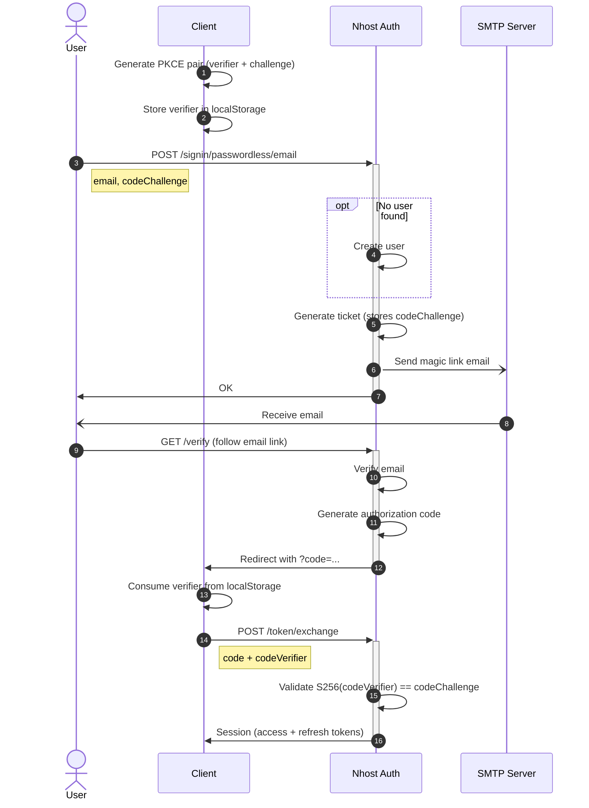

Magic Links are a type of passwordless login that allow users to sign in by clicking a link emailed to them, rather than typing a password.

Magic Links are disabled by default and can be enabled using the Nhost Dashboard under **Settings -> Sign-In Methods -> Magic Link**.

## Sign In

To sign in users with a Magic Link, use `signInPasswordlessEmail` with an email and a `codeChallenge` for [PKCE](/products/auth/pkce):

```js
import { generatePKCEPair } from '@nhost/nhost-js/auth';

const { verifier, challenge } = await generatePKCEPair();
localStorage.setItem('nhost_pkce_verifier', verifier);

await nhost.auth.signInPasswordlessEmail({
  email: 'joe@example.com',
  options: {
    redirectTo: `${window.location.origin}/verify`,
  },
  codeChallenge: challenge,
});
```

After the user clicks the magic link in their email, they'll be redirected to your app with an authorization code. See [Handling the Verification Redirect](/products/auth/pkce#handling-the-verification-redirect) to exchange the code for a session.

:::note
A user account is created the first time a Magic Link is used.
:::

:::tip
Users who have signed up with email and password can also sign in with a Magic Link.
:::

:::tip
It is possible to customize the email with the Magic Link, learn how to [here](/products/auth/email-templates).
:::

### Sign In Flow


