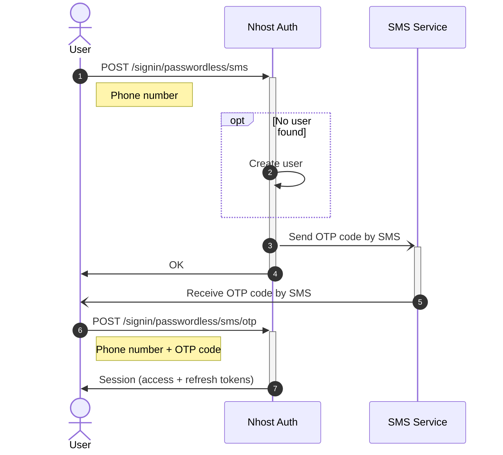

import { Tabs, TabItem } from '@astrojs/starlight/components';


An SMS OTP (one-time password) is a secure authorization method where a numeric or alphanumeric code is sent to a mobile phone number.

Nhost supports OTP via SMS with Twilio.

## Configuration

You need a [Twilio account](https://www.twilio.com/try-twilio) to use this feature because all SMS' are sent through Twilio.

Enable the Phone Number (SMS) sign-in method in the Nhost Dashboard under **Settings -> Sign-In Methods -> Phone Number (SMS)**.

You need to configure the following:

- Account SID
- Auth Token
- Messaging Service SID (or a Twilio phone number)

## Sign In

Signing in users with a phone number is a two-step process:


### Request OTP

The user will receive the OTP on the phone number specified.

<Tabs>
<TabItem label="JavaScript">
```js
await nhost.auth.signIn({
  phoneNumber: '+11233213123'
})
```
</TabItem>
<TabItem label="Dart">
```dart
await nhost.auth.signIn(
  phoneNumber: '+11233213123'
)
```
</TabItem>
</Tabs>


### Sign In with OTP

To sign in the user, pass in the OTP received on the previous step.

<Tabs>
<TabItem label="JavaScript">
```js
await nhost.auth.signIn({
  phoneNumber: '+11233213123',
  otp: '123456'
})
```
</TabItem>
<TabItem label="Dart">
```dart
await nhost.auth.signIn(
  phoneNumber: '+11233213123',
  otp: '123456'
)
```
</TabItem>
</Tabs>


:::note
A user account is created the first time a phone number is used
:::

:::note
Phone numbers should start with `+` (not `00`) to follow the [E.164 formatting standard](https://en.wikipedia.org/wiki/E.164)
:::

### Sign In Flow



## Test Phone Numbers

The environment variable `AUTH_SMS_TEST_PHONE_NUMBERS` can be set with comma-separated test phone numbers. When sign in is invoked, the SMS message with the verification code will be available in the logs. This way you can also test your SMS templates.

## Other SMS Providers

We only support Twilio for now. If you want support for another SMS provider, please create an issue on [GitHub](https://github.com/nhost/nhost).
