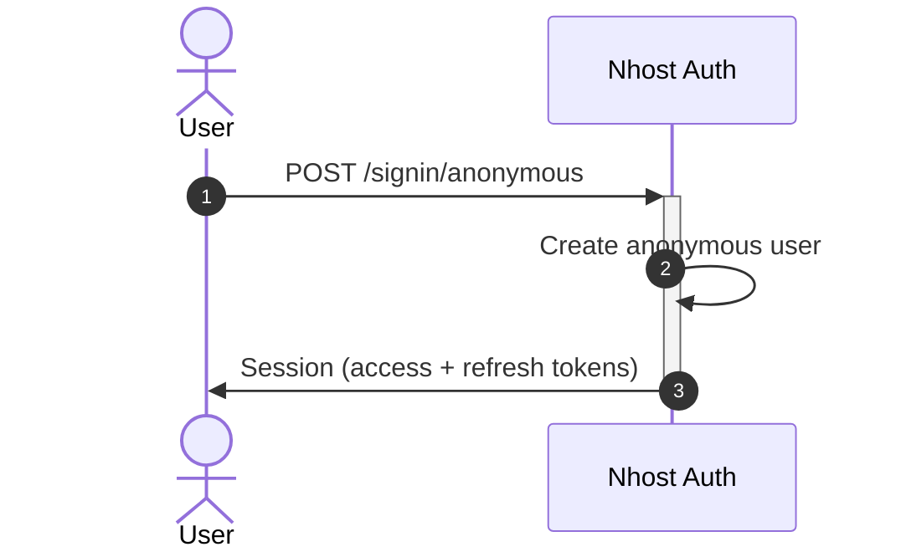
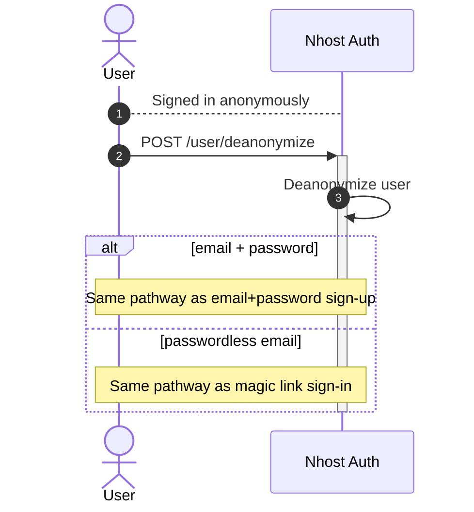

## Creating Users

Users are created using the sign-up or sign-in flows described under [Supported Methods](/products/auth/#supported-methods).

- **Avoid** creating users directly via GraphQL or the database, unless you are [importing users](#import-users) from an external system.
- **Avoid** modifying the database schema for the `auth.users` table.
- **Avoid** modifying the GraphQL root queries or fields for any of the tables in the `auth` schema.

You're allowed to:

- Add and remove your GraphQL relationships for the `users` table and other tables in the `auth` schema.
- Create, edit and delete permissions for the `users` table and other tables in the `auth` schema.

## Anonymous Users

Anonymous sign-in creates a temporary user without requiring any credentials. This is useful for allowing users to try your application before committing to an account.

```js
await nhost.auth.signInAnonymous();
```

### Anonymous Sign-In Flow



### Deanonymization

Anonymous users can be converted to permanent accounts by linking an email address. The deanonymization flow follows the same PKCE pattern as sign-up, using `userDeanonymize`:

```js
import { generatePKCEPair } from '@nhost/nhost-js/auth';

const { verifier, challenge } = await generatePKCEPair();
localStorage.setItem('nhost_pkce_verifier', verifier);

// Deanonymize with email + password
await nhost.auth.userDeanonymize({
  email: 'joe@example.com',
  password: 'secret-password',
  options: {
    redirectTo: `${window.location.origin}/verify`,
  },
  codeChallenge: challenge,
});

// Or deanonymize with passwordless email (magic link)
await nhost.auth.userDeanonymize({
  email: 'joe@example.com',
  options: {
    redirectTo: `${window.location.origin}/verify`,
  },
  codeChallenge: challenge,
});
```

After the user verifies their email, the authorization code is [exchanged for a session](/products/auth/sign-in-email-password#handling-the-verification-redirect).

### Deanonymization Flow



Both pathways support [PKCE](/products/auth/sign-in-email-password#pkce) via the `codeChallenge` parameter when email verification is required.

## Roles

Each user has one **default role** and a list of **allowed roles**. These roles are used to resolve permissions for requests to [GraphQL](/products/graphql/permissions) and [Storage](/products/storage/#permissions).

When the user makes a request, only one role is used to resolve permissions. The default role is used if no role is explicitly specified. Users can only make requests using the default role or one of the allowed roles.

### Default Role

The default role is used when no role is specified in the request. By default, users' default role is `user`.

You can change what the default role for new users should be at **Settings -> Roles and Permissions**.

### Allowed Roles

Allowed roles are roles the user is allowed to use when making a request. Usually, you would change the role from `user` (the default role) to some other role because you want to use a different role to resolve permissions for a particular request.

By default, users have two allowed roles:

- `user` (default)
- `me`

You can change the default role for new users at **Settings -> Roles and Permissions**.

#### Assign Allowed Roles

It's possible to give users a subset of allowed roles during signup.

**Example:** Only set the `user` role (exclude the `me` role) for the user's allowed roles:

```js
await nhost.auth.signUp({
  email: 'joe@example.com',
  password: 'secret-password'
  options: {
    allowedRoles: ['user']
  }
})
```

### Set Role for GraphQL Requests

When no role is specified, the user's default role will be used:

```js
await nhost.graphql.request(QUERY, {})
```

If you want to make a GraphQL request using a specific role, you can do so by using the `x-hasura-role` header, like this:

```js
await nhost.graphql.request(
  QUERY,
  {},
  {
    headers: {
      'x-hasura-role': 'me'
    }
  }
)
```

If the request is not part of the user's allowed roles, the request will fail.

## Metadata

You can store custom information about the user in the `metadata` column of the `users` table. The `metadata` column is of type JSONB so any JSON data can be stored.

**Example:** Add metadata to a user during sign-up:

```js
await nhost.auth.signUp({
  email: 'joe@example.com',
  password: 'secret-password',
  options: {
    metadata: {
      birthYear: 1989,
      town: 'Stockholm',
      likes: ['Postgres', 'GraphQL', 'Hasura', 'Authentication', 'Storage', 'Serverless Functions']
    }
  }
})
```

## Get User Information using GraphQL

**Example:** Get all users.

```graphql
query {
  users {
    id
    displayName
    email
    metadata
  }
}
```

**Example:** Get a single user.

```graphql
query {
  user(id: "<user-id>") {
    id
    displayName
    email
    metadata
  }
}
```

## Import Users

If you have users in a different system, you can import them into Nhost. When importing users you should insert the users directly into the database instead of using the authentication endpoints (`/signup/email-password`) to avoid sending unnecessary transactional emails.

### GraphQL

Make a GraphQL request to insert a user like this:

```graphql
mutation insertUser($user: users_insert_input!) {
  insertUser(object: $user) {
    id
  }
}
```

### SQL

Connect directly to the database and insert a user like this:

```sql
INSERT INTO auth.users (id, email, display_name, password_hash, ..) VALUES ('<user-id>', '<email>', '<display-name>', '<password-hash>', ..);
```

Passwords are hashed using [bcrypt](https://en.wikipedia.org/wiki/Bcrypt).
