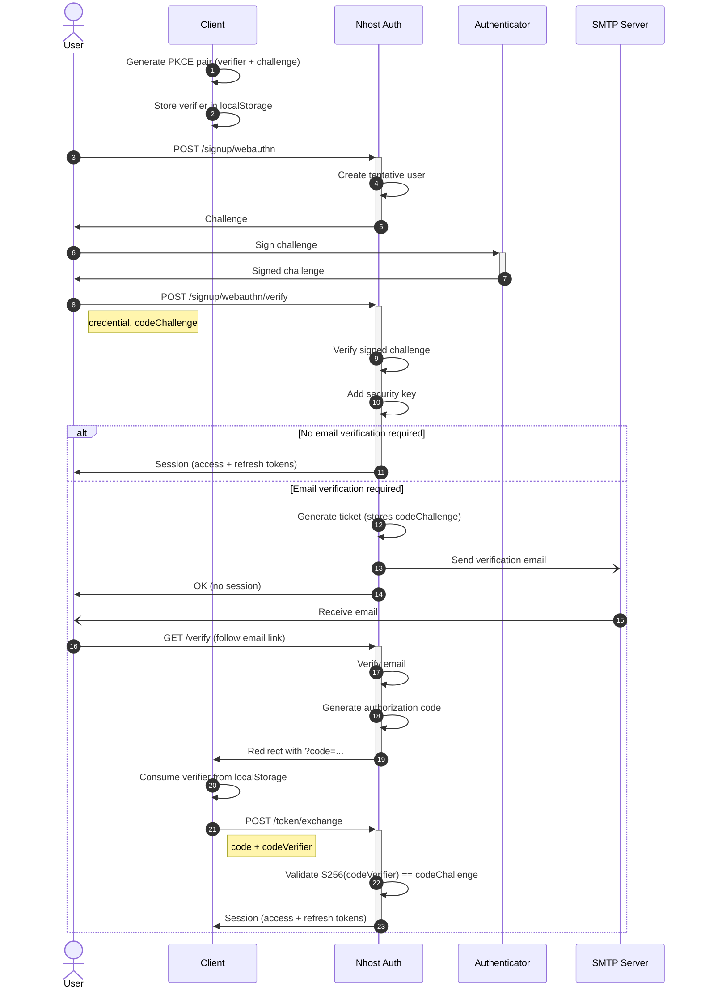
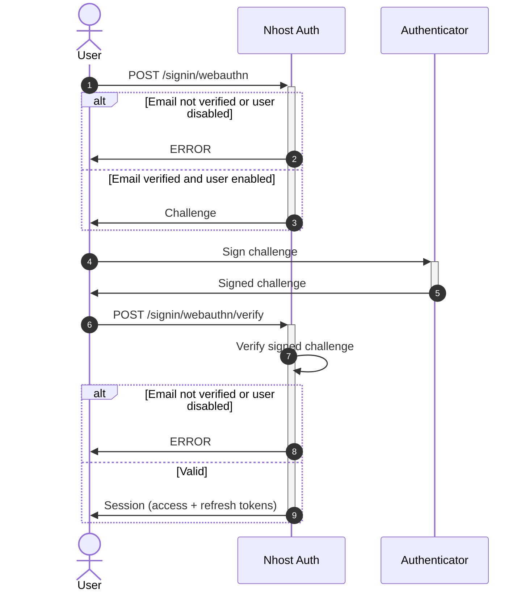
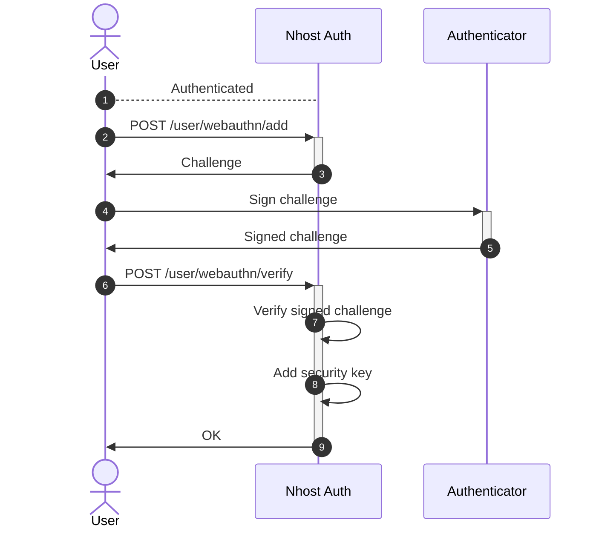

Follow this guide to sign in users with security keys and the WebAuthn API.

Examples of security keys:

- [Passkeys](https://www.passkeys.com/)
- [Windows Hello](https://support.microsoft.com/en-us/windows/learn-about-windows-hello-and-set-it-up-dae28983-8242-bb2a-d3d1-87c9d265a5f0)
- [Apple Touch ID](https://support.apple.com/en-us/HT201371)
- [Apple Face ID](https://support.apple.com/en-us/HT208109)
- [Yubico security keys](https://www.yubico.com/)
- Android Fingerprint sensors

You can read more about this feature in our [blog post](https://nhost.io/blog/webauthn-sign-in-method)

## Configuration

Enable the Security Key sign-in method in the Nhost Dashboard under **Settings -> Sign-In Methods -> Security Keys**.

You need to make sure you also set a valid client URL under **Settings -> Authentication -> Client URL**.

## Sign Up

Users must use an email address to sign up with a security key. When email verification is enabled, pass a `codeChallenge` for [PKCE](/products/auth/pkce):

```tsx
import { generatePKCEPair } from '@nhost/nhost-js/auth';
import { startRegistration } from '@simplewebauthn/browser';

const { verifier, challenge } = await generatePKCEPair();
localStorage.setItem('nhost_pkce_verifier', verifier);

// Step 1: Request registration challenge
const response = await nhost.auth.signUpWebauthn({
  email: 'joe@example.com',
  options: {
    redirectTo: `${window.location.origin}/verify`,
  },
});

// Step 2: Create credential with authenticator
const credential = await startRegistration({ optionsJSON: response.body });

// Step 3: Verify credential with PKCE
await nhost.auth.verifySignUpWebauthn({
  credential,
  options: {
    redirectTo: `${window.location.origin}/verify`,
  },
  nickname: 'My Security Key',
  codeChallenge: challenge,
});
```

If email verification is required, the user will receive a verification email. After clicking the link, the authorization code is [exchanged for a session](/products/auth/pkce#handling-the-verification-redirect).

### Sign Up Flow



## Sign In

Once a user signed up with a security key and verified their email if needed, they can use it to sign in.

```js
await nhost.auth.signIn({
  email: 'joe@example.com',
  securityKey: true,
});
```

### Sign In Flow



## Add a Security Key

Any signed-in user with a verified email can add a security key to their user account. It's possible to add multiple security keys.

```tsx
const { key, error } = await nhost.auth.addSecurityKey('My iPhone');
```

### Add Security Key Flow



## List or Remove Security Keys

To list and remove security keys, use GraphQL and set permissions on the `auth.security_keys` table:

```graphql
query securityKeys($userId: uuid!) {
  authUserSecurityKeys(where: { userId: { _eq: $userId } }) {
    id
    nickname
  }
}
```

To remove a security key:

```graphql
mutation removeSecurityKey($id: uuid!) {
  deleteAuthUserSecurityKey(id: $id) {
    id
  }
}
```
