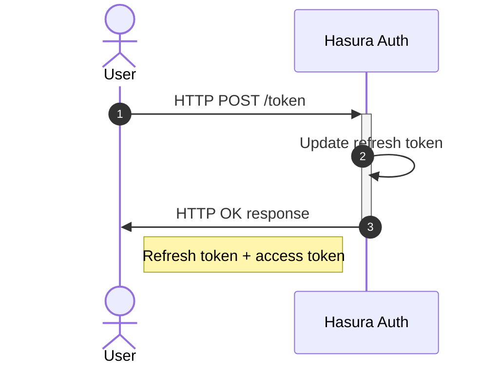

```mermaid
sequenceDiagram
	autonumber
	actor U as User
	participant A as Hasura Auth
	U->>+A: HTTP POST /token
	A->>A: Update refresh token
	A->>-U: HTTP OK response
	Note left of A: Refresh token + access token
```
