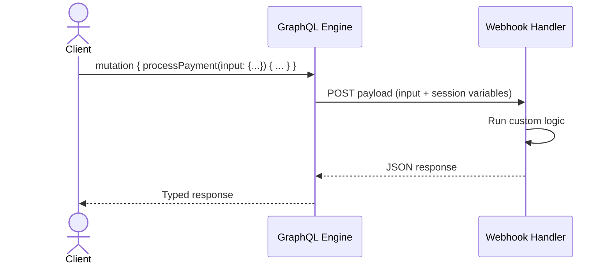

import { Steps, Tabs, TabItem } from '@astrojs/starlight/components';
import { SquarePen } from '@lucide/astro';
import { Card, CardGroup } from '@components';

Actions let you extend your GraphQL API with custom queries and mutations that are resolved by an HTTP webhook you host. You define the GraphQL types, point the field at a handler URL, and the GraphQL engine forwards the input to your handler and returns the typed result. This is how you add custom business logic, call third-party services, or wrap an existing REST endpoint in your GraphQL schema.

Actions are stored in your project's metadata, so they deploy the same way as your other metadata. Managing Actions in the dashboard requires a project admin secret.

:::note[Not yet supported by Constellation]
Actions are served by the default engine. [Constellation](/products/graphql/constellation) does not read `actions.yaml` or model an Action's custom types yet, so Action fields are not part of the schema it serves and calls to them fail. See [what still runs on Hasura](/products/graphql/constellation#what-still-runs-on-hasura).
:::

## Use Cases

- **Custom business logic**: run logic that isn't a plain database operation, such as processing a payment or fulfilling an order.
- **Third-party integrations**: call an external API and return the result as a typed GraphQL field.
- **Server-side validation**: validate or enrich input before it reaches your database.
- **Wrapping REST endpoints**: expose an existing REST service through your GraphQL API. Pair Actions with [Functions](/products/functions) to host the handler on Nhost.

## How Actions Work

When a client calls an Action, the GraphQL engine forwards the request to your webhook handler and returns the handler's response typed as the Action's output type.



The handler receives a JSON payload containing the Action's input arguments, the caller's session variables, and the raw GraphQL request, and returns a JSON body that matches the output type.

```json title="Example handler payload"
{
  "action": { "name": "processPayment" },
  "input": {
    "input": {
      "orderId": "ord_123",
      "amount": 49.99,
      "currency": "USD"
    }
  },
  "request_query": "mutation { processPayment(input: {orderId: \"ord_123\", amount: 49.99, currency: \"USD\"}) { transactionId status } }",
  "session_variables": {
    "x-hasura-role": "user",
    "x-hasura-user-id": "3b9f1de2-7c1a-4f0e-9b6d-2a45c8e1f7a0",
    "x-hasura-user-is-anonymous": "false"
  }
}
```

To report an error, the handler responds with a `4xx` status code and a JSON body containing a `message` field. The message is returned to the client as a GraphQL error.

## Creating an Action

You can create an Action in the dashboard, or declaratively by editing your project's metadata files. Both produce the same result.

<Tabs>
<TabItem label="Dashboard">

<Steps>

1. **Create a new Action**

   

   In your project dashboard, go to **GraphQL** > **Actions** and click **New Action** to open the configuration form.

2. **Define the Action**

   

   Enter the **Action Definition**: a single field under a `Mutation` or `Query` type.

   ```graphql
   type Mutation {
     processPayment(input: PaymentInput!): PaymentResult
   }
   ```

3. **Configure the types**

   

   In **Type Configuration**, define the input and output types the Action uses.

   ```graphql
   input PaymentInput {
     orderId: String!
     amount: Float!
     currency: String!
   }

   type PaymentResult {
     transactionId: String!
     status: String!
   }
   ```

   :::note
   If a type name here already exists in your custom types, the dashboard warns you that it will be overwritten when you save.
   :::

4. **Set the handler and options**

   

   - **Comment**: an optional short description. It surfaces as the field's description in GraphQL introspection.
   - **Webhook URL or template**: the handler endpoint. You can reference environment variables with the `{{VARIABLE}}` syntax, for example `{{NHOST_FUNCTIONS_URL}}/process-payment`. See [Environment Variables](/platform/cloud/environment-variables) for more details.
   - **Kind**: **Synchronous** or **Asynchronous**. An asynchronous Action returns an action id immediately and the response can be fetched later. Query Actions are always synchronous; only mutations can run asynchronously.
   - **Timeout**: the number of seconds to wait for the handler response before timing out (default: 30).

5. **Configure headers and transforms (optional)**

   Expand **Headers Settings** to forward the client's headers to your handler or send additional ones, and **Request & Response Options** to reshape the outgoing request or the handler's response. Both are covered in detail in [Headers](#headers) and [Transforms](#transforms) below.

6. **Create**

   Click **Create**. The Action is now part of your GraphQL schema.

</Steps>

</TabItem>
<TabItem label="Metadata">

Everything the dashboard form configures lives in two files in your project's metadata. Editing them directly is the natural path when you manage your project as code, and it is the most direct format for AI coding agents.

`nhost/metadata/actions.graphql` holds the GraphQL definitions: the Action's field plus its custom types.

```graphql title="nhost/metadata/actions.graphql"
type Mutation {
  processPayment(input: PaymentInput!): PaymentResult
}

input PaymentInput {
  orderId: String!
  amount: Float!
  currency: String!
}

type PaymentResult {
  transactionId: String!
  status: String!
}
```

`nhost/metadata/actions.yaml` holds everything else: the handler, kind, headers, permissions, and any relationships on the output types.

```yaml title="nhost/metadata/actions.yaml"
actions:
  - name: processPayment
    definition:
      kind: synchronous
      handler: '{{NHOST_FUNCTIONS_URL}}/process-payment'
      forward_client_headers: true
      headers:
        - name: x-source
          value: main-api
        - name: x-payments-api-key
          value_from_env: PAYMENTS_API_TOKEN
    comment: Process a payment and return the transaction result.
    permissions:
      - role: user
custom_types:
  enums: []
  input_objects:
    - name: PaymentInput
  objects:
    - name: PaymentResult
  scalars: []
```

Run `nhost up` to apply the change to your local project.

</TabItem>
</Tabs>

:::tip[Using an AI assistant?]
Connect the [Nhost MCP server](/platform/cli/mcp) and your assistant can inspect your schema, read these docs, and create or modify Actions for you.
:::

## Headers


Actions often need to send authentication or context to the handler. Expand **Headers Settings** on the Action form to configure them.

**Forward client headers to webhook**: pass the headers sent by the client app (such as `Authorization`) along to your handler. Enable it when the handler needs the caller's authentication token or other request context.

**Additional Headers**: click **+** to add a row. Each row is a key, a type, and a value, and the type decides how the value is read:

- **Value** sends what you type, exactly as typed. Use it for constants, such as the key `x-source` with the value `main-api`.
- **Env Var** treats what you type as the name of an environment variable and sends that variable's contents at request time. Use it for secrets, such as the key `x-payments-api-key` with the env var `PAYMENTS_API_TOKEN`, so you can rotate the value without editing the Action.

The two types map to the `value` and `value_from_env` keys in [`nhost/metadata/actions.yaml`](#creating-an-action).

## Transforms

Actions can reshape the outgoing request to the handler and the incoming response before it reaches the client. Expand **Request & Response Options** on the Action form to configure them. Transforms use the [Kriti templating language](/reference/kriti), the same engine used by [Event and Cron trigger transformations](/products/events/transformations).


**Request Options Transform**: override the HTTP method, customize the URL with a template, and add query parameters.


**Payload Transform**: reshape the request body. Choose a JSON [Kriti template](/reference/kriti), a form-encoded (`application/x-www-form-urlencoded`) body, or disable the body. The dashboard shows a live preview from a sample input.


**Response Transform**: map the handler's response to the Action's output type with a Kriti template. Use `{{$body}}` to access the original response body.

For the full list of template variables, see [Transformations](/products/events/transformations#template-variables).

## Viewing an Action


Selecting an Action from the sidebar opens its detail page, which shows:

- The **handler** URL, with a copy button.
- **Settings**: the handler timeout, and the kind (for mutations).
- The read-only **Action Definition** and **Type Configuration**.
- Any configured **request headers** and **transforms**.

The header indicates whether the Action is a **Query** (read-only) or a **Mutation** (modifies data), along with its comment and a badge when client headers are forwarded.

## Editing and Deleting

Each Action in the sidebar has a `⋯` menu with **Edit Action**, **Edit Permissions**, **Edit Relationships**, and **Delete Action**.

:::caution
Renaming an Action is not supported. When you edit an Action, its name is locked. To use a different name, create a new Action and delete the old one.
:::

## Permissions

By default, only the `admin` role can call an Action. To let other roles call it, open the `⋯` menu for the Action and select **Edit Permissions**. Unlike table permissions, this is call-or-deny per role, with no column-level rules or row checks.

See [Action Permissions](/products/graphql/permissions/examples#action-permissions) for the walkthrough, and [Permissions](/products/graphql/permissions) for how roles work.

## Relationships

You can relate an Action's response type to tables in your database, so a single query can return the Action's result joined with related database rows.


Open the `⋯` menu for an Action and select **Edit Relationships**. The list shows the relationships already defined on the Action's output type. Click **Relationship +** to create one.


<Steps>

1. **Name the relationship**

   Enter a **Relationship Name**. This becomes the field name on the output type in your GraphQL schema, so it has to be unique among the Action's relationships.

2. **Select the reference table**

   Choose the **Source**, **Schema**, and **Table** holding the rows you want to join.

3. **Choose the relationship type**

   Under **Relationship Details**, pick **Object Relationship** for a single related row, or **Array Relationship** for a list of related rows.

4. **Map the fields**

   Map a **Source Field** on the Action's output type to a **Reference Column** on the table. Click **Add New Mapping** to match on more than one pair.

5. **Create**

   Click **Create Relationship**. The relationship becomes available on the Action's response type in your GraphQL schema.

</Steps>

To change an existing relationship, click the edit icon <SquarePen size={16} style="display: inline; vertical-align: middle; margin: 0;" /> on its row. Everything except the name can be changed.

:::note
Relationships can only be attached when the Action's output type is an object type.
:::

## Custom Types Editor


The **Custom Types Editor**, accessible from the bottom of the Actions sidebar, is a single SDL editor for all the custom types used across your Actions. Use it to review or edit input, object, enum, and scalar types in one place. Edit the SDL and click **Save**, or **Revert changes** to discard.

## Troubleshooting

| Symptom | What to check |
| --- | --- |
| Calls fail with a timeout | Raise the Action's **Timeout**, confirm the handler is reachable from your Nhost project, or switch long-running work to an **Asynchronous** mutation. |
| Permission denied | Grant the user's role permission in **Edit Permissions**. Only `admin` is allowed by default. |
| Handler returns 401 or 403 | Enable **Forward client headers** so the caller's `Authorization` header reaches the handler, and confirm any header environment variables are set. |
| Saving warns that types will be overwritten | Rename the conflicting types in your **Type Configuration**, or reconcile them in the **Custom Types Editor**. |

## Learn more

<CardGroup cols={2}>
  <Card title="Functions" href="/products/functions">
  Host your Action handlers as serverless functions on Nhost
  </Card>

  <Card title="Permissions" href="/products/graphql/permissions">
  Learn how roles and permissions work
  </Card>

  <Card title="Transformations" href="/products/events/transformations">
  Reshape requests and responses with Kriti templates
  </Card>

  <Card title="Kriti templating" href="/reference/kriti">
  The templating language used by Action transforms
  </Card>
</CardGroup>
