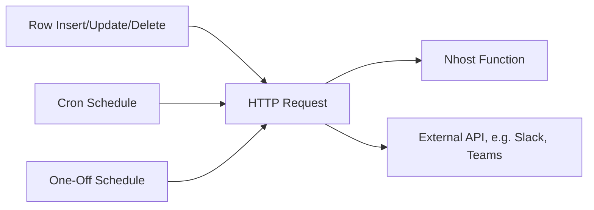

import { Card, CardGroup } from '@components';

Events fire HTTP requests to a webhook URL when a database row changes, a cron trigger fires, or a one-off scheduled event arrives. The webhook target can be any HTTP endpoint — an Nhost Function, an incoming webhook (e.g. Slack), or any external API. The default method is POST, but request transformations can change it to GET, PUT, PATCH, or DELETE.

## How It Works

## When to Use Each Type

| Type | Fires When | Use Case | Payload Contains |
|------|-----------|----------|-----------------|
| **Event Trigger** | A row is inserted, updated, or deleted | Notifications on data changes, audit logs, downstream syncs | Old and new row data |
| **Cron Trigger** | A cron trigger fires on schedule | Periodic cleanup, report generation, digest emails | Custom JSON you define |
| **One-Off Scheduled Event** | A specific date/time arrives | Deferred reminders, scheduled broadcasts, timed publishing | Custom JSON you define |

## Webhook Targets

Events call any HTTP endpoint. Common targets:

- **Nhost Functions** — build async business workflows (notifications, data processing, external syncs). Functions receive automatic access to `NHOST_WEBHOOK_SECRET` and the Nhost SDK for querying your database and calling other services. See the [Nhost SDK guide](/products/functions/guides/nhost-sdk) for details on using the admin client inside functions.
- **External services** — send directly to Slack, PagerDuty, or any API that accepts webhooks. Use request/payload transformations to match the target API's expected format.

## Shared Concepts

- All three event types support configurable retry count, interval, and timeout
- All three support custom HTTP headers on the webhook request
- All three are configured from the dashboard under **Events**
- Event triggers and cron triggers support request and payload transformations

## Event Types

<CardGroup cols={3}>
  <Card title="Event Triggers" href="/products/graphql/events/event-triggers">
    Fire webhooks when database rows are inserted, updated, or deleted
  </Card>
  <Card title="Cron Triggers" href="/products/graphql/events/cron-triggers">
    Call webhooks on a recurring schedule
  </Card>
  <Card title="One-Off Scheduled Events" href="/products/graphql/events/one-off-scheduled-events">
    Fire a webhook once at a specific date and time
  </Card>
</CardGroup>
