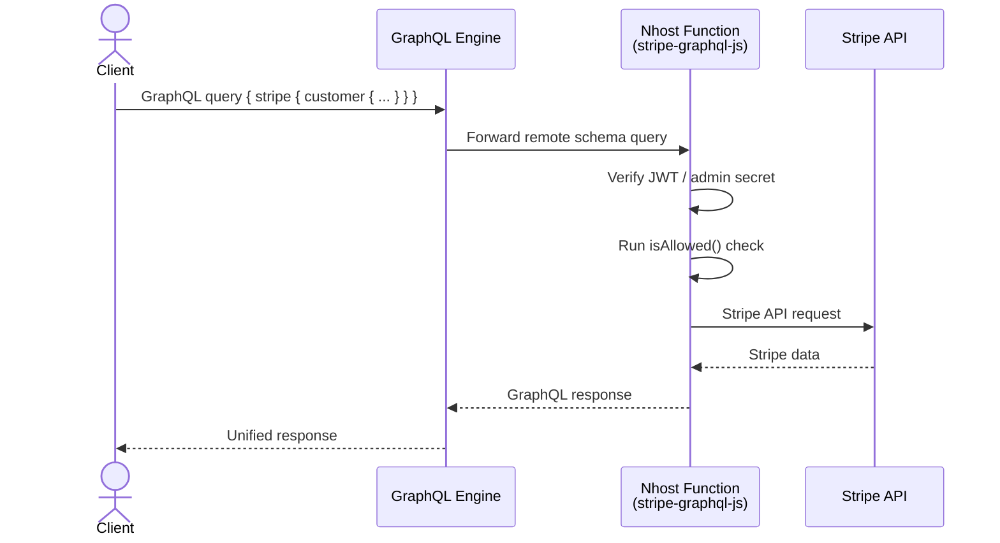

import { Steps, Tabs, TabItem } from '@astrojs/starlight/components';

The [`@nhost/stripe-graphql-js`](https://www.npmjs.com/package/@nhost/stripe-graphql-js) package lets you expose Stripe's API as a GraphQL [Remote Schema](/products/graphql/remote-schemas). Once connected, you can query Stripe customers, subscriptions, invoices, payment methods, and more alongside your existing data in a single GraphQL request.

## Architecture



Your client sends a single GraphQL query to the GraphQL engine. The engine identifies the `stripe` field as a Remote Schema and forwards it to the Nhost Function running `@nhost/stripe-graphql-js`. The function authenticates the request, checks permissions, fetches data from Stripe, and returns it through the GraphQL engine back to the client.

## Setup

<Steps>

1. **Install the package**

   In your Nhost project, install the dependency:

   ```shell
   pnpm add @nhost/stripe-graphql-js
   ```

2. **Create the serverless function**

   Create a file at `functions/graphql/stripe.ts`:

   ```ts functions/graphql/stripe.ts
   import { createStripeGraphQLServer } from '@nhost/stripe-graphql-js';

   const server = createStripeGraphQLServer();

   export default server;
   ```

3. **Add the Stripe secret key**

   First, store your Stripe secret key as a project secret. In the Nhost dashboard go to **Settings** > **Secrets**, or use the CLI:

   ```shell
   nhost secrets create STRIPE_SECRET_KEY sk_live_...
   ```

   Then expose it as an environment variable in `nhost/nhost.toml`:

   ```toml nhost/nhost.toml
   [[global.environment]]
   name = 'STRIPE_SECRET_KEY'
   value = '{{ secrets.STRIPE_SECRET_KEY }}'
   ```

4. **Register as a Remote Schema**

   Add the function as a Remote Schema in `nhost/metadata/remote_schemas.yaml`:

   ```yaml nhost/metadata/remote_schemas.yaml
   - name: stripe
     definition:
       url: '{{NHOST_FUNCTIONS_URL}}/graphql/stripe'
       timeout_seconds: 60
       customization: {}
   ```

   Or add it through the dashboard under **GraphQL** > **Remote Schemas**, using `{{NHOST_FUNCTIONS_URL}}/graphql/stripe` as the URL.

</Steps>

## Available Operations

### Queries

All queries are namespaced under the `stripe` field:

| Query | Arguments | Description |
|-------|-----------|-------------|
| `stripe.customer` | `id` (required) | Get a single customer by ID |
| `stripe.customers` | `email`, `limit`, `startingAfter`, `endingBefore` | List customers with optional filtering and pagination |

A customer object includes nested fields that resolve additional Stripe data:

| Nested Field | Description |
|-------------|-------------|
| `subscriptions` | Customer's active subscriptions |
| `invoices` | Customer's invoices |
| `paymentMethods` | Customer's payment methods (accepts `type`, `limit`, `startingAfter`, `endingBefore`) |
| `paymentIntents` | Customer's payment intents |
| `charges` | Customer's charges |

Additional root queries (admin only):

| Query | Arguments | Description |
|-------|-----------|-------------|
| `stripe.connectedAccount` | `id` (required) | Get a connected account |
| `stripe.connectedAccounts` | — | List all connected accounts |

### Mutations

| Mutation | Arguments | Description |
|----------|-----------|-------------|
| `stripe.createBillingPortalSession` | `customer` (required), `returnUrl`, `configuration`, `locale` | Create a Stripe Billing Portal session |

## Example Queries

### Fetch a customer with subscriptions and payment methods

```graphql
query {
  stripe {
    customer(id: "cus_ABC123") {
      id
      name
      email
      subscriptions {
        data {
          id
          status
          items {
            data {
              price {
                unitAmount
                currency
                product {
                  name
                }
              }
            }
          }
        }
      }
      paymentMethods(type: card) {
        data {
          id
          card {
            brand
            last4
            expMonth
            expYear
          }
        }
      }
    }
  }
}
```

### List invoices for a customer

```graphql
query {
  stripe {
    customer(id: "cus_ABC123") {
      invoices {
        data {
          id
          status
          amountDue
          amountPaid
          currency
          created
          hostedInvoiceUrl
          invoicePdf
        }
      }
    }
  }
}
```

### Create a billing portal session

```graphql
mutation {
  stripe {
    createBillingPortalSession(
      customer: "cus_ABC123"
      returnUrl: "https://myapp.com/account"
    ) {
      url
    }
  }
}
```

## Authorization

By default, only admin requests (those with a valid admin secret header) are allowed. You can provide a custom `isAllowed` function to implement fine-grained access control:

```ts functions/graphql/stripe.ts
import {
  createNhostClient,
  withAdminSession,
} from '@nhost/nhost-js';
import { Context, createStripeGraphQLServer } from '@nhost/stripe-graphql-js';

const nhost = createNhostClient({
  subdomain: process.env['NHOST_SUBDOMAIN']!,
  region: process.env['NHOST_REGION']!,
  configure: [
    withAdminSession({
      adminSecret: process.env['NHOST_ADMIN_SECRET']!,
    }),
  ],
});

const server = createStripeGraphQLServer({
  isAllowed: async (stripeCustomerId: string, context: Context) => {
    const { isAdmin, userClaims } = context;

    // Admins can access any customer
    if (isAdmin) {
      return true;
    }

    // Otherwise, verify the user owns this Stripe customer.
    // For example, look up the mapping in your database:
    const userId = userClaims?.['x-hasura-user-id'];
    if (!userId) {
      return false;
    }

    // Query your database to check if this user owns the Stripe customer
    const resp = await nhost.graphql.request({
      query: `
        query ($userId: uuid!, $stripeCustomerId: String!) {
          users(where: {
            id: { _eq: $userId },
            metadata: { _contains: { stripeCustomerId: $stripeCustomerId } }
          }) {
            id
          }
        }
      `,
      variables: { userId, stripeCustomerId },
    });
    return (resp.body.data?.users?.length ?? 0) > 0;
  },
});

export default server;
```

The `isAllowed` function receives:
- **`stripeCustomerId`**: The Stripe customer ID being accessed
- **`context`**: An object containing:
  - `isAdmin` — Whether the request has admin privileges
  - `userClaims` — The decoded JWT claims (includes `x-hasura-user-id`, `x-hasura-default-role`, `x-hasura-allowed-roles`).

The function is called for customer-scoped queries and mutations. Admin-only queries like `connectedAccounts` check `isAdmin` directly.

## Configuration

The `createStripeGraphQLServer` function accepts these options:

| Option | Type | Default | Description |
|--------|------|---------|-------------|
| `isAllowed` | `(stripeCustomerId, context) => boolean \| Promise<boolean>` | Admin-only | Custom authorization function |
| `cors` | `CORSOptions` | — | [CORS configuration](https://www.the-guild.dev/graphql/yoga-server/docs/features/cors) |
| `graphiql` | `boolean` | `false` | Enable the GraphiQL interface |
| `maskedErrors` | `boolean` | `true` | [Mask error details](https://the-guild.dev/graphql/yoga-server/docs/features/error-masking#disabling-error-masking) in responses |

## Environment Variables

| Variable | Required | Description |
|----------|----------|-------------|
| `STRIPE_SECRET_KEY` | Yes | Your Stripe API secret key |
| `NHOST_JWT_SECRET` | Auto | Set automatically by Nhost. Used to verify user JWTs |
| `NHOST_ADMIN_SECRET` | Auto | Set automatically by Nhost. Used to verify admin requests |
| `NHOST_WEBHOOK_SECRET` | Auto | Set automatically by Nhost. Used to verify internal requests from the GraphQL engine |
