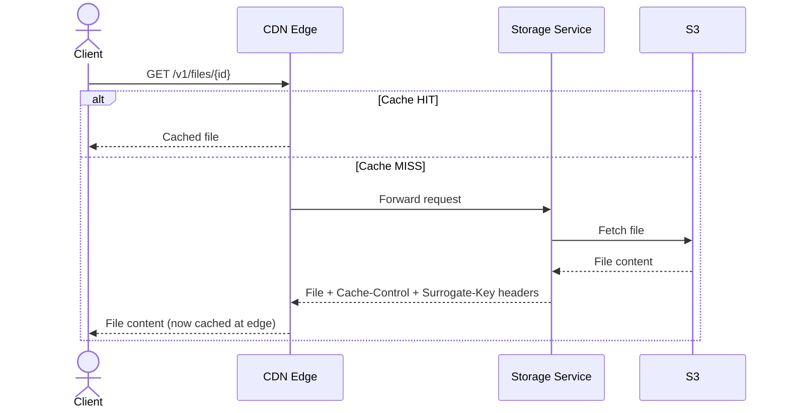
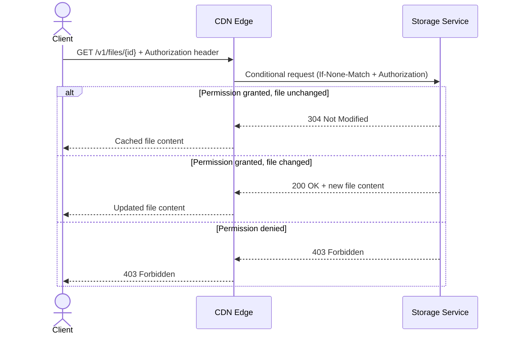
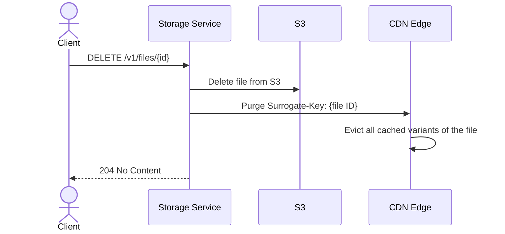

The [storage](/products/storage/) service integrates with a CDN to cache files and serve them from edge locations close to users. This reduces response times and offloads the backend. You can read our initial [announcement](https://nhost.io/blog/launching-nhost-cdn-nhost-storage-is-now-blazing-fast) for general information about the CDN and performance gains.

## How It Works

### Public Files

Public files are cached at the edge and served directly to users without hitting the backend. The `Cache-Control` and `Surrogate-Control` headers (configured per [bucket](/products/storage/buckets)) control how long the CDN caches the file.

### Authenticated Files

For files that require authentication, the CDN caches the file content but re-validates every request by forwarding the client's `Authorization` header to the backend. The backend checks permissions and responds with a `304 Not Modified` if access is allowed and the file hasn't changed -- the CDN then serves the cached content without re-downloading the file from S3.

This means authenticated files still benefit from CDN caching -- the backend only validates the permission without re-serving the file content.

## Cache Invalidation

When a file is deleted or replaced, the storage service immediately purges it from the CDN. Each file is tagged with a **Surrogate-Key** (the file's ID), which allows targeted purging without affecting other cached content.

This happens automatically -- no action is needed from your application.

## Large File Support

The CDN uses **segmented caching** for large files, breaking them into segments that can be cached and streamed independently. This means:

- Large files don't need to be fully downloaded before the CDN starts serving them
- [Range requests](https://developer.mozilla.org/en-US/docs/Web/HTTP/Headers/Range) are supported, allowing partial downloads of cached files

## Maximizing Cache HITs

A **HIT** occurs when a file is found in the cache and served directly. A **MISS** requires a round trip to the backend. To maximize HITs:

1. **Limit query parameter combinations.** Each unique set of query parameters (e.g., image transformations) is treated as a separate cached resource. Standardize on a few sizes rather than generating unique dimensions per request.

2. **Avoid pre-signed URLs for cacheable content.** Each pre-signed URL is unique, so the CDN treats them as different resources even if they point to the same file. Pre-signed URLs effectively bypass the cache.

3. **Prefer public files when possible.** Public files get full CDN caching with no revalidation overhead.

4. **Authenticated files are the next best option.** They benefit from CDN caching with lightweight conditional revalidation. Use [`nhost.storage.getFile`](/reference/javascript/nhost-js/storage#getfile) to download private files with proper auth headers.

5. **Use range requests for large files.** The CDN caches and serves partial content, so range requests avoid re-downloading the entire file.
