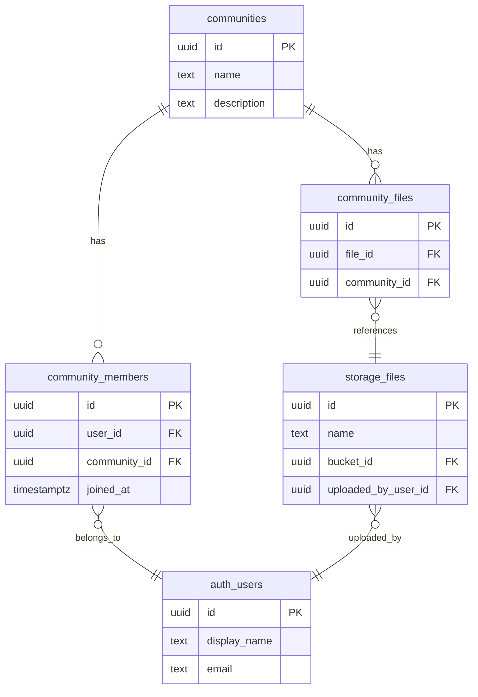

import { Tabs, TabItem } from '@astrojs/starlight/components';


This guide walks through two common file-access patterns: **personal files** (users access only their own) and **community files** (shared across a group via a junction table and membership). Both patterns build on [Hasura permissions](/products/graphql/permissions) applied to the `storage.files` table.


## Personal Files

The simplest pattern — users can upload, view, and delete only their own files in a dedicated bucket.

### 1. Create a Bucket

Insert a `personal` bucket into `storage.buckets` (via the Dashboard or a migration):

```sql
INSERT INTO storage.buckets (id)
VALUES ('personal');
```

### 2. Configure Permissions

Set permissions on the `storage.files` table for the `user` role:

<Tabs>
<TabItem label="Insert (Upload)">

| Setting | Value |
|---------|-------|
| Columns | `id`, `bucket_id`, `name`, `size`, `mime_type` |
| Row check | `{"bucket_id": {"_eq": "personal"}}` |
| Column preset | `uploaded_by_user_id` = `X-Hasura-User-Id` |

The column preset automatically tags every upload with the authenticated user's ID.

</TabItem>
<TabItem label="Select (Download)">

| Setting | Value |
|---------|-------|
| Columns | **All** |
| Row check | `{"_and": [{"uploaded_by_user_id": {"_eq": "X-Hasura-User-Id"}}, {"bucket_id": {"_eq": "personal"}}]}` |

</TabItem>
<TabItem label="Delete">

| Setting | Value |
|---------|-------|
| Row check | `{"_and": [{"uploaded_by_user_id": {"_eq": "X-Hasura-User-Id"}}, {"bucket_id": {"_eq": "personal"}}]}` |

</TabItem>
</Tabs>

### 3. Upload and Query Files

```typescript
// Upload a file to the personal bucket
const { body } = await nhost.storage.uploadFiles({
  'bucket-id': 'personal',
  'file[]': [file],
})

const uploadedFile = body.processedFiles?.[0]
```

:::note
The pattern is the same as the `default` bucket — only the `bucket-id` value changes.
:::

Because metadata lives in Hasura, you can query files via GraphQL — permissions are applied automatically:

```typescript
const response = await nhost.graphql.request<{
  files: Array<{ id: string; name: string; size: number; mimeType: string; createdAt: string }>
}>({
  query: `query MyFiles {
    files(where: { bucketId: { _eq: "personal" } }, order_by: { createdAt: desc }) {
      id
      name
      size
      mimeType
      createdAt
    }
  }`,
})

// Only returns files uploaded by the current user (enforced by permissions)
const files = response.body.data?.files ?? []
```

---

## Community Files

A more advanced pattern where files are shared with groups. Users join communities, upload files to a shared `communities` storage bucket, and associate files with communities through a junction table. Access is controlled by membership — only community members can see the community's files.

### Architecture



### 1. Create the Schema

```sql
-- Communities bucket
INSERT INTO storage.buckets (id) VALUES ('communities');

-- Communities
CREATE TABLE public.communities (
    id UUID PRIMARY KEY DEFAULT gen_random_uuid(),
    name TEXT NOT NULL UNIQUE,
    description TEXT,
    created_at TIMESTAMPTZ NOT NULL DEFAULT now()
);

-- Membership junction
CREATE TABLE public.community_members (
    id UUID PRIMARY KEY DEFAULT gen_random_uuid(),
    user_id UUID NOT NULL REFERENCES auth.users(id) ON DELETE CASCADE,
    community_id UUID NOT NULL REFERENCES public.communities(id) ON DELETE CASCADE,
    joined_at TIMESTAMPTZ NOT NULL DEFAULT now(),
    UNIQUE(user_id, community_id)
);

-- File ↔ community junction
CREATE TABLE public.community_files (
    id UUID PRIMARY KEY DEFAULT gen_random_uuid(),
    file_id UUID NOT NULL REFERENCES storage.files(id) ON DELETE CASCADE,
    community_id UUID NOT NULL REFERENCES public.communities(id) ON DELETE CASCADE,
    created_at TIMESTAMPTZ NOT NULL DEFAULT now()
);
```

Track all three tables and their foreign-key relationships in Hasura so they appear in the GraphQL API.

### 2. Configure Relationships in Hasura

| Source table | Relationship | Type | Target |
|---|---|---|---|
| `communities` | `members` | array | `community_members.community_id` |
| `communities` | `community_files` | array | `community_files.community_id` |
| `community_members` | `community` | object | `community_members.community_id → communities.id` |
| `community_members` | `user` | object | `community_members.user_id → auth.users.id` |
| `community_files` | `community` | object | `community_files.community_id → communities.id` |
| `community_files` | `file` | object | `community_files.file_id → storage.files.id` |
| `storage.files` | `community_files` | array | `community_files.file_id` |
| `storage.files` | `uploadedByUser` | object | `storage.files.uploaded_by_user_id → auth.users.id` (manual config) |

### 3. Configure Permissions

#### `public.communities` (user role)

| Operation | Columns | Filter |
|-----------|---------|--------|
| Select | all | `{}` (all communities visible) |

#### `public.community_members` (user role)

<Tabs>
<TabItem label="Select">

| Setting | Value |
|---------|-------|
| Columns | all |
| Filter | `{}` |

</TabItem>
<TabItem label="Insert">

| Setting | Value |
|---------|-------|
| Columns | `user_id`, `community_id` |
| Row check | `{"user_id": {"_eq": "X-Hasura-User-Id"}}` |
| Column preset | `user_id` = `X-Hasura-User-Id` |

</TabItem>
<TabItem label="Delete">

| Setting | Value |
|---------|-------|
| Filter | `{"user_id": {"_eq": "X-Hasura-User-Id"}}` |

</TabItem>
</Tabs>

#### `public.community_files` (user role)

<Tabs>
<TabItem label="Select">

Only members of the file's community can see it:

| Setting | Value |
|---------|-------|
| Columns | all |
| Filter | `{"community": {"members": {"user_id": {"_eq": "X-Hasura-User-Id"}}}}` |

This traverses the `community` → `members` relationships to check membership.

</TabItem>
<TabItem label="Insert">

| Setting | Value |
|---------|-------|
| Columns | `file_id`, `community_id` |
| Row check | `{"community": {"members": {"user_id": {"_eq": "X-Hasura-User-Id"}}}}` |

</TabItem>
<TabItem label="Delete">

| Setting | Value |
|---------|-------|
| Filter | `{"file": {"uploaded_by_user_id": {"_eq": "X-Hasura-User-Id"}}}` |

</TabItem>
</Tabs>

#### `storage.files` (user role)

Update the existing `storage.files` permissions to support all three buckets:

<Tabs>
<TabItem label="Insert (Upload)">

| Setting | Value |
|---------|-------|
| Columns | `id`, `bucket_id`, `name`, `size`, `mime_type` |
| Row check | `{"bucket_id": {"_in": ["default", "personal", "communities"]}}` |
| Column preset | `uploaded_by_user_id` = `X-Hasura-User-Id` |

</TabItem>
<TabItem label="Select (Download)">

Users can see their own files in `default`/`personal` buckets, plus any community files they have membership for:

| Setting | Value |
|---------|-------|
| Columns | all |
| Filter | `{"_or": [{"_and": [{"uploaded_by_user_id": {"_eq": "X-Hasura-User-Id"}}, {"bucket_id": {"_in": ["default", "personal"]}}]}, {"community_files": {"community": {"members": {"user_id": {"_eq": "X-Hasura-User-Id"}}}}}]}` |

</TabItem>
<TabItem label="Delete">

| Setting | Value |
|---------|-------|
| Filter | `{"uploaded_by_user_id": {"_eq": "X-Hasura-User-Id"}}` |

</TabItem>
</Tabs>

### 4. Join and Leave Communities

```typescript

// Join a community
await nhost.graphql.request({
  query: `mutation JoinCommunity($communityId: uuid!) {
    insert_community_members_one(object: { community_id: $communityId }) {
      id
    }
  }`,
  variables: { communityId },
})

// Leave a community
await nhost.graphql.request({
  query: `mutation LeaveCommunity($communityId: uuid!, $userId: uuid!) {
    delete_community_members(where: {
      community_id: { _eq: $communityId },
      user_id: { _eq: $userId }
    }) {
      affected_rows
    }
  }`,
  variables: { communityId, userId },
})
```

The insert permission's column preset automatically sets `user_id` to the authenticated user, and the check constraint prevents users from adding memberships for other users.

### 5. Upload and Assign to a Community

```typescript

// 1. Upload the file to the communities bucket
const uploadResponse = await nhost.storage.uploadFiles({
  'bucket-id': 'communities',
  'file[]': [file],
})

const uploadedFile = uploadResponse.body.processedFiles?.[0]
if (!uploadedFile?.id) throw new Error('Upload failed')

// 2. Associate the file with a community
await nhost.graphql.request({
  query: `mutation AddCommunityFile($fileId: uuid!, $communityId: uuid!) {
    insert_community_files_one(object: {
      file_id: $fileId,
      community_id: $communityId
    }) {
      id
    }
  }`,
  variables: { fileId: uploadedFile.id, communityId },
})
```

### 6. Query Community Files

```typescript
const response = await nhost.graphql.request<{
  community_files: Array<{
    id: string
    file: { id: string; name: string; size: number; mimeType: string; uploadedByUser: { displayName: string } | null }
  }>
}>({
  query: `query GetCommunityFiles($communityId: uuid!) {
    community_files(where: { community_id: { _eq: $communityId } }) {
      id
      file {
        id
        name
        size
        mimeType
        uploadedByUser {
          displayName
        }
      }
    }
  }`,
  variables: { communityId },
})

// Permissions automatically filter to communities the user is a member of
const communityFiles = response.body.data?.community_files ?? []
```

### 7. Remove a File from a Community

```typescript

// Remove the junction record
await nhost.graphql.request({
  query: `mutation RemoveCommunityFile($id: uuid!) {
    delete_community_files_by_pk(id: $id) {
      id
    }
  }`,
  variables: { id: communityFileId },
})

// Optionally delete the file from storage entirely
await nhost.storage.deleteFile(fileId)
```

The `ON DELETE CASCADE` on `community_files.file_id` automatically removes all community associations when the storage file is deleted.
