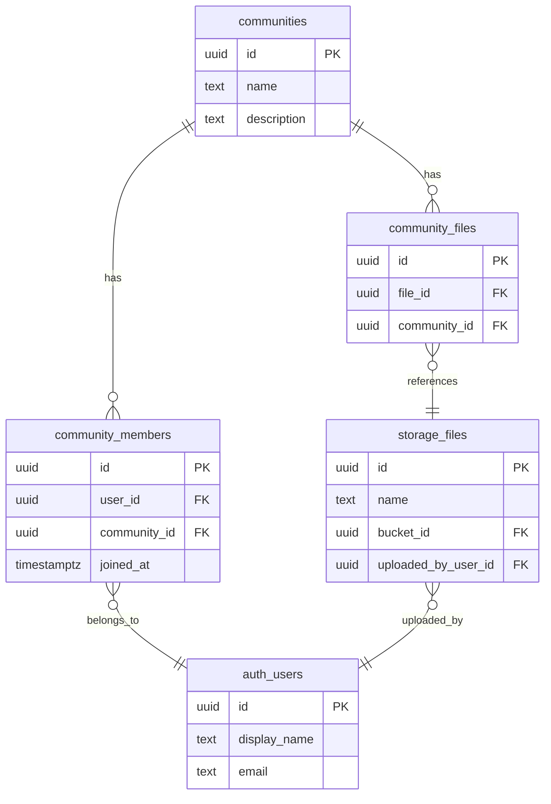

import { Tabs, TabItem } from '@astrojs/starlight/components';


This guide walks through two common file-access patterns: **personal files** (users access only their own) and **community files** (shared across a group via a junction table and membership). Both patterns build on [Hasura permissions](/products/graphql/permissions) applied to the `storage.files` table.


## Personal Files

The simplest pattern — users can upload, view, and delete only their own files in a dedicated bucket.

### 1. Create a Bucket

Go to the **Storage** page in the dashboard and click **New Bucket** in the sidebar. Name it `personal`.


:::note
Alternatively, you can create the bucket via a migration:
```sql
INSERT INTO storage.buckets (id)
VALUES ('personal');
```
:::

### 2. Configure Permissions

Open **Storage → Permissions** in the dashboard to reach the permission grid. For each action below, click the cell for the `user` role and configure it in the [rule editor](/products/graphql/permissions/rule-editor). The JSON equivalent is shown below each rule — you can also paste it directly into the rule editor's JSON view instead of building the rule visually.

<Tabs>
<TabItem label="Upload">

1. Select **With custom check** and add a rule: `bucket_id` equals `personal`.
2. Under **Uploader identity**, enable the **Prefill `uploaded_by_user_id` with `X-Hasura-User-Id`** toggle — this automatically tags every upload with `uploaded_by_user_id = X-Hasura-User-Id`.


*Equivalent JSON:*

```json
{"bucket_id": {"_eq": "personal"}}
```

</TabItem>
<TabItem label="Download">

1. Select **With custom check**.
2. Add two rules (combined with AND by default):
   - `uploaded_by_user_id` equals `X-Hasura-User-Id`
   - `bucket_id` equals `personal`


*Equivalent JSON:*

```json
{
  "_and": [
    {"uploaded_by_user_id": {"_eq": "X-Hasura-User-Id"}},
    {"bucket_id": {"_eq": "personal"}}
  ]
}
```

</TabItem>
<TabItem label="Delete">

Use the same two rules as Download:

- `uploaded_by_user_id` equals `X-Hasura-User-Id`
- `bucket_id` equals `personal`


*Equivalent JSON:*

```json
{
  "_and": [
    {"uploaded_by_user_id": {"_eq": "X-Hasura-User-Id"}},
    {"bucket_id": {"_eq": "personal"}}
  ]
}
```

</TabItem>
</Tabs>

### 3. Upload and Query Files

```typescript
// Upload a file to the personal bucket
const { body } = await nhost.storage.uploadFiles({
  'bucket-id': 'personal',
  'file[]': [file],
})

const uploadedFile = body.processedFiles?.[0]
```

:::note
The pattern is the same as the `default` bucket — only the `bucket-id` value changes.
:::

Because metadata lives in Hasura, you can query files via GraphQL — permissions are applied automatically:

```typescript
const response = await nhost.graphql.request<{
  files: Array<{ id: string; name: string; size: number; mimeType: string; createdAt: string }>
}>({
  query: `query MyFiles {
    files(where: { bucketId: { _eq: "personal" } }, order_by: { createdAt: desc }) {
      id
      name
      size
      mimeType
      createdAt
    }
  }`,
})

// Only returns files uploaded by the current user (enforced by permissions)
const files = response.body.data?.files ?? []
```

---

## Community Files

A more advanced pattern where files are shared with groups. Users join communities, upload files to a shared `communities` storage bucket, and associate files with communities through a junction table. Access is controlled by membership — only community members can see the community's files.

### Architecture


```mermaid
erDiagram
    communities ||--o{ community_members : has
    communities ||--o{ community_files : has
    community_files }o--|| storage_files : references
    community_members }o--|| auth_users : belongs_to
    storage_files }o--|| auth_users : uploaded_by

    communities {
        uuid id PK
        text name
        text description
    }
    community_members {
        uuid id PK
        uuid user_id FK
        uuid community_id FK
        timestamptz joined_at
    }
    community_files {
        uuid id PK
        uuid file_id FK
        uuid community_id FK
    }
    storage_files {
        uuid id PK
        text name
        uuid bucket_id FK
        uuid uploaded_by_user_id FK
    }
    auth_users {
        uuid id PK
        text display_name
        text email
    }
```

### 1. Create the Schema

Go to the **Storage** page in the dashboard and click **New Bucket** in the sidebar. Name it `communities`.

Then create the required tables (via the Dashboard or a migration):

```sql
-- Communities
CREATE TABLE public.communities (
    id UUID PRIMARY KEY DEFAULT gen_random_uuid(),
    name TEXT NOT NULL UNIQUE,
    description TEXT,
    created_at TIMESTAMPTZ NOT NULL DEFAULT now()
);

-- Membership junction
CREATE TABLE public.community_members (
    id UUID PRIMARY KEY DEFAULT gen_random_uuid(),
    user_id UUID NOT NULL REFERENCES auth.users(id) ON DELETE CASCADE,
    community_id UUID NOT NULL REFERENCES public.communities(id) ON DELETE CASCADE,
    joined_at TIMESTAMPTZ NOT NULL DEFAULT now(),
    UNIQUE(user_id, community_id)
);

-- File ↔ community junction
CREATE TABLE public.community_files (
    id UUID PRIMARY KEY DEFAULT gen_random_uuid(),
    file_id UUID NOT NULL REFERENCES storage.files(id) ON DELETE CASCADE,
    community_id UUID NOT NULL REFERENCES public.communities(id) ON DELETE CASCADE,
    created_at TIMESTAMPTZ NOT NULL DEFAULT now()
);
```

### 2. Configure Relationships

On the **Database** page sidebar, click the **⋯** menu on each table and choose **Edit Relationships**. Under **Suggested Relationships**, every foreign key is listed — click **Add** and then **Create Relationship**. Do this for each table below so the relationships appear in the GraphQL API.


| From | Name | Type | To |
|---|---|---|---|
| `communities` | `members` | Array | `community_members` |
| `communities` | `community_files` | Array | `community_files` |
| `community_members` | `community` | Object | `communities` |
| `community_members` | `user` | Object | `auth.users` |
| `community_files` | `community` | Object | `communities` |
| `community_files` | `file` | Object | `storage.files` |
| `storage.files` | `community_files` | Array | `community_files` |

:::note
The dashboard suggests `community_members` as the name for the array relationship from `communities`. This guide uses `members` instead (matching the [Nhost demo app](https://github.com/nhost/nhost/tree/main/examples/demos)) — rename it when you add the relationship, or stick with `community_members` and substitute it throughout the rules below.
:::

One more relationship links each file to the user who uploaded it. In the **Database** sidebar, switch to the `storage` schema, open the **files** table's **Edit Relationships**, and click **Relationship +**:

- **Relationship Name**: `uploadedByUser`
- **From Source**: `default` / `storage` / `files`
- **To Reference**: `default` / `auth` / `users`
- **Relationship Type**: Object Relationship
- **Source Column** → **Reference Column**: `uploaded_by_user_id` → `id`

Click **Create Relationship**.


### 3. Configure Permissions

#### `public.communities` (user role)

On the **Database** page, open the `communities` table and click **Permissions**. For the `user` role, configure **Select**: choose **Without any checks** and select all columns. All communities are visible so anyone can browse and join.


#### `public.community_members` (user role)

On the **Database** page, open `community_members` → **Permissions** for the `user` role and configure each operation below.

<Tabs>
<TabItem label="Select">

Choose **Without any checks** and select all columns. Anyone can see who's a member of any community.


</TabItem>
<TabItem label="Insert">

1. Select **With custom check** and add a rule: `user_id` equals `X-Hasura-User-Id` — this prevents users from adding memberships for other users.
2. Under **Column presets**, set `user_id` to `X-Hasura-User-Id`.
3. Allow columns `user_id` and `community_id`.


*Equivalent JSON:*

```json
{"user_id": {"_eq": "X-Hasura-User-Id"}}
```

</TabItem>
<TabItem label="Delete">

Select **With custom check** and add a rule: `user_id` equals `X-Hasura-User-Id`. Users can only remove their own memberships.


*Equivalent JSON:*

```json
{"user_id": {"_eq": "X-Hasura-User-Id"}}
```

</TabItem>
</Tabs>

#### `public.community_files` (user role)

On the **Database** page, open `community_files` → **Permissions** for the `user` role and configure each operation below.

<Tabs>
<TabItem label="Select">

Only members of the file's community can see it:

1. Select **With custom check**.
2. Pick relationship `community`, then pick relationship `members`, then add condition: `user_id` equals `X-Hasura-User-Id`.
3. Allow all columns.


*Equivalent JSON:*

```json
{"community": {"members": {"user_id": {"_eq": "X-Hasura-User-Id"}}}}
```

</TabItem>
<TabItem label="Insert">

1. Select **With custom check**.
2. Pick relationship `community` → `members`, then add condition: `user_id` equals `X-Hasura-User-Id`.
3. Allow columns `file_id` and `community_id`.


*Equivalent JSON:*

```json
{"community": {"members": {"user_id": {"_eq": "X-Hasura-User-Id"}}}}
```

</TabItem>
<TabItem label="Delete">

Only the uploader of the underlying file can remove the association:

1. Select **With custom check**.
2. Pick relationship `file`, then add condition: `uploaded_by_user_id` equals `X-Hasura-User-Id`.


*Equivalent JSON:*

```json
{"file": {"uploaded_by_user_id": {"_eq": "X-Hasura-User-Id"}}}
```

</TabItem>
</Tabs>

#### Storage permissions (user role)

Configure the **Storage** permissions for the `user` role: Upload, Download, and Delete each get their own rule.

<Tabs>
<TabItem label="Upload">

Click the **Upload** cell for the `user` role:

1. Select **With custom check** and add a rule: `bucket_id` is in `default`, `personal`, `communities`.
2. Under **Uploader identity**, enable the **Prefill `uploaded_by_user_id` with `X-Hasura-User-Id`** toggle.


*Equivalent JSON:*

```json
{"bucket_id": {"_in": ["default", "personal", "communities"]}}
```

</TabItem>
<TabItem label="Download">

Users can see their own files in `default`/`personal` buckets, plus any community files they have membership for:

1. Click the **Download** cell for the `user` role, select **With custom check**.
2. Change the root group operator to **OR**.
3. Add the first branch — an AND group with two conditions:
   - `uploaded_by_user_id` equals `X-Hasura-User-Id`
   - `bucket_id` is in `default`, `personal`
4. Add the second branch: pick relationship `community_files` → `community` → `members`, then add condition `user_id` equals `X-Hasura-User-Id`.


*Equivalent JSON:*

```json
{
  "_or": [
    {
      "_and": [
        {"uploaded_by_user_id": {"_eq": "X-Hasura-User-Id"}},
        {"bucket_id": {"_in": ["default", "personal"]}}
      ]
    },
    {"community_files": {"community": {"members": {"user_id": {"_eq": "X-Hasura-User-Id"}}}}}
  ]
}
```

</TabItem>
<TabItem label="Delete">

Click the **Delete** cell for the `user` role. Select **With custom check** and add a rule: `uploaded_by_user_id` equals `X-Hasura-User-Id`.


*Equivalent JSON:*

```json
{"uploaded_by_user_id": {"_eq": "X-Hasura-User-Id"}}
```

</TabItem>
</Tabs>

### 4. Join and Leave Communities

```typescript

// Join a community
await nhost.graphql.request({
  query: `mutation JoinCommunity($communityId: uuid!) {
    insert_community_members_one(object: { community_id: $communityId }) {
      id
    }
  }`,
  variables: { communityId },
})

// Leave a community
await nhost.graphql.request({
  query: `mutation LeaveCommunity($communityId: uuid!, $userId: uuid!) {
    delete_community_members(where: {
      community_id: { _eq: $communityId },
      user_id: { _eq: $userId }
    }) {
      affected_rows
    }
  }`,
  variables: { communityId, userId },
})
```

The insert permission's column preset automatically sets `user_id` to the authenticated user, and the check constraint prevents users from adding memberships for other users.

### 5. Upload and Assign to a Community

```typescript

// 1. Upload the file to the communities bucket
const uploadResponse = await nhost.storage.uploadFiles({
  'bucket-id': 'communities',
  'file[]': [file],
})

const uploadedFile = uploadResponse.body.processedFiles?.[0]
if (!uploadedFile?.id) throw new Error('Upload failed')

// 2. Associate the file with a community
await nhost.graphql.request({
  query: `mutation AddCommunityFile($fileId: uuid!, $communityId: uuid!) {
    insert_community_files_one(object: {
      file_id: $fileId,
      community_id: $communityId
    }) {
      id
    }
  }`,
  variables: { fileId: uploadedFile.id, communityId },
})
```

### 6. Query Community Files

```typescript
const response = await nhost.graphql.request<{
  community_files: Array<{
    id: string
    file: { id: string; name: string; size: number; mimeType: string; uploadedByUser: { displayName: string } | null }
  }>
}>({
  query: `query GetCommunityFiles($communityId: uuid!) {
    community_files(where: { community_id: { _eq: $communityId } }) {
      id
      file {
        id
        name
        size
        mimeType
        uploadedByUser {
          displayName
        }
      }
    }
  }`,
  variables: { communityId },
})

// Permissions automatically filter to communities the user is a member of
const communityFiles = response.body.data?.community_files ?? []
```

### 7. Remove a File from a Community

```typescript

// Remove the junction record
await nhost.graphql.request({
  query: `mutation RemoveCommunityFile($id: uuid!) {
    delete_community_files_by_pk(id: $id) {
      id
    }
  }`,
  variables: { id: communityFileId },
})

// Optionally delete the file from storage entirely
await nhost.storage.deleteFile(fileId)
```

The `ON DELETE CASCADE` on `community_files.file_id` automatically removes all community associations when the storage file is deleted.
