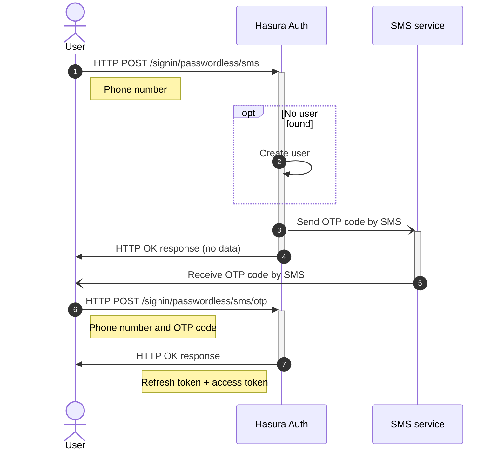

## Passwordless with SMS

```mermaid
sequenceDiagram
	autonumber
	actor U as User
	participant A as Hasura Auth
	participant S as SMS service
	U->>+A: HTTP POST /signin/passwordless/sms
	Note right of U: Phone number
	opt No user found
		A->>A: Create user
	end
	A-)+S: Send OTP code by SMS
	A->>-U: HTTP OK response (no data)
	S-)-U: Receive OTP code by SMS
	U->>+A: HTTP POST /signin/passwordless/sms/otp
	Note right of U: Phone number and OTP code
	A->>-U: HTTP OK response
	Note left of A: Refresh token + access token
```
