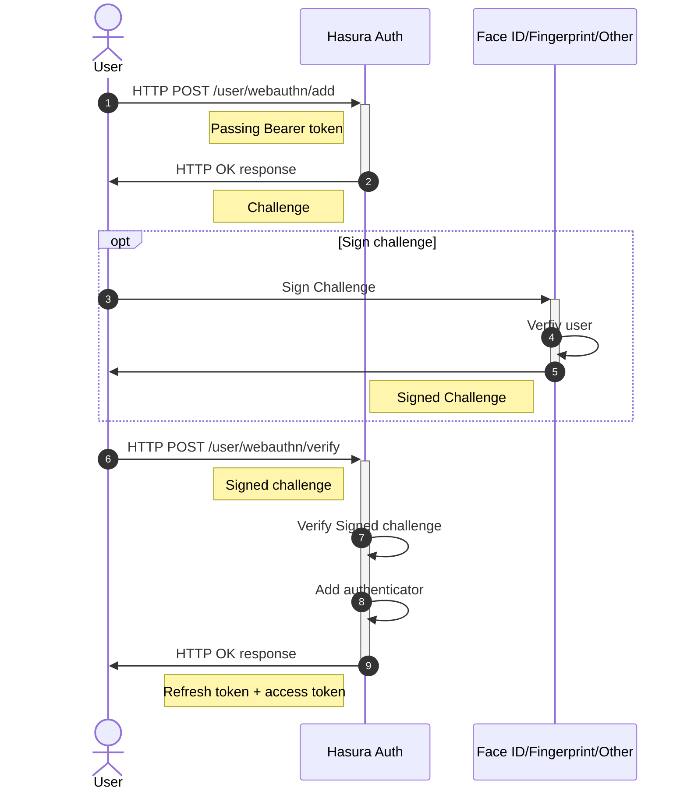
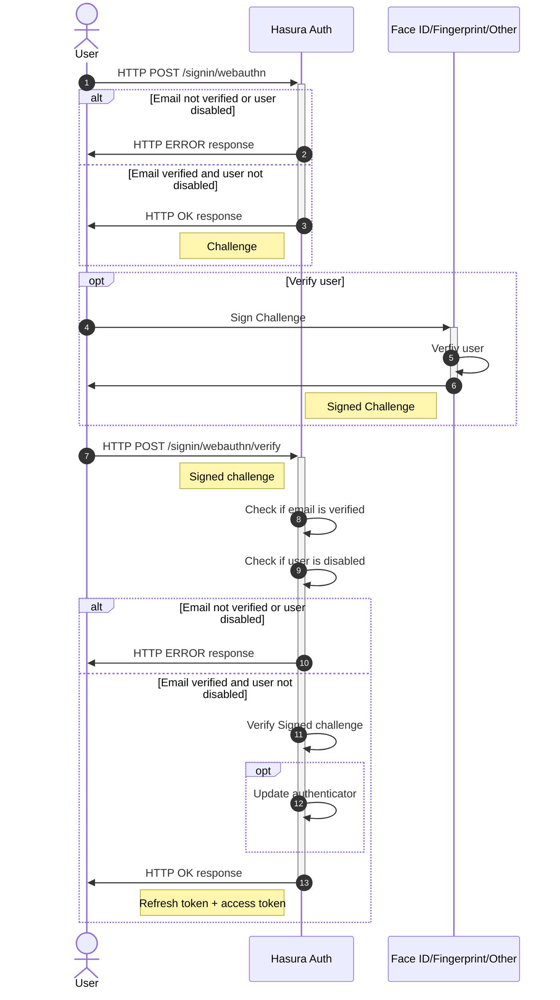

# Security Keys with WebAuthn

Hasura-auth implements the WebAuthn protocol to sign in with security keys, also referred as authenticators in the WebAuthn protocol.

A user needs first to sign up with another method, for instance email+password, passwordless email or Oauth, then to add their security key to their account.

Once the security key is added, it is then possible to sign in with it, using the email as a username.

## Add a security key

Users can add multiple security keys, for example when they need to login from multiple devices or browsers. Only authenticated users are allowed to add security keys.

## Sign in

