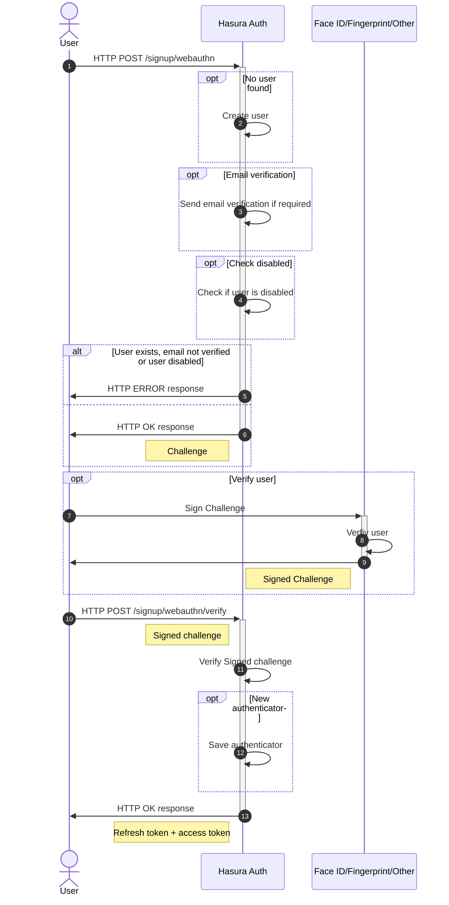
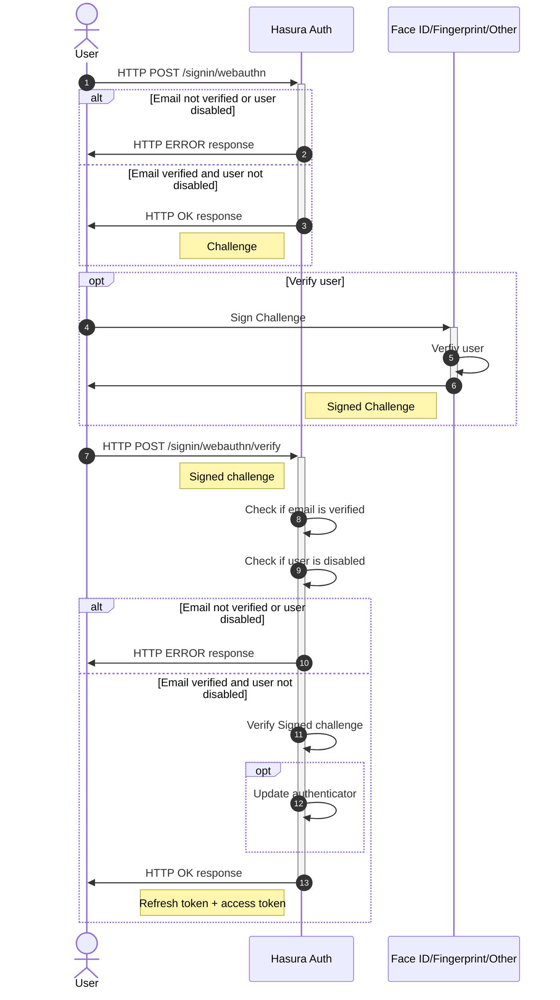
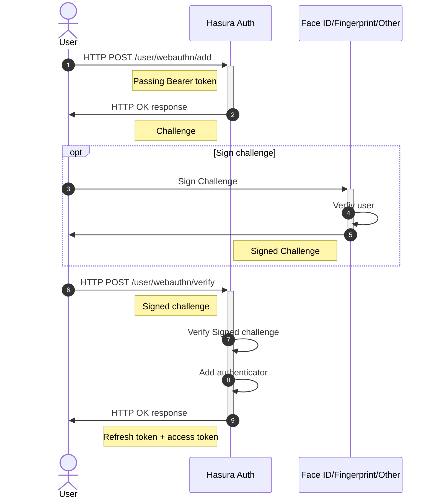

# Sign up and sign in users with Webauthn using strong authenticator

User can sign up with webauthn only if email verification is disabled. When email verification is enabled, user must verify it's email, login via password, magic link or ther credentials and then add webauthn authenticator via `/user/webauthn/add` endpoint instead. After that user can sign in using the webauthn authenticator.

## Sign up

## Sign in

## Adding authenticator to user

Users can add multiple authenticators, for example when they need to login from multiple devices or browsers. To do that, they should have a valid session.

