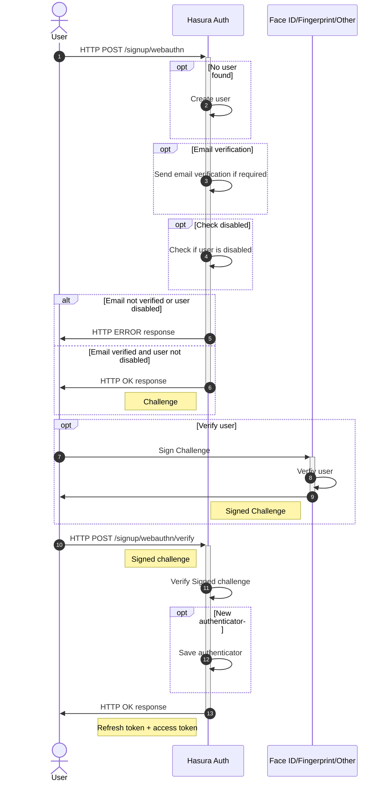
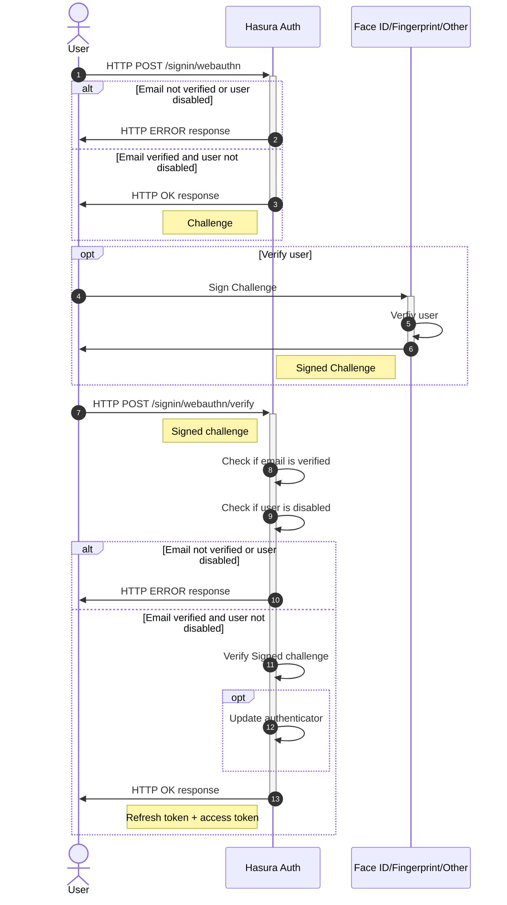

# Sign up and sign in users with Webauthn using strong authenticator

## Sign up

**User can sign up multiple times with same email but with different authenticators.
Authenticators can be different devices (Smartphone, Laptop, Browser) or different strong authenticators (Fingerprint, Face ID, Yubi key, etc) on same device.**

## Sign in

