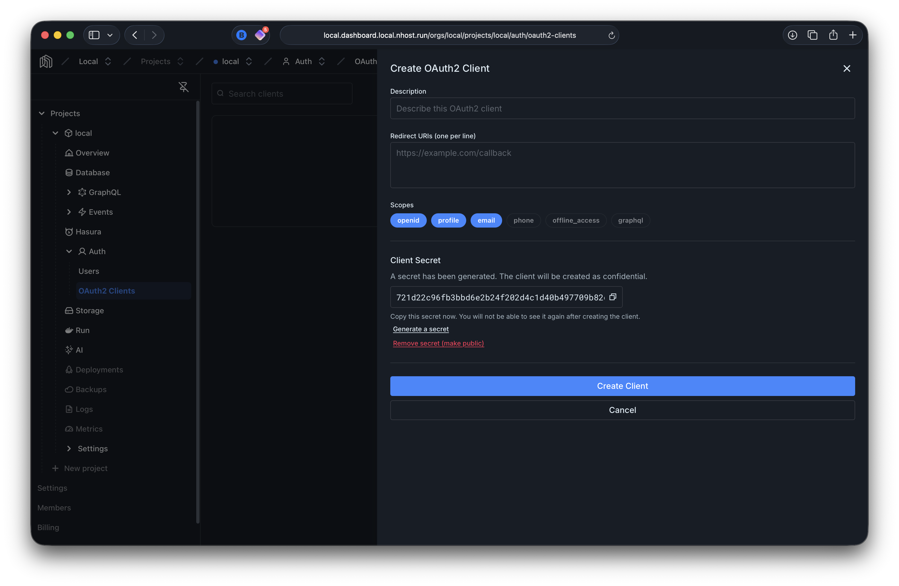
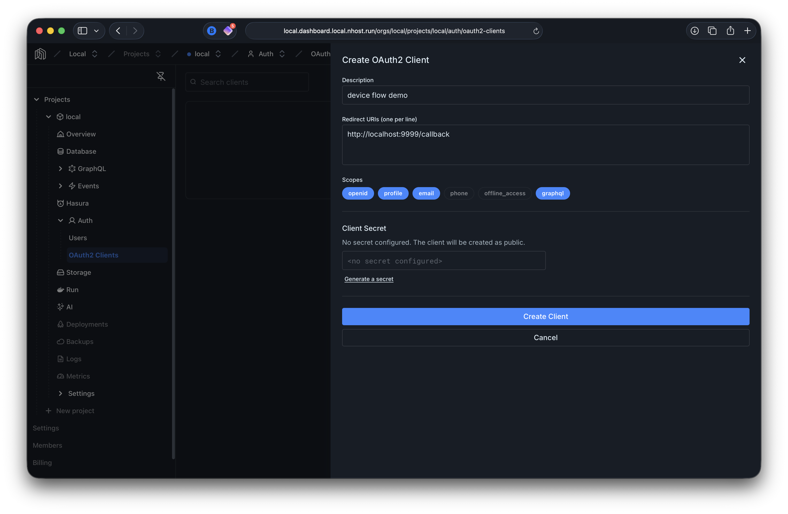

# OAuth2 Device Flow Demo

This demo shows Nhost Auth's OAuth2 Device Authorization Grant (RFC 8628). A TypeScript script (run with `npx tsx`) acts as an input-constrained device that authenticates a user via a browser, then uses the resulting token to query GraphQL via the Nhost SDK.

## Architecture

```
 Terminal (device)                Browser (user)
 ─────────────────               ──────────────────
 pnpm demo                       React Demo :5173
   │                                │
   │ POST /oauth2/device            │
   │──────────────────────►         │
   │◄──── device_code, user_code    │
   │                                │
   │  "Open this URL and enter      │
   │   code BCDF-GHJK"              │
   │           ─ ─ ─ ─ ─ ─ ─ ─ ─ ─ ►│
   │                                │ GET /oauth2/device/verify
   │                                │ POST /oauth2/device/verify
   │                                │   (approve / deny)
   │                                │
   │ POST /oauth2/token             │
   │   (poll with device_code)      │
   │──────────────────────►         │
   │◄──── access_token,             │
   │      refresh_token             │
   │                                │
   │ POST /v1/graphql               │
   │   (Bearer access_token)        │
   │──────────────────────►         │
   │◄──── user info                 │
```

## Quick Start

1. **Start the backend** (from `../backend/`):
   ```bash
   cd ../backend && nhost up
   ```

2. **Start the frontend** (from `../react-demo/`):
   ```bash
   cd ../react-demo && pnpm dev
   ```

3. **Sign up** — create an account via the React app at http://localhost:5173. Check **Mailhog** (https://local.mailhog.local.nhost.run/) for the email verification link.

4. **Create a public OAuth2 client** — open the Dashboard's [OAuth2 Clients page](https://local.dashboard.local.nhost.run/orgs/local/projects/local/auth/oauth2-clients) and create a new client. A secret is generated by default:

   

   Click **"Remove secret (make public)"** to make it a public client (device flow clients can't securely store a secret). Also select the `graphql` scope in addition to the defaults — this embeds Hasura-compatible claims in the access token. The redirect URL doesn't matter for the device flow but is required — use `http://localhost:9999/callback`:

   

5. **Install dependencies**:
   ```bash
   cd examples/demos/device-flow && pnpm install
   ```

6. **Run the device flow script** — copy the client ID from the dashboard:
   ```bash
   pnpm demo <client_id>
   ```

   The script will:
   - Request a device authorization code using the Nhost SDK
   - Display a URL and user code
   - Poll for authorization

7. **Authorize in the browser** — open the URL printed by the script. Sign in if needed, then click "Authorize".

8. **Watch the terminal** — once you approve, the script receives tokens and fetches your user info via GraphQL.

## Example Output

```
============================================
  OAuth2 Device Flow Demo
============================================

  Client ID: nhoa_ffe60dafd20ee464

Requesting device authorization...

============================================
  Open this URL in your browser:

    http://localhost:5173/oauth2/device?user_code=BCDF-GHJK

  Or go to: http://localhost:5173/oauth2/device
  and enter code: BCDF-GHJK

  Expires in 600 seconds.
============================================

Waiting for authorization...
....

Authorization successful!

── Token Details ─────────────────────────
  Access Token:  eyJhbGciOiJIUzI1NiIsInR5cCI6IkpXVC...
  Refresh Token: a1b2c3d4-e5f6-...
  Scope:         openid profile email graphql
  Expires In:    900s
  ID Token:      eyJhbGciOiJIUzI1NiIsInR5cCI6IkpXVC...

── Fetching user info via GraphQL ────────
  User ID (from JWT sub): db477732-48fa-4289-...

{
  "id": "db477732-48fa-4289-...",
  "displayName": "Jane Doe",
  "email": "jane@example.com",
  "emailVerified": true,
  ...
}

Done!
```

## Configuration

The script uses these environment variables (with defaults for the local dev environment):

| Variable | Default | Description |
|----------|---------|-------------|
| `AUTH_URL` | `https://local.auth.local.nhost.run/v1` | Auth service URL |
| `GRAPHQL_URL` | `https://local.graphql.local.nhost.run/v1` | GraphQL endpoint URL |

## Requirements

- Node.js (v22+)
- `pnpm`

## How It Works

1. You create a **public OAuth2 client** (no secret) in the Nhost Dashboard. Public clients are typical for the device flow since the device cannot securely store a secret.

2. The script calls `nhost.auth.oauth2DeviceAuthorization()` with the client ID and requested scopes (`openid profile email graphql`). The `graphql` scope is key — it embeds Hasura-compatible claims in the access token.

3. The auth service returns a `device_code` (kept secret by the script), a `user_code` (shown to the user), and a `verification_uri`.

4. The user opens the verification URL in a browser, which loads the React app's `/oauth2/device` page. There they enter the user code, see which scopes are being requested, and approve or deny.

5. Meanwhile, the script polls `POST /oauth2/token` with `grant_type=urn:ietf:params:oauth:grant-type:device_code`. The server responds with `authorization_pending` until the user acts.

6. Once approved, the token endpoint returns an access token, refresh token, and (if `openid` scope was requested) an ID token.

7. The script decodes the JWT to extract the user ID (`sub` claim) and makes a GraphQL query via `nhost.graphql.request()` using the access token as a Bearer token — no admin secret needed, because the `graphql` scope embedded Hasura claims in the token.
