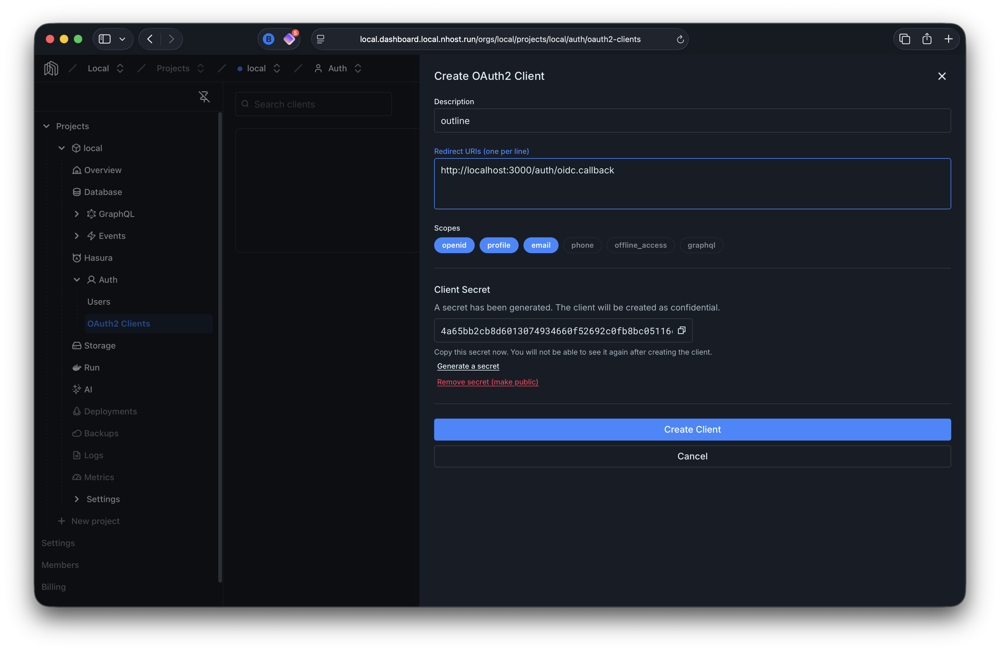
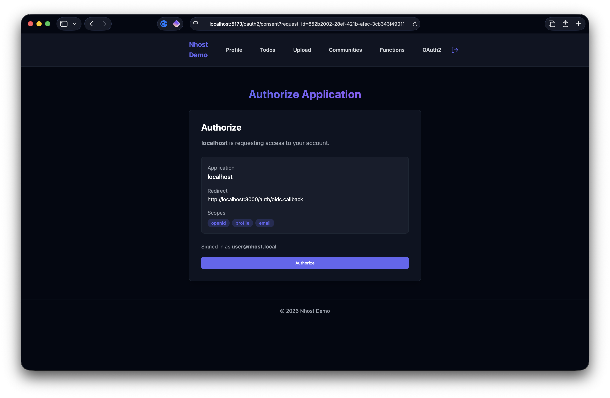
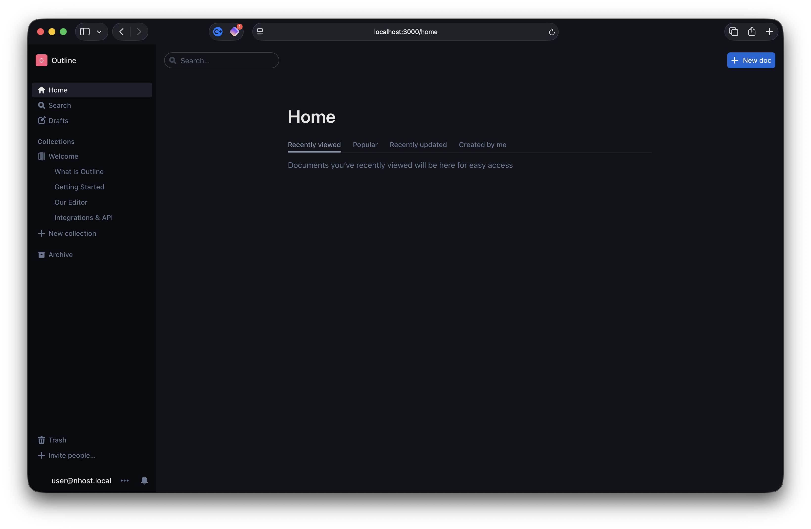

# OAuth2/OIDC Demo — Sign in with Nhost via Outline

This demo shows Nhost Auth acting as an OAuth2/OpenID Connect Identity Provider. Outline (a collaborative wiki) is configured as a relying party that uses "Continue with Nhost" for authentication.

## Architecture

```
┌─────────┐     ┌──────────────┐     ┌──────────────┐
│ Outline │────→│  Nhost Auth  │────→│  React Demo  │
│ :3000   │     │  (backend)   │     │  :5173       │
└─────────┘     └──────────────┘     └──────────────┘
      │                │
      │       ┌────────┼─────────┐
      │       │        │         │
      │  ┌────┴───┐ ┌──┴────┐ ┌──┴────┐
      │  │Postgres│ │GraphQL│ │Mailhog│
      │  └────────┘ └───────┘ └───────┘
      │
 ┌────┴───┐
 │ Redis  │
 └────────┘
```

All services are managed by `nhost up` from `../backend/`. Outline and Redis are configured as Nhost Run services via TOML config files in this directory.

## Quick Start

1. **Start the backend** (from `../backend/`):
   ```bash
   cd ../backend && nhost up
   ```

2. **Create an OAuth2 client** — open the Dashboard's [OAuth2 Clients page](https://local.dashboard.local.nhost.run/orgs/local/projects/local/auth/oauth2-clients) and create a new client. Set the redirect URL to `http://localhost:3000/auth/oidc.callback` and select the `openid`, `profile`, and `email` scopes:

   

3. **Configure Outline** — copy the client ID and secret, then run:
   ```bash
   ./setup.sh <client_id> <client_secret>

4. **Start the frontend** (from `../react-demo/`):
   ```bash
   cd ../react-demo && pnpm dev
   ```


5. **Sign up** — create an account via the React app. Don't forget to check **Mailhog** (https://local.mailhog.local.nhost.run/) for the email verification link.

6. **Start Outline** — restart the backend with the run services:
   ```bash
   cd ../backend && nhost up --run-service ../outline/redis.toml --run-service ../outline/outline.toml
   ```

7. **Open Outline** — go to http://localhost:3000. You will be redirected to the frontend's consent page. Once you accept, you are redirected to Outline, now logged in.

   

   

## Useful Links

| Service | URL |
|---------|-----|
| Outline | http://localhost:3000 |
| React Demo (Consent) | http://localhost:5173/oauth2/consent |
| Auth Service | https://local.auth.local.nhost.run/v1 |
| OIDC Discovery | https://local.auth.local.nhost.run/v1/.well-known/openid-configuration |
| JWKS | https://local.auth.local.nhost.run/v1/oauth2/jwks |

## How It Works

1. **Outline** redirects to `https://local.auth.local.nhost.run/v1/oauth2/authorize` with standard OAuth2 parameters (client_id, redirect_uri, scope, state)
2. **Nhost Auth** validates the request and redirects to the configured login URL (`http://localhost:5173/oauth2/consent?request_id=<uuid>`)
3. The **consent page** (React Demo) fetches request details via the Nhost SDK (`oauth2LoginGet`) and, if the user is not authenticated, redirects to `/signin?redirect=/oauth2/consent?request_id=...`
4. The user signs in via the **sign-in page** (`signInEmailPassword`) to establish a session, then is redirected back to the consent page
5. The **consent page** displays the client info and requested scopes; the user clicks "Authorize" and the page completes the flow via the Nhost SDK (`oauth2LoginPost`) with the request ID
6. **Nhost Auth** returns a redirect URI containing the authorization code
7. The browser redirects to Outline's callback URL (`/auth/oidc.callback`) with the code
8. **Outline** (server-side) exchanges the code for tokens via `POST /oauth2/token`
9. **Outline** fetches user info via `GET /oauth2/userinfo` and creates a session

## Cleanup

Remove the Outline secrets from `../backend/.secrets` (the lines under `# Outline`).
